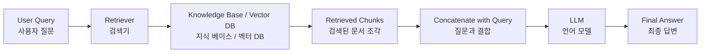
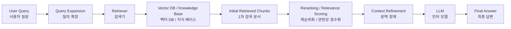
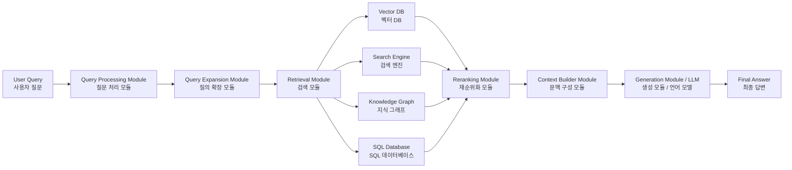
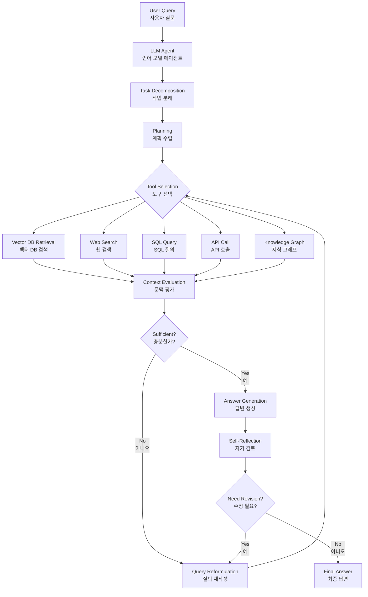
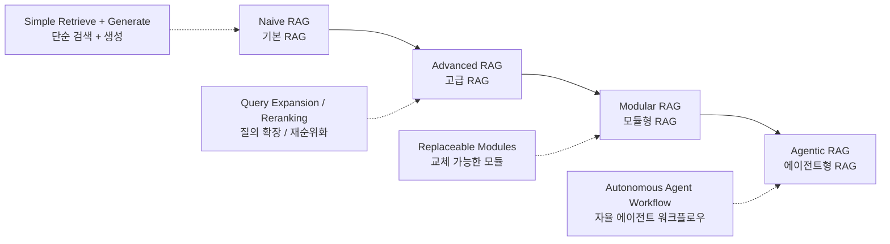

# 2.1 RAG RAG Architecture 유형

> Retrieval-Augmented Generation(RAG, 검색 증강 생성)은 Language Model(언어 모델)과 External Knowledge Retrieval System(외부 지식 검색 시스템)을 결합한 AI 기술이다.
> 이 Hybrid Approach(하이브리드 접근 방식)는 방대한 외부 자료에서 상세하고 관련성 높은 정보를 검색한 뒤, 이를 답변 생성 과정에 통합함으로써 더 정확하고 신뢰도 높은 응답을 생성하도록 돕는다.
> RAG Architecture(RAG 아키텍처)의 다양한 유형을 이해하는 것은 각 방식의 장점을 파악하고, 특정 Use Case(활용 사례)에 적합한 구조를 선택하는 데 중요하다. 대표적인 RAG 아키텍처는 다음과 같이 구분할 수 있다.

---

## 1. Naive RAG(기본 RAG)

Naive RAG(기본 RAG)는 Retrieval-Augmented Generation(RAG)의 가장 기초적인 방식이다. 사용자의 Query(질문)가 입력되면 Knowledge Base(지식 베이스)에서 관련 있는 정보 Chunk(문서 조각)를 검색하고, 검색된 내용을 Context(문맥)로 사용하여 Language Model(언어 모델)이 답변을 생성한다.

### Characteristics(특징)

**Retrieval Mechanism(검색 메커니즘)**
Keyword Matching(키워드 매칭)이나 Basic Semantic Similarity(기본 의미 유사도)와 같은 단순한 검색 방식을 사용하여 사전에 구축된 Index(색인)에서 관련 문서 Chunk(조각)를 가져온다.

**Contextual Integration(문맥 통합)**
검색된 문서는 사용자의 Query(질문)와 함께 결합되어 Language Model(언어 모델)에 입력된다. 이를 통해 모델은 더 넓은 Context(문맥)를 참고하여 관련성 높은 답변을 생성할 수 있다.

**Processing Flow(처리 흐름)**
Naive RAG는 일반적으로 `Retrieve(검색) → Concatenate(결합) → Generate(생성)`의 선형 Workflow(워크플로우)를 따른다. 검색된 데이터는 별도의 수정이나 정제 없이 그대로 사용되는 경우가 많다.

### Architecture(아키텍처)

---

## 2. Advanced RAG(고급 RAG)

Advanced RAG(고급 RAG)는 Naive RAG(기본 RAG)의 구조를 기반으로 하면서, 검색 정확도와 문맥 활용 능력을 높이기 위해 더 정교한 기법을 추가한 방식이다. 이 방식은 단순 검색의 한계를 보완하고, 검색된 Context(문맥)를 더 효과적으로 활용하도록 설계된다.

### Characteristics(특징)

**Enhanced Retrieval(향상된 검색)**
Query Expansion(질의 확장), Iterative Retrieval(반복 검색)과 같은 고급 검색 전략을 사용한다. Query Expansion(질의 확장)은 사용자의 원래 질문에 관련 용어나 유사 표현을 추가하여 검색 범위를 확장하는 방식이다. Iterative Retrieval(반복 검색)은 여러 단계에 걸쳐 문서를 검색하고, 검색 결과를 점진적으로 개선하는 방식이다.

**Contextual Refinement(문맥 정제)**
Attention Mechanism(어텐션 메커니즘)이나 Context Filtering(문맥 필터링)과 같은 기법을 활용하여 검색된 문서 중 중요한 부분에 더 집중한다. 이를 통해 Language Model(언어 모델)은 더 정확하고 세밀한 답변을 생성할 수 있다.

**Optimization Strategies(최적화 전략)**
Relevance Scoring(관련성 점수화), Context Augmentation(문맥 보강) 등의 최적화 기법을 사용한다. 이를 통해 모델에 제공되는 정보의 품질을 높이고, 불필요한 문맥으로 인한 오류를 줄일 수 있다.

### Architecture(아키텍처)

---

## 3. Modular RAG(모듈형 RAG)

Modular RAG(모듈형 RAG)는 RAG 방식 중 가장 유연하고 Customizable(맞춤화 가능)한 구조이다. 검색과 생성 과정을 하나의 고정된 Pipeline(파이프라인)으로 처리하지 않고, 여러 개의 독립적인 Module(모듈)로 분리하여 구성한다.

### Characteristics(특징)

**Modular Components(모듈형 구성 요소)**
RAG 과정을 Query Expansion(질의 확장), Retrieval(검색), Reranking(재순위화), Generation(생성) 등 독립적인 Module(모듈)로 나눈다. 각 Module(모듈)은 필요에 따라 개별적으로 최적화하거나 교체할 수 있다.

**Customization and Flexibility(맞춤화와 유연성)**
개발자는 각 단계에서 다양한 기법과 구성을 실험할 수 있다. 예를 들어 Retrieval Module(검색 모듈)을 Dense Retrieval(밀집 검색), Sparse Retrieval(희소 검색), Hybrid Search(하이브리드 검색) 등으로 바꿀 수 있다.

**Integration and Adaptation(통합과 적응성)**
Memory Module(메모리 모듈), Web Search Module(웹 검색 모듈), Knowledge Graph(지식 그래프), Database(데이터베이스) 등 다양한 기능을 추가로 통합할 수 있다. 따라서 특정 서비스나 도메인 요구사항에 맞춰 RAG 시스템을 세밀하게 조정할 수 있다.

### Architecture(아키텍처)

---

## 4. Agentic RAG(에이전트형 RAG)

Agentic RAG(에이전트형 RAG)는 RAG의 가장 진화된 형태로 볼 수 있다. 기존의 고정된 Pipeline(파이프라인) 방식에서 벗어나, Language Model(언어 모델)이 Agent(에이전트)처럼 동작하면서 검색, 도구 선택, 질의 수정, 답변 검증 과정을 스스로 조율한다.

즉, Agentic RAG(에이전트형 RAG)는 단순히 검색 결과를 받아 답변하는 구조가 아니라, 문제를 분석하고 계획을 세우며, 필요한 도구를 선택하고, 결과가 부족하면 다시 검색하거나 수정하는 Autonomous Workflow(자율적 워크플로우)를 가진다.

### Characteristics(특징)

**Autonomous Planning(자율 계획 수립)**
Agentic RAG(에이전트형 RAG)는 복잡한 Query(질문)를 분석하여 여러 개의 Sub-task(하위 작업)로 분해할 수 있다. 단일 검색으로 답을 찾는 것이 아니라, 각 하위 질문을 단계적으로 해결하기 위한 Plan(계획)을 생성한다.

**Multi-hop Retrieval(다중 홉 검색)**
하나의 검색 결과를 바탕으로 다음 검색을 수행할 수 있다. 예를 들어 첫 번째 검색에서 얻은 정보를 활용해 두 번째 검색어를 만들고, 여러 Data Source(데이터 소스)의 정보를 연결하여 복잡한 질문에 답할 수 있다.

**Self-correction and Reflection(자기 수정과 반성)**
Agent(에이전트)는 검색된 Context(문맥)의 품질을 평가할 수 있다. 정보가 부족하거나 관련성이 낮다고 판단되면 Query Reformulation(질의 재작성)을 수행하거나 다른 Data Source(데이터 소스)를 선택한다. 이를 통해 Hallucination(환각)을 줄일 수 있다.

**Dynamic Tool Orchestration(동적 도구 오케스트레이션)**
Agentic RAG(에이전트형 RAG)는 단순한 문서 저장소뿐 아니라 Web Search(웹 검색), SQL Database(SQL 데이터베이스), API, Calculator(계산기), Knowledge Graph(지식 그래프) 등 다양한 Tool(도구)을 상황에 따라 선택하여 사용할 수 있다. 이를 통해 더 정확하고 최신성이 높은 답변을 생성할 수 있다.

### Architecture(아키텍처)

---

# RAG 유형별 비교 요약

| 유형                     | 핵심 구조                              | 장점                     | 한계                  | 적합한 활용 사례                      |
| ---------------------- | ---------------------------------- | ---------------------- | ------------------- | ------------------------------ |
| Naive RAG(기본 RAG)      | 검색 → 결합 → 생성                       | 구현이 간단하고 빠름            | 검색 품질과 문맥 정제가 약함    | 간단한 문서 Q&A, 내부 문서 검색 챗봇        |
| Advanced RAG(고급 RAG)   | 질의 확장, 재순위화, 문맥 정제 추가              | 검색 정확도와 답변 품질 향상       | 구조가 다소 복잡해짐         | 전문 문서 검색, 정책/법률/기술 문서 질의응답     |
| Modular RAG(모듈형 RAG)   | 기능을 독립 모듈로 분리                      | 유연하고 확장성이 높음           | 설계와 운영 난이도 증가       | 기업용 RAG 플랫폼, 복합 데이터 기반 챗봇      |
| Agentic RAG(에이전트형 RAG) | LLM Agent가 계획, 검색, 도구 선택, 자기 수정 수행 | 복잡한 문제 해결과 다중 도구 활용 가능 | 비용, 속도, 안정성 관리가 어려움 | 복잡한 리서치, 자동 분석 보고서, 멀티소스 AI 비서 |

---

# 전체 RAG 발전 흐름

---

# 핵심 정리

RAG(Retrieval-Augmented Generation, 검색 증강 생성)는 LLM(Language Model, 언어 모델)이 외부 지식을 검색하여 더 정확한 답변을 생성하도록 돕는 구조이다.

Naive RAG(기본 RAG)는 가장 단순한 검색-생성 구조이고, Advanced RAG(고급 RAG)는 검색 품질과 문맥 정제를 강화한 구조이다. Modular RAG(모듈형 RAG)는 검색, 재순위화, 생성 등을 독립 모듈로 분리하여 유연성을 높인 방식이며, Agentic RAG(에이전트형 RAG)는 LLM이 Agent(에이전트)처럼 스스로 계획하고 도구를 선택하며 검색과 답변을 반복 개선하는 가장 발전된 구조이다.

따라서 RAG 아키텍처를 선택할 때는 단순한 문서 질의응답인지, 전문 지식 검색인지, 여러 데이터 소스를 통합해야 하는지, 또는 자율적인 문제 해결이 필요한지에 따라 적절한 방식을 선택해야 한다.

강의자료로 사용한다면 이 구성은 그대로 GitHub README나 Markdown 문서에 붙여 넣을 수 있습니다.
