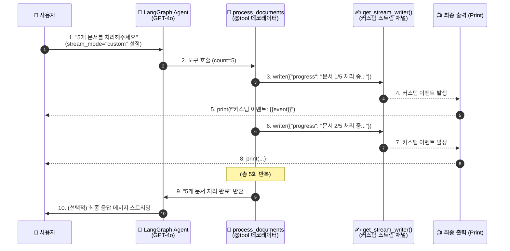

```mermaid
sequenceDiagram
    autonumber
    participant User as 👤 사용자
    participant Agent as 🤖 LangGraph Agent<br>(GPT-4o)
    participant Tool as 🔧 process_documents<br>(@tool 데코레이터)
    participant Writer as ✍️ get_stream_writer()<br>(커스텀 스트림 채널)
    participant Output as 📺 최종 출력 (Print)

    User->>Agent: 1. "5개 문서를 처리해주세요"<br>(stream_mode="custom" 설정)
    
    Agent->>Tool: 2. 도구 호출 (count=5)
    
    Tool->>Writer: 3. writer({"progress": "문서 1/5 처리 중..."})
    Writer-->>Output: 4. 커스텀 이벤트 발생
    Output-->>User: 5. print(f"커스텀 이벤트: {{event}}")
    
    Tool->>Writer: 6. writer({"progress": "문서 2/5 처리 중..."})
    Writer-->>Output: 7. 커스텀 이벤트 발생
    Output-->>User: 8. print(...)
    
    Note over Tool: (총 5회 반복)
    
    Tool->>Agent: 9. "5개 문서 처리 완료" 반환
    Agent->>User: 10. (선택적) 최종 응답 메시지 스트리밍
```

