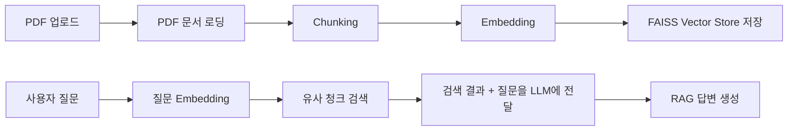

# PDF → Chunking → Vector Store 저장 → 질문 검색 → LLM 답변 생성
> **PDF → Chunking → Vector Store 저장 → 질문 검색 → LLM 답변 생성**까지 수행하는 **간단한 Colab용 RAG 실습 코드**입니다.
> 실습 대상은 업로드한 **2026 충청남도 임신·출산·육아 지원 안내서 PDF**입니다. 

LangChain에서는 문서 분할에 `RecursiveCharacterTextSplitter`를 많이 사용하고, 벡터 저장소는 `similarity_search` 같은 공통 인터페이스로 검색할 수 있습니다. ([Docs by LangChain][1])

---

## 1. 패키지 설치

```python
!pip install -q \
    langchain \
    langchain-community \
    langchain-openai \
    langchain-huggingface \
    langchain-text-splitters \
    pypdf \
    faiss-cpu \
    sentence-transformers
```

---

## 2. PDF 업로드

```python
from google.colab import files

uploaded = files.upload()

PDF_PATH = list(uploaded.keys())[0]
print("업로드된 PDF:", PDF_PATH)
```

업로드할 파일:

```text
2026 충청남도 임신.출산.육아 지원 안내서_수정(6.8)(2).pdf
```

---

## 3. PDF 문서 로딩

```python
from langchain_community.document_loaders import PyPDFLoader

loader = PyPDFLoader(PDF_PATH)
pages = loader.load()

print("전체 페이지 수:", len(pages))
print(pages[0].page_content[:500])
```

---

## 4. Chunking: 문서를 작은 조각으로 나누기

```python
from langchain_text_splitters import RecursiveCharacterTextSplitter

text_splitter = RecursiveCharacterTextSplitter(
    chunk_size=600,
    chunk_overlap=100
)

chunks = text_splitter.split_documents(pages)

print("생성된 청크 수:", len(chunks))
print(chunks[0].page_content[:500])
```

---

## 5. Embedding + Vector Store 저장

```python
from langchain_huggingface import HuggingFaceEmbeddings
from langchain_community.vectorstores import FAISS

embedding_model = HuggingFaceEmbeddings(
    model_name="sentence-transformers/paraphrase-multilingual-MiniLM-L12-v2"
)

vectorstore = FAISS.from_documents(
    documents=chunks,
    embedding=embedding_model
)

retriever = vectorstore.as_retriever(
    search_kwargs={"k": 3}
)

print("Vector Store 생성 완료")
```

---

## 6. 검색 테스트

```python
query = "난임부부 시술비 지원 대상과 지원금액은?"

retrieved_docs = retriever.invoke(query)

for i, doc in enumerate(retrieved_docs, 1):
    page = doc.metadata.get("page", 0) + 1
    print(f"\n--- 검색 결과 {i} / PDF page {page} ---")
    print(doc.page_content[:700])
```

---

## 7. LLM 연결

OpenAI API Key가 필요합니다.

```python
import os
from getpass import getpass
from langchain_openai import ChatOpenAI

os.environ["OPENAI_API_KEY"] = getpass("OpenAI API Key 입력: ")

llm = ChatOpenAI(
    model="gpt-4o-mini",
    temperature=0
)
```

---

## 8. 간단한 RAG 함수 만들기

```python
def ask_rag(question):
    # 1. 질문과 유사한 문서 청크 검색
    docs = retriever.invoke(question)

    # 2. 검색된 청크를 하나의 참고 문맥으로 구성
    context = ""

    for i, doc in enumerate(docs, 1):
        page = doc.metadata.get("page", 0) + 1
        context += f"\n[참고문서 {i} | PDF page {page}]\n"
        context += doc.page_content
        context += "\n"

    # 3. LLM에게 문서 기반 답변 요청
    prompt = f"""
당신은 충청남도 임신·출산·육아 지원 안내서를 바탕으로 답변하는 RAG 상담 도우미입니다.

규칙:
1. 반드시 참고문서 내용에 근거해서 답변하세요.
2. 문서에 없는 내용은 추측하지 말고 "문서에서 확인되지 않습니다"라고 답하세요.
3. 답변은 한국어로 쉽게 정리하세요.
4. 가능하면 대상, 내용, 신청방법, 문의처 순서로 정리하세요.

[사용자 질문]
{question}

[참고문서]
{context}
"""

    response = llm.invoke(prompt)

    return response.content
```

---

## 9. 질문 실행

```python
answer = ask_rag("난임부부 시술비 지원 대상과 지원금액은?")
print(answer)
```

다른 질문도 테스트할 수 있습니다.

```python
questions = [
    "임산부 철분제와 엽산제는 어떻게 지원되나요?",
    "고위험 임산부 의료비 지원 대상은 누구인가요?",
    "청소년산모 임신 출산 의료비 지원 내용은 무엇인가요?",
    "위기임신 및 보호출산 지원은 어떤 제도인가요?",
    "첫만남이용권은 무엇인가요?"
]

for q in questions:
    print("\n==============================")
    print("질문:", q)
    print("==============================")
    print(ask_rag(q))
```

---

## 전체 흐름 요약



이 코드는 수업 실습용으로 가장 단순한 구조입니다. 핵심은 **PDF 전체를 한 번에 LLM에 넣는 것이 아니라**, 먼저 작게 나눈 뒤 질문과 관련 있는 청크만 검색해서 LLM에게 전달한다는 점입니다.

[1]: https://docs.langchain.com/oss/python/integrations/splitters?utm_source=chatgpt.com "Text splitter integrations - Docs by LangChain"
