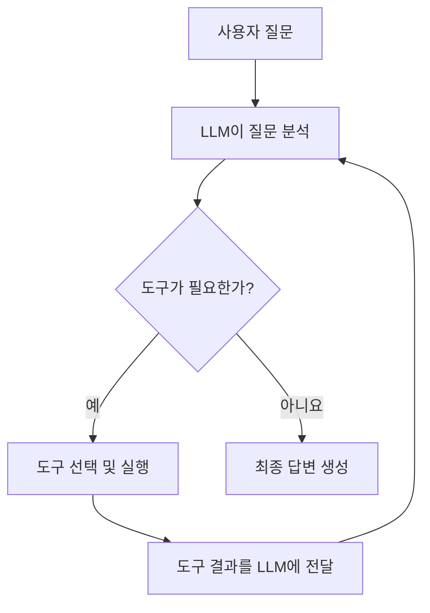

# LangChain 1.x Agents & Tools 로컬 PC 실습

WikiDocs의 Part 3 중 다음 네 주제에 대응하는 독립 실행 예제입니다.

| 파일 | 학습 주제 | 핵심 내용 |
|---|---|---|
| `01_agent_overview.py` | 3-1 Agent 개요 | 에이전트가 가격 조회 후 할인 계산 도구를 순차 호출 |
| `02_builtin_tools.py` | 3-2 내장 도구 | DuckDuckGo 웹 검색과 위키백과 검색 도구 |
| `03_custom_tools.py` | 3-3 커스텀 도구 | `@tool`로 Open-Meteo 날씨 API 도구 구현 |
| `04_toolruntime_context.py` | 3-4 ToolRuntime & 컨텍스트 | 사용자 Context 주입과 Store 기반 선호도 저장·조회 |

## 1. 권장 환경

- Windows 10/11
- Python 3.11 또는 3.12
- VS Code
- 인터넷 연결
- Google AI Studio의 Gemini API 키

Python 3.13은 일부 패키지의 호환성이 늦을 수 있으므로 수업에서는
Python 3.11 또는 3.12를 권장합니다.

## 2. Windows PowerShell에서 설치

프로젝트 폴더로 이동한 뒤 다음 명령을 순서대로 실행합니다.

```powershell
py -3.12 -m venv .venv
Set-ExecutionPolicy -Scope Process -ExecutionPolicy Bypass
.\.venv\Scripts\Activate.ps1
python -m pip install --upgrade pip
pip install -r requirements.txt
Copy-Item .env.example .env
```

CMD를 사용한다면 가상환경 활성화 명령은 다음과 같습니다.

```cmd
.venv\Scripts\activate.bat
```

## 3. API 키 설정

`.env` 파일을 열고 아래 항목에 실제 Gemini API 키를 입력합니다.

```dotenv
GOOGLE_API_KEY=실제_API_KEY
MODEL_NAME=google_genai:gemini-2.5-flash-lite
```

API 키 앞뒤에 따옴표를 넣지 않는 것을 권장합니다. `.env` 파일은
GitHub에 올리지 마세요.

## 4. 예제 실행

```powershell
python 01_agent_overview.py
python 02_builtin_tools.py
python 03_custom_tools.py
python 04_toolruntime_context.py
```

## 5. 실행 흐름



## 6. 예제별 확인 사항

### 01 Agent 개요

`get_product_price` 결과를 `calculate_discount` 입력으로 이어서 사용하는지
확인합니다. 이것이 간단한 ReAct 방식의 ‘판단 → 행동 → 결과 관찰’ 흐름입니다.

### 02 내장 도구

일반 배경지식에는 Wikipedia, 최근 정보에는 웹 검색 도구를 선택하는지
확인합니다. 공개 검색 서비스의 일시적인 제한이나 네트워크 상태에 따라
검색이 실패할 수 있습니다.

### 03 커스텀 도구

일반 Python 함수가 `@tool`을 통해 도구가 되는 과정과 타입 힌트,
docstring이 입력 스키마와 설명으로 활용되는 점을 확인합니다.
Open-Meteo는 이 실습에서 별도 API 키가 필요하지 않습니다.

### 04 ToolRuntime & 컨텍스트

- `runtime.context`: 사용자 ID처럼 실행 시 주입되는 읽기 전용 정보
- `runtime.store`: 대화가 달라도 재사용할 수 있는 장기 데이터 저장소
- `ToolRuntime` 인자는 모델이 작성하지 않고 LangChain이 자동 주입

이 예제의 `InMemoryStore`는 프로그램이 종료되면 사라집니다. 실제 서비스에서는
PostgreSQL 기반 Store 등 영속 저장소로 교체해야 합니다.

## 7. 자주 발생하는 오류

### `GOOGLE_API_KEY가 없습니다`

`.env.example`이 아니라 `.env` 파일에 키를 넣었는지 확인합니다.

### `ModuleNotFoundError`

가상환경이 활성화된 터미널에서 다시 설치합니다.

```powershell
pip install -r requirements.txt
```

### Gemini 모델을 찾을 수 없다는 404 오류

계정이나 API 버전에 따라 사용 가능한 모델이 다를 수 있습니다.
Google AI Studio에서 사용 가능한 모델명을 확인한 뒤 `.env`의
`MODEL_NAME`만 변경합니다.

### 웹 검색 오류

DuckDuckGo 공개 검색은 일시적으로 요청을 제한할 수 있습니다.
잠시 후 다시 실행하거나 다른 검색어로 시험합니다.

## 참고 자료

- WikiDocs Part 3: https://wikidocs.net/261566
- LangChain Agents: https://docs.langchain.com/oss/python/langchain/agents
- LangChain Tools: https://docs.langchain.com/oss/python/langchain/tools
- LangChain Runtime: https://docs.langchain.com/oss/python/langchain/runtime
- Open-Meteo API: https://open-meteo.com/

