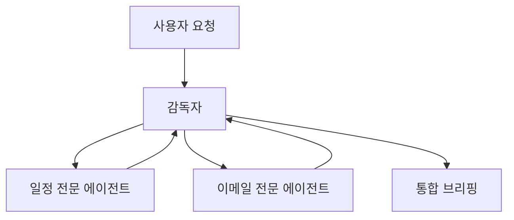
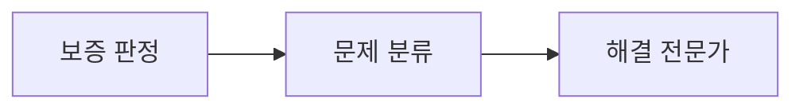
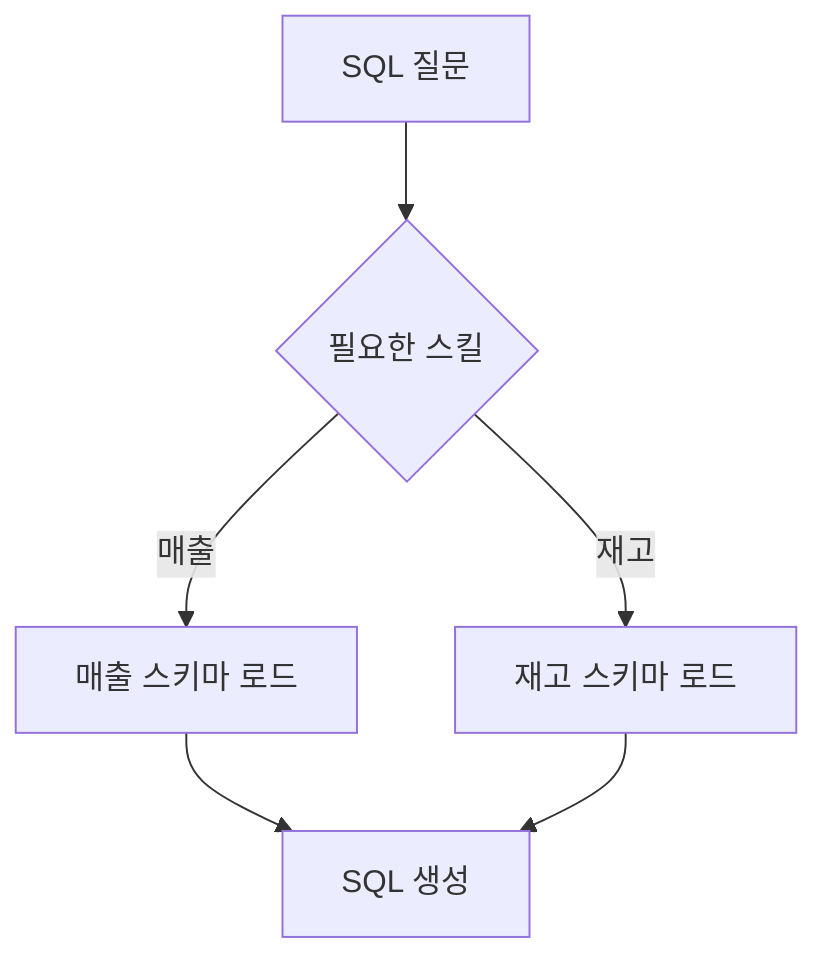
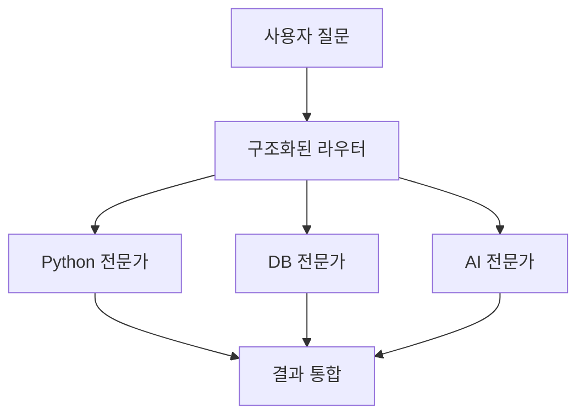

# LangChain 1.x 멀티 에이전트 로컬 실습

WikiDocs Part 5와 LangChain 공식 멀티 에이전트 문서를 참고하여 만든
로컬 PC용 독립 실행 예제입니다.

| 파일 | 패턴 | 대표 실습 |
|---|---|---|
| `01_multi_agent_overview.py` | 5-1 개요 | 기술·교육 전문가 병렬 분석 후 통합 |
| `02_subagents_pattern.py` | 5-2 Subagents | 수행비서 감독자가 일정·이메일 전문가 호출 |
| `03_handoffs_pattern.py` | 5-3 Handoffs | 보증 → 장애분류 → 해결 담당자로 제어권 전환 |
| `04_skills_pattern.py` | 5-4 Skills | 매출·재고 SQL 지침을 필요할 때만 로드 |
| `05_router_pattern.py` | 5-5 Router | 질문을 분류하고 선택된 전문가를 병렬 호출 |

## 1. 권장 환경

- Windows 10/11
- Python 3.11 또는 3.12
- VS Code
- Google AI Studio Gemini API 키
- 인터넷 연결

`requirements.txt`에는 회사·교육장처럼 SOCKS 프록시를 사용하는 환경을
고려한 HTTP 의존성도 포함되어 있습니다.

## 2. Windows PowerShell 설치

```powershell
py -3.12 -m venv .venv
Set-ExecutionPolicy -Scope Process -ExecutionPolicy Bypass
.\.venv\Scripts\Activate.ps1
python -m pip install --upgrade pip
pip install -r requirements.txt
Copy-Item .env.example .env
```

CMD에서는 다음 명령으로 활성화합니다.

```cmd
.venv\Scripts\activate.bat
```

`.env` 파일에 실제 키를 입력합니다.

```dotenv
GOOGLE_API_KEY=실제_Gemini_API_KEY
MODEL_NAME=google_genai:gemini-2.5-flash-lite
```

## 3. 실행

```powershell
python 01_multi_agent_overview.py
python 02_subagents_pattern.py
python 03_handoffs_pattern.py
python 04_skills_pattern.py
python 05_router_pattern.py
```

## 4. 패턴별 핵심 차이

| 패턴 | 제어 주체 | 상태 | 병렬 처리 | 적합한 상황 |
|---|---|---|---|---|
| Subagents | 감독자 에이전트 | 감독자가 관리 | 가능 | 여러 독립 전문 분야 |
| Handoffs | 현재 단계·전문가 | 단계 상태 유지 | 보통 순차 | 고객지원, 승인 절차 |
| Skills | 하나의 에이전트 | 로드한 지침 활용 | 제한적 | 많은 전문 프롬프트 |
| Router | 분류기 | 일반적으로 무상태 | 가능 | 질문별 명시적 분배 |

## 5. 실행 흐름

### Subagents



### Handoffs



### Skills



### Router



## 6. 실행 검증 범위

제공 시점에 모든 Python 파일의 문법 검사와 필수 파일 구성을 검사합니다.
다만 실제 Gemini 호출은 사용자의 API 키, 계정별 모델 사용 가능 여부,
인터넷 상태와 당시 패키지 버전에 영향을 받습니다.

`gemini-2.5-flash-lite`를 사용할 수 없다는 404 오류가 나오면 Google AI
Studio에서 사용 가능한 모델을 확인한 뒤 `.env`의 `MODEL_NAME`을 변경하세요.

## 참고

- WikiDocs Part 5: https://wikidocs.net/318925
- LangChain Multi-agent: https://docs.langchain.com/oss/python/langchain/multi-agent
- Subagents: https://docs.langchain.com/oss/python/langchain/multi-agent/subagents
- Handoffs: https://docs.langchain.com/oss/python/langchain/multi-agent/handoffs
- Skills: https://docs.langchain.com/oss/python/langchain/multi-agent/skills
- Router: https://docs.langchain.com/oss/python/langchain/multi-agent/router
