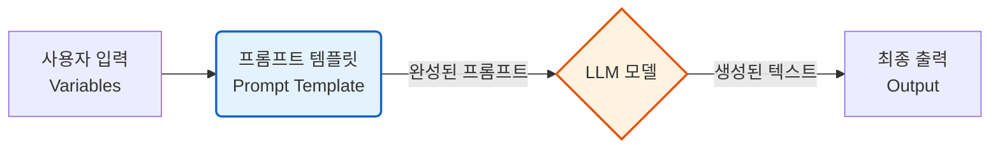
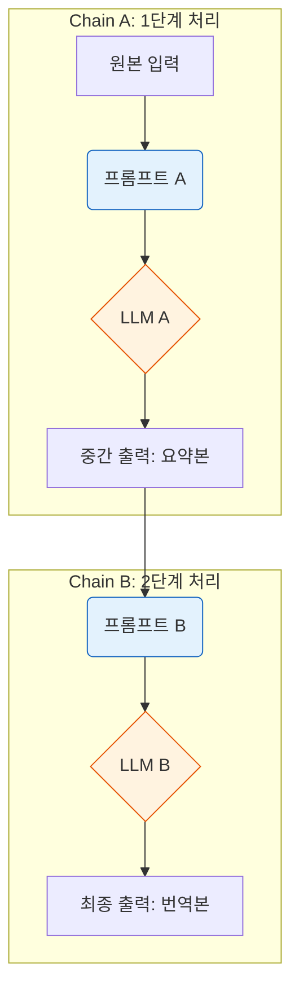
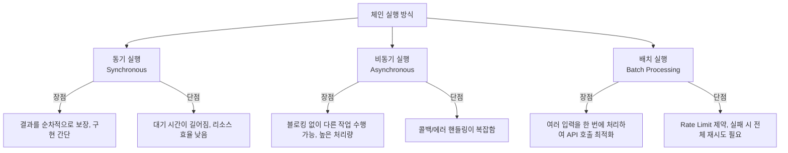
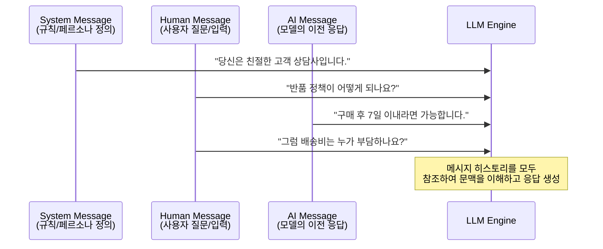
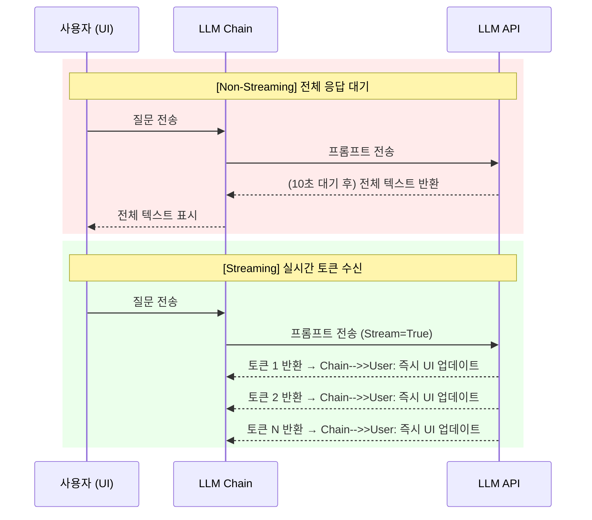

# 1-2. LLM 체인(LLMChain) 만들기: 이론적 개요

LLM 체인(Chain)은 단일 LLM 호출만으로는 해결할 수 없는 복잡한 작업을 수행하기 위해, **여러 구성 요소(프롬프트, LLM, 출력 파서 등)를 파이프라인 형태로 연결한 것**을 의미합니다. 체인을 사용하면 입력 데이터가 여러 단계를 거치며 변환되고, 최종적으로 고도화된 결과를 얻을 수 있습니다.

---

## 1-2-1. 기본 LLM 체인 (Prompt + LLM)

가장 기초적인 체인 형태로, **프롬프트 템플릿(Prompt Template)** 과 **LLM 모델**을 1:1로 연결한 구조입니다. 사용자의 입력 변수를 프롬프트에 주입하여 LLM에 전달하고, 그 결과를 반환합니다.

### 📊 구조 시각화 (Mermaid)

### ⚖️ 장단점 및 응용 분야
* **장점**: 구조가 단순하여 디버깅이 쉽고, 재사용성이 높습니다.
* **단점**: 단일 단계의 논리만 처리 가능하므로, 복잡한 추론이나 다단계 처리에는 한계가 있습니다.
* **응용 분야**: 단순 번역기, 감성 분석, 짧은 문장 요약, 이메일 초안 작성 등 1단계로 끝나는 작업.

---

## 1-2-2. 멀티 체인 (Multi-Chain / Sequential Chain)

여러 개의 기본 LLM 체인을 직렬 또는 병렬로 연결한 구조입니다. **첫 번째 체인의 출력이 두 번째 체인의 입력(또는 입력의 일부)으로 사용**됩니다. 복잡한 작업을 모듈화하여 처리할 때 필수적입니다.

### 📊 구조 시각화 (Mermaid)

### ⚖️ 장단점 및 응용 분야
* **장점**: 복잡한 작업을 단계별로 분해(Split)하여 처리하므로 정확도가 높아지고, 각 단계를 독립적으로 최적화하거나 교체할 수 있습니다.
* **단점**: LLM을 여러 번 호출하므로 **지연 시간(Latency)** 이 증가하고, 비용이 상승합니다. 또한 앞 단계의 오류(Hallucination 등)가 다음 단계로 전파(Error Propagation)될 수 있습니다.
* **응용 분야**: 
  1. 논문 분석 (추출 → 요약 → 한국어 번역)
  2. 복잡한 데이터 파싱 (웹 크롤링 → 구조화된 JSON 변환 → DB 저장 포맷팅)

---

## 1-2-3. 체인을 실행하는 방법 (Execution Methods)

체인을 실제로 구동하는 방식에 따라 시스템의 성능과 사용자 경험이 크게 달라집니다. 주로 **동기/비동기**와 **단일/배치** 실행으로 나뉩니다.

### 📊 구조 시각화 (Mermaid)

### ⚖️ 장단점 및 응용 분야
* **장점**: 워크로드(Workload)의 특성에 맞춰 실행 방식을 선택함으로써 시스템 리소스를 효율적으로 관리할 수 있습니다.
* **단점**: 비동기나 배치 처리는 네트워크 오류, API Rate Limit, 부분적 실패(Partial Failure)에 대한 예외 처리 로직이 복잡해집니다.
* **응용 분야**: 
  * *동기*: 실시간 챗봇 응답 대기
  * *비동기*: 백그라운드에서 대량의 문서 인덱싱
  * *배치*: 하루 치 뉴스 기사 1,000개를 한 번에 요약하여 DB에 저장

---

## 1-2-4. 메시지 (Messages)

초기 LLM은 단순한 문자열(String)을 입력받았으나, 최신 Chat 모델은 **역할(Role)이 부여된 메시지 객체(Message Object)** 리스트를 입력으로 받도록 설계되었습니다. 이는 대화의 맥락(Context)과 페르소나를 유지하는 데 필수적입니다.

### 📊 구조 시각화 (Mermaid)

### ⚖️ 장단점 및 응용 분야
* **장점**: 대화의 흐름(History)을 명확히 구분할 수 있어, 다중 턴(Multi-turn) 대화에서 일관성을 유지하기 쉽습니다. System 메시지를 통해 모델의 행동 양식을 강력하게 제어할 수 있습니다.
* **단점**: 단순 문자열보다 데이터 구조가 복잡하며, 메시지 히스토리가 길어질수록 **컨텍스트 윈도우(Context Window)** 를 빠르게 소모하여 비용과 지연 시간이 증가합니다.
* **응용 분야**: 챗봇, 페르소나 기반 AI 비서, 코드 리뷰 어시스턴트 등 대화형 애플리케이션 전반.

---

## 1-2-5. 스트리밍 (Streaming)

LLM이 전체 응답을 생성할 때까지 기다리는 대신, **토큰(Token)이나 청크(Chunk) 단위로 생성되는 즉시 데이터를 조각조각 받아오는 방식**입니다.

### 📊 구조 시각화 (Mermaid)

### ⚖️ 장단점 및 응용 분야
* **장점**: 
  1. **인지적 지연 시간(Perceived Latency)** 을 획기적으로 줄여 사용자 경험(UX)을 향상시킵니다.
  2. 사용자가 원하지 않는 응답을 발견하면 즉시 생성을 중단(Stop Generation)할 수 있어 API 비용을 절약할 수 있습니다.
* **단점**: 프론트엔드 구현이 복잡해지며, 네트워크 패킷 오버헤드로 인해 전체 처리 완료 시간(Total Time to First Token은 빠르지만, 전체 완료 시간은 비슷하거나 약간 더 길 수 있음)에는 큰 차이가 없을 수 있습니다.
* **응용 분야**: ChatGPT와 같은 실시간 챗 인터페이스, 실시간 동시 통역, 장문 콘텐츠 생성 시 사용자의 실시간 피드백 반영.

---

### 💡 종합 요약
LLM 체인은 단순한 모델 호출을 넘어 **애플리케이션의 로직을 정의하는 핵심 프레임워크**입니다. 
1. **기본 체인**으로 프로토타입을 만들고, 
2. **멀티 체인**으로 복잡도를 관리하며, 
3. **메시지** 구조로 문맥을 제어하고, 
4. **스트리밍**과 적절한 **실행 방식**을 통해 최적의 사용자 경험을 제공하는 것이 현대 LLM 애플리케이션 개발의 정석입니다. 

이러한 체인 개념은 이후 배울 **RAG(Retrieval-Augmented Generation)** 나 **Agent** 구조로 확장되는 기초가 됩니다.
