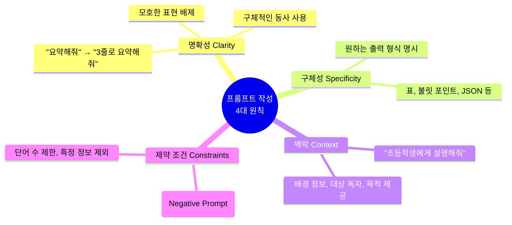
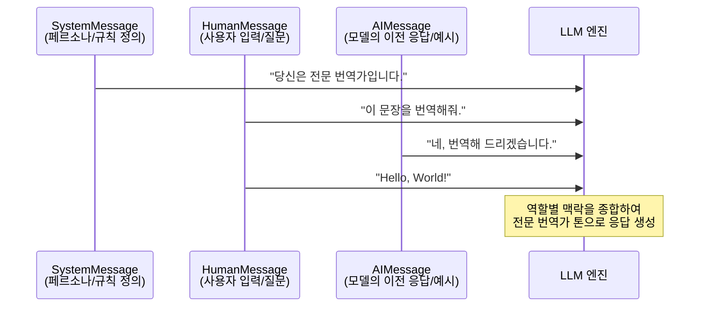

# 1-3. 프롬프트(Prompt)의 이해와 활용

프롬프트는 거대 언어 모델(LLM)에게 원하는 작업을 수행하도록 지시하는 **입력 텍스트**입니다. LLM의 성능을 극대화하기 위해서는 단순히 질문을 던지는 것을 넘어, 모델이 이해하기 쉽고 명확한 구조로 지시하는 '프롬프트 엔지니어링' 기술이 필수적입니다.

---

## 1-3-1. 프롬프트 작성 원칙

효과적인 프롬프트를 작성하기 위해 반드시 지켜야 할 4가지 핵심 원칙입니다.

### 📊 구조 시각화 (Mermaid)


### ⚖️ 장단점 및 응용 분야
* **장점**: 모델의 환각(Hallucination)을 줄이고, 일관성 있고 예측 가능한 고품질 결과를 얻을 수 있습니다.
* **단점**: 원칙을 모두 적용하면 프롬프트가 길어질 수 있으며, 초기 작성에 시간이 다소 소요됩니다.
* **응용 분야**: 모든 LLM 기반 작업의 기초. 특히 법률 문서 검토, 의료 정보 요약, 비즈니스 보고서 작성 등 정확도가 중요한 업무.

---

## 1-3-2. 프롬프트 템플릿 (PromptTemplate)

고정된 텍스트와 동적으로 변하는 **변수(Variable)** 를 결합하여 재사용 가능한 프롬프트 구조를 만드는 방법입니다.

### 📊 구조 시각화 (Mermaid)
```mermaid
graph LR
    A[프롬프트 템플릿<br>'{topic}에 대해 {tone} 톤으로 설명해줘.'] --> B{변수 주입}
    C[변수: topic='AI'] --> B
    D[변수: tone='친절한'] --> B
    B --> E[완성된 프롬프트<br>'AI에 대해 친절한 톤으로 설명해줘.']
    E --> F[LLM 모델]
    
    style A fill:#e3f2fd,stroke:#1565c0,stroke-width:2px
    style E fill:#e8f5e9,stroke:#2e7d32,stroke-width:2px
```

### ⚖️ 장단점 및 응용 분야
* **장점**: 동일한 논리 구조를 유지하면서 데이터(변수)만 교체하여 대량의 작업을 자동화할 수 있습니다. 코드와 프롬프트를 분리하여 유지보수가 용이합니다.
* **단점**: 변수가 너무 많아지면 템플릿 관리가 복잡해질 수 있습니다.
* **응용 분야**: 대량의 고객 리뷰를 한 번에 분석할 때 리뷰 텍스트만 변수로 넣어 반복 실행, 개인화된 마케팅 이메일 대량 생성.

---

## 1-3-3. 챗 프롬프트 템플릿 (ChatPromptTemplate)

단순한 문자열이 아닌, **역할(Role)** 에 따라 메시지를 구조화하는 템플릿입니다. 현대 Chat 모델은 `System`(규칙), `Human`(사용자), `AI`(어시스턴트)의 대화 형식을 가장 잘 이해합니다.

### 📊 구조 시각화 (Mermaid)


### ⚖️ 장단점 및 응용 분야
* **장점**: 모델의 페르소나를 강력하게 고정할 수 있으며, 다중 턴(Multi-turn) 대화에서 문맥(Context)을 잃지 않고 일관성을 유지합니다.
* **단점**: 단순 텍스트 템플릿보다 구조가 복잡하며, 대화 히스토리가 길어질수록 토큰 사용량이 급증합니다.
* **응용 분야**: 챗봇, AI 비서, 코드 리뷰 어시스턴트, 역할극(Role-play) 기반 교육 시뮬레이터.

---

## 1-3-4. Few-shot Prompt

모델에게 정답을 직접 가르치는 것이 아니라, **몇 가지 예시(Shot)** 를 보여줌으로써 원하는 패턴이나 형식을 유추하게 만드는 기법입니다. (예시가 0개인 것은 Zero-shot)

### 📊 구조 시각화 (Mermaid)
```mermaid
graph TD
    subgraph Zero-shot Prompt
        Z1[지시문: 감정을 분류해줘.] --> Z2[입력: 서비스가 너무 느려요.]
        Z2 --> Z3[출력: ??? (모델이 형식을 모름)]
    end

    subgraph Few-shot Prompt
        F1[지시문: 감정을 분류해줘.] --> F2[예시 1: 음식이 맛있어요. → 긍정]
        F2 --> F3[예시 2: 배차가 너무 늦어요. → 부정]
        F3 --> F4[입력: 서비스가 너무 느려요.]
        F4 --> F5[출력: 부정 (패턴을 학습하여 정확히 분류)]
    end

    style F5 fill:#e8f5e9,stroke:#2e7d32,stroke-width:2px
```

### ⚖️ 장단점 및 응용 분야
* **장점**: 모델을 재학습(Fine-tuning)시키지 않고도 복잡한 형식(JSON, 특정 말투, 논리적 추론)을 따르게 할 수 있어 비용 대비 효과가 매우 높습니다.
* **단점**: 예시를 프롬프트에 포함해야 하므로 입력 토큰 길이가 늘어나 비용이 증가하고, 컨텍스트 윈도우를 빠르게 소모할 수 있습니다.
* **응용 분야**: 복잡한 JSON 포맷 추출, 특정 브랜드의 말투(톤앤매너) 모방, Chain-of-Thought(단계별 추론) 유도.

---

## 1-3-5. Partial Prompt (부분 프롬프트)

프롬프트 템플릿의 **일부 변수만 미리 채워두고(Partial)**, 나머지 변수는 나중에 실행 시점에 채우는 기법입니다. 템플릿을 단계적으로 조립할 때 유용합니다.

### 📊 구조 시각화 (Mermaid)
```mermaid
graph LR
    A[원본 템플릿<br>'{system_rule} {user_input} {format}'] --> B[Partial 적용]
    
    C[미리 채울 변수<br>system_rule='번역가'<br>format='JSON으로'] --> B
    
    B --> D[부분 완성 템플릿<br>'번역가 {user_input} JSON으로']
    
    D --> E[나중에 채울 변수<br>user_input='안녕하세요']
    E --> F[최종 프롬프트<br>'번역가 안녕하세요 JSON으로']
    
    style D fill:#fff3e0,stroke:#e65100,stroke-width:2px
    style F fill:#e8f5e9,stroke:#2e7d32,stroke-width:2px
```

### ⚖️ 장단점 및 응용 분야
* **장점**: 복잡한 프롬프트를 모듈 단위로 관리할 수 있습니다. 예를 들어, 시스템 규칙과 출력 형식은 고정해 두고, 사용자 입력만 동적으로 받아 처리하는 파이프라인을 쉽게 구축할 수 있습니다.
* **단점**: 변수 관리가 분산되어 초기 설계 시 어떤 변수를 Partial로 할지 결정하는 것이 까다로울 수 있습니다.
* **응용 분야**: 현재 날짜/시간을 자동으로 주입하는 프롬프트, 고정된 회사 규정(System Rule)을 미리 로드해 두고 사용자 질문만 변수로 받는 RAG 시스템.

---

### 💡 종합 요약
프롬프트는 LLM 애플리케이션의 **소프트웨어 코드**와 같습니다. 
1. **원칙**에 따라 명확하게 지시하고, 
2. **템플릿**으로 재사용성을 높이며, 
3. **Chat 구조**로 역할을 부여하고, 
4. **Few-shot**으로 패턴을 학습시키고, 
5. **Partial**로 유연하게 조립하는 것이 고품질 AI 서비스를 만드는 핵심입니다.
