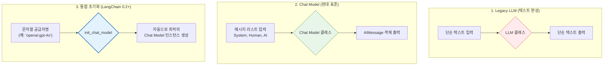

# 1-4. LangChain의 언어 모델(Model)

# 1-4. LangChain의 언어 모델(Model) 이해

LangChain에서 '모델(Model)'은 AI의 두뇌 역할을 하는 핵심 구성 요소입니다. LangChain은 다양한 AI 공급업체의 모델을 **표준화된 인터페이스**로 감싸서, 개발자가 공급업체에 종속되지 않고 유연하게 모델을 교체하거나 조합할 수 있도록 설계되었습니다.

---

## 1-4-1. LangChain 모델 유형

LangChain은 역사적 흐름과 사용 목적에 따라 크게 세 가지 방식으로 모델을 다룹니다.

### 📊 구조 시각화 (Mermaid)


### 1-4-1-1. LLM (Legacy Text Completion)
* **개념:** 과거 GPT-3 시대의 방식입니다. 단순한 문자열을 입력하면 다음에 올 문자열을 예측하여 반환합니다.
* **장점:** 구조가 단순하고 API 호출 오버헤드가 미세하게 낮습니다.
* **단점:** 대화의 맥락(System, User, Assistant)을 구조적으로 관리하기 어렵고, 현대의 지시어 기반(Instruction-tuned) 모델과는 궁합이 좋지 않습니다.
* **응용 분야:** 레거시 시스템 유지보수, 매우 단순한 텍스트 완성 작업.

### 1-4-1-2. Chat Model (현대 표준)
* **개념:** ChatGPT, Claude 등 현대 모델의 표준입니다. `SystemMessage`, `HumanMessage`, `AIMessage`와 같은 객체 리스트를 입력받아, 구조화된 `AIMessage` 객체를 반환합니다.
* **장점:** 대화의 역할(Role)과 맥락(Context)을 명확히 구분하여 관리할 수 있으며, 함수 호출(Function Calling) 등 고급 기능을 완벽하게 지원합니다.
* **단점:** 단순 텍스트 완성보다는 데이터 구조가 다소 복잡합니다.
* **응용 분야:** 챗봇, 에이전트, RAG, 페르소나 기반 AI 등 거의 모든 현대 AI 애플리케이션.

### 1-4-1-3. 통합 모델 초기화 (`init_chat_model`)
* **개념:** LangChain 0.2 버전부터 도입된 기능입니다. 공급업체별 클래스(`ChatOpenAI`, `ChatAnthropic` 등)를 직접 임포트하는 대신, `"openai:gpt-4o"` 또는 `"anthropic:claude-3-5-sonnet"`과 같은 문자열 하나로 모델을 초기화합니다.
* **장점:** **공급업체 벤더 락인(Vendor Lock-in) 방지**. 코드 수정 없이 문자열만 바꾸면 OpenAI에서 Claude나 Gemini로 모델을 즉시 교체할 수 있습니다.
* **단점:** 공급업체 특유의 고급 파라미터를 세밀하게 제어하려면 추가 설정이 필요할 수 있습니다.
* **응용 분야:** 멀티 클라우드 전략, A/B 테스트, 공급업체 변경이 빈번한 프로토타이핑 단계.

---

## 1-4-2. LangChain의 LLM 모델 파라미터 설정

모델의 창의성(Temperature), 최대 길이(Max Tokens), 특정 단어 중단(Stop) 등을 제어하는 파라미터를 설정하는 두 가지 주요 방법이 있습니다.

### 📊 구조 시각화 (Mermaid)
```mermaid
graph LR
    subgraph "방법 1: 직접 전달 (정적)"
        A1[모델 인스턴스 생성 시] --> A2["temperature=0.7<br>max_tokens=500"]
        A2 --> A3[고정된 설정으로<br>일관된 동작 보장]
    end

    subgraph "방법 2: bind 메소드 (동적)"
        B1[기본 모델 인스턴스] --> B2[".bind() 메소드 호출"]
        B2 --> B3["런타임에 동적으로<br>파라미터 덮어쓰기 또는 추가"]
        B3 --> B4[체인(Chain) 구성 시<br>최고의 유연성 제공]
    end

    style A3 fill:#fff3e0,stroke:#e65100
    style B4 fill:#e8f5e9,stroke:#2e7d32,stroke-width:2px
```

### 1-4-2-1. LLM 모델에 직접 파라미터 전달
* **개념:** `ChatOpenAI(temperature=0.7, max_tokens=500)`처럼 모델을 처음 생성할 때 파라미터를 고정합니다.
* **장점:** 코드가 직관적이며, 해당 모델 인스턴스를 사용하는 모든 곳에서 일관된 동작을 보장합니다.
* **단점:** 런타임에 상황에 따라 파라미터를 바꾸려면 새로운 모델 인스턴스를 다시 생성해야 하므로 유연성이 떨어집니다.
* **응용 분야:** 전체 애플리케이션의 기본 창의성 수준을 고정해야 하는 경우.

### 1-4-2-2. LLM 모델 파라미터를 추가로 바인딩 (`bind` 메소드)
* **개념:** 이미 생성된 모델 인스턴스에 `.bind(stop=["\n"], temperature=0.2)`와 같이 메소드를 체이닝하여 런타임에 파라미터를 동적으로 주입합니다.
* **장점:** **유연성 극대화**. 동일한 모델 인스턴스를 재사용하면서도, 특정 체인(Chain)이나 도구(Tool) 호출 시에만 특수한 파라미터(예: JSON 출력 강제, 특정 토큰에서 중단)를 적용할 수 있습니다.
* **단점:** 코드가 다소 복잡해 보일 수 있으며, 파라미터 우선순위(기본값 vs bind 값)를 이해해야 합니다.
* **응용 분야:** 구조화된 데이터 추출(JSON 모드), 특정 키워드가 나오면 생성을 중단해야 하는 정제 작업, 공급업체 전용 고급 기능(예: OpenAI의 `response_format`) 활성화.

---

## 1-4-3. 다른 공급업체의 모델 살펴보기

LangChain은 OpenAI 외에도 주요 AI 기업의 모델을 표준화된 인터페이스로 지원합니다.

### 📊 구조 시각화 (Mermaid)
```mermaid
mindmap
  root((주요 LLM 공급업체))
    OpenAI
      장점: 생태계 표준, 함수 호출 안정성
      단점: 상대적으로 높은 비용, 검열 엄격
      대표 모델: GPT-4o, GPT-4o-mini
    Claude Anthropic
      장점: 압도적인 컨텍스트 윈도우(200K+), 뛰어난 추론 및 안전성, 자연스러운 문체
      단점: API 속도 변동성, 일부 기능 제한
      대표 모델: Claude 3.5 Sonnet, Claude 3 Opus
    Gemini Google
      장점: 멀티모달 네이티브(이미지/비디오/오디오 직접 입력), 무료 티어 관대함, Google 생태계 통합
      단점: 환각(Hallucination)이 가끔 발생, 프롬프트 민감도 높음
      대표 모델: Gemini 1.5 Pro, Gemini 1.5 Flash
```

### 1-4-3-1. Claude (Anthropic)
* **이론적 특징:** 'Constitutional AI' 철학을 바탕으로 안전성과 정렬(Alignment)에 중점을 둡니다. 특히 **긴 컨텍스트 윈도우**(최대 20만 토큰 이상)에서 문서 전체를 읽고 정확히 정보를 찾아내는 능력(Needle In A Haystack)이 탁월합니다.
* **장점:** 복잡한 추론 작업에서 환각이 적고, 문장 구조가 매우 자연스럽고 인간적입니다.
* **단점:** OpenAI에 비해 서드파티 도구 연동 생태계가 약간 작습니다.
* **응용 분야:** 장문 문서 분석(법률 계약서, 논문), 창의적인 글쓰기, 안전성이 최우선인 고객 응대 챗봇.

### 1-4-3-2. Gemini (Google)
* **이론적 특징:** 처음부터 **멀티모달(Multimodal)** 로 설계되었습니다. 텍스트뿐만 아니라 이미지, 오디오, 비디오를 별도의 변환 과정 없이 직접 입력으로 받아 이해하고 분석할 수 있습니다.
* **장점:** 100만 토큰에 달하는 엄청난 컨텍스트 처리 능력과 빠른 처리 속도(Flash 모델), Google 워크스페이스(Google Docs, Drive)와의 원활한 통합 잠재력.
* **단점:** 지시어(Instruction)를 따르는 정밀도가 때때로 불안정하며, 특정 프롬프트에서 과도한 거절(Refusal) 반응을 보일 수 있습니다.
* **응용 분야:** 영상/이미지 내용 기반 Q&A, 대규모 데이터 로그 실시간 분석, Google 생태계 기반의 자동화 워크플로우.

---

### 💡 종합 요약
LangChain에서 모델을 다루는 핵심은 **"추상화(Abstraction)"** 와 **"유연성(Flexibility)"** 입니다. 
1. 현대 애플리케이션은 반드시 **Chat Model**을 기반으로 해야 하며,
2. `init_chat_model`을 통해 공급업체 변경에 대비하고,
3. `bind` 메소드를 활용해 런타임에 모델의 행동을 정밀하게 제어함으로써, 
단순한 API 호출을 넘어 **견고하고 유지보수가 쉬운 AI 파이프라인**을 구축할 수 있습니다.
