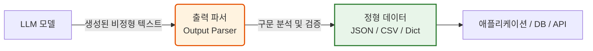

# 1-5. 출력 파서(Output Parser)

# 1-5. 출력 파서(Output Parser)의 이해

거대 언어 모델(LLM)은 본질적으로 **비정형 텍스트(Unstructured Text)** 를 생성합니다. 하지만 실제 애플리케이션(데이터베이스, API, 웹 UI 등)은 **정형 데이터(Structured Data)** 를 필요로 합니다. 출력 파서는 LLM이 생성한 텍스트를 애플리케이션이 즉시 사용할 수 있는 특정 형식(CSV, JSON, 파이썬 딕셔너리 등)으로 변환하고 검증하는 '번역기이자 검증기' 역할을 합니다.

### 📊 출력 파서의 역할 시각화 (Mermaid)


---

## 1-5-1. CSV Parser (Comma-Separated Values)

CSV 파서는 LLM의 출력을 쉼표(,)와 줄바꿈(\n)으로 구분된 표 형식의 데이터로 변환하는 도구입니다.

### 📊 구조 시각화 (Mermaid)
```mermaid
graph TD
    A[LLM 출력 텍스트<br>'이름,나이,직업\n김철수,30,개발자'] --> B{CSV Parser}
    B -->|1. 줄바꿈으로 행 분리| C[행 Row 분리]
    B -->|2. 쉼표로 열 분리| D[열 Column 분리]
    C & D --> E[정형화된 리스트/딕셔너리<br>[{'이름':'김철수', '나이':'30', '직업':'개발자'}]]
    
    style A fill:#ffebee,stroke:#c62828
    style E fill:#e3f2fd,stroke:#1565c0,stroke-width:2px
```

### ⚖️ 장단점 및 응용 분야
* **장점**: 
  1. 구조가 매우 단순하여 LLM이 생성하기 쉽고, 파싱 실패 확률이 낮습니다.
  2. 변환된 데이터를 엑셀이나 스프레드시트 소프트웨어로 바로 내보내기에 최적화되어 있습니다.
  3. 토큰 사용량이 JSON에 비해 적어 비용 효율적입니다.
* **단점**: 
  1. 데이터 내부에 쉼표(예: "서울, 강남구")가 포함되면 파싱이 깨질 수 있어(Fragile) 처리가 까다롭습니다.
  2. 중첩(Nested) 구조나 계층적 데이터를 표현할 수 없습니다(평면적 구조만 가능).
* **응용 분야**: 
  - 문서에서 추출한 단순 명단(이름, 이메일, 전화번호) 정리
  - 제품 리뷰에서 평점과 한 줄 요약만 표 형태로 추출
  - 재고 목록이나 단순 로그 데이터의 정규화

---

## 1-5-2. JSON Parser (JavaScript Object Notation)

JSON 파서는 LLM의 출력을 키-값(Key-Value) 쌍으로 이루어진 계층적 구조의 데이터로 변환하고, 유효한 JSON 형식인지 검증하는 도구입니다. 현대 AI 애플리케이션에서 **가장 표준적이고 널리 쓰이는 파서**입니다.

### 📊 구조 시각화 (Mermaid)
```mermaid
graph TD
    A[LLM 출력 텍스트<br>'{\n  "name": "김철수",\n  "skills": ["Python", "AI"]\n}'] --> B{JSON Parser}
    
    B -->|1. 구문 검증<br>Syntax Validation| C{유효한 JSON인가?}
    C -->|Yes| D[네이티브 객체 변환<br>Dict / Object]
    C -->|No| E[파싱 오류 발생<br>또는 재시도(Retry) 로직]
    
    D --> F[계층적 데이터 활용 가능<br>예: user.skills[0]]
    
    style B fill:#fff3e0,stroke:#e65100,stroke-width:2px
    style D fill:#e8f5e9,stroke:#2e7d32,stroke-width:2px
    style E fill:#ffebee,stroke:#c62828
```

### ⚖️ 장단점 및 응용 분야
* **장점**: 
  1. **계층적 구조 지원**: 객체 안에 객체나 리스트를 넣을 수 있어 복잡한 데이터 관계를 표현하기에 완벽합니다.
  2. **범용성**: 거의 모든 프로그래밍 언어와 웹 API가 JSON을 표준 데이터 교환 형식으로 지원합니다.
  3. **스키마 검증**: Pydantic 등의 라이브러리와 결합하면, LLM이 출력한 데이터가 미리 정의한 데이터 타입(예: 나이는 반드시 정수)을 따르는지 엄격하게 검증할 수 있습니다.
* **단점**: 
  1. LLM이 가끔 유효하지 않은 JSON(예: 마지막 쉼표 누락, 큰따옴표 대신 작은따옴표 사용)을 생성할 수 있어, 이를 처리하기 위한 예외 처리 또는 재시도(Retry) 로직이 필요합니다.
  2. CSV보다 문법 규칙이 엄격하여, 프롬프트에 형식 지시를 명확히 하지 않으면 파싱 실패율이 높아집니다.
* **응용 분야**: 
  - 외부 API 호출을 위한 페이로드(Payload) 자동 생성
  - 복잡한 문서(계약서, 이력서)에서 구조화된 정보(인적사항, 경력 리스트, 계약 조건) 추출
  - RAG 시스템에서 문서에 메타데이터(태그, 카테고리, 작성일)를 자동으로 부여할 때

---

### 💡 종합 요약: 파서 선택 가이드

| 구분 | CSV Parser | JSON Parser |
| :--- | :--- | :--- |
| **데이터 구조** | 평면적 (2차원 표) | 계층적 (트리 구조, 중첩 가능) |
| **LLM 생성 난이도** | 낮음 (단순 텍스트) | 중간~높음 (엄격한 구문 필요) |
| **파싱 안정성** | 높음 (단, 데이터 내 쉼표 주의) | 중간 (유효성 검증 로직 필수) |
| **주요 용도** | 스프레드시트 내보내기, 단순 리스트 | API 연동, 복잡한 데이터 추출, 스키마 검증 |

**핵심 인사이트:** 출력 파서는 단순히 텍스트를 자르는 도구가 아닙니다. **"LLM에게 원하는 출력 형식을 지시(Prompting)하고, 그 결과가 규칙을 지키는지 검증(Validation)하여 애플리케이션의 안정성을 보장하는 게이트키퍼"** 로 이해해야 합니다.
