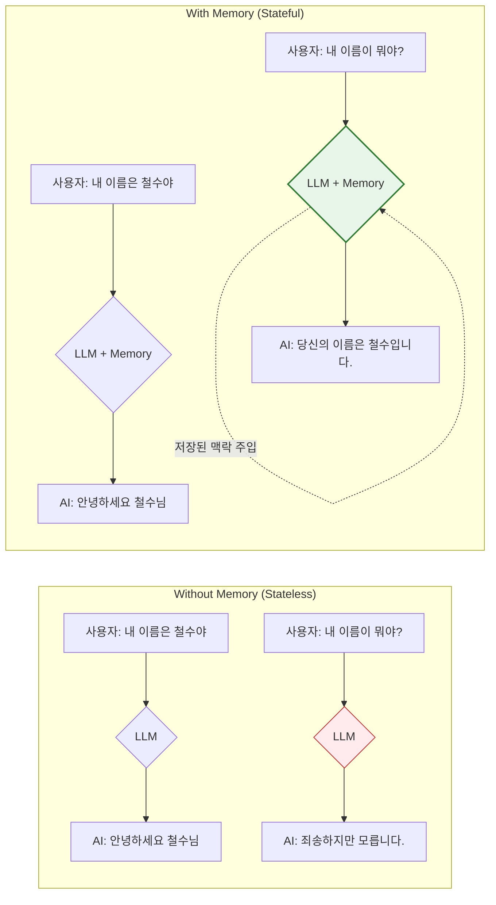
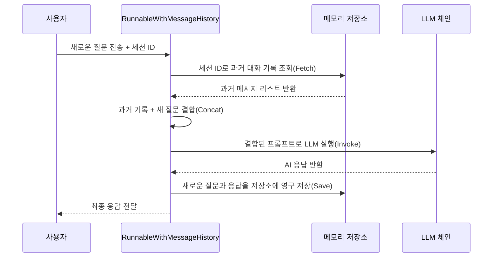

# 1-6. 메모리와 대화 관리

# 1-6. 메모리와 대화 관리(Memory)의 이해

거대 언어 모델(LLM)은 본질적으로 **상태 비저장성(Stateless)** 을 가집니다. 즉, 이전 대화 내용을 스스로 기억하지 못하며, 매번 새로운 요청이 들어올 때마다 과거의 맥락 없이 독립적으로 응답을 생성합니다. 메모리(Memory)는 이러한 한계를 극복하고, **과거 대화 기록을 현재 프롬프트에 주입**하여 일관성 있는 다중 턴(Multi-turn) 대화를 가능하게 하는 핵심 메커니즘입니다.

---

## 1-6-1. 메모리의 필요성과 개념

### 📊 개념 시각화 (Mermaid)


### ⚖️ 장단점 및 응용 분야
* **장점**: 대화의 연속성(Continuity)과 일관성(Consistency)을 보장하며, 사용자가 매번 배경 정보를 반복해서 입력할 필요가 없어 사용자 경험(UX)이 획기적으로 개선됩니다.
* **단점**: 대화 기록이 누적될수록 프롬프트의 길이(토큰 수)가 증가하여 API 비용이 상승하고, 응답 지연 시간(Latency)이 길어질 수 있습니다. 또한 컨텍스트 윈도우 한계를 초과할 위험이 있습니다.
* **응용 분야**: 챗봇, AI 비서, 상담 지원 시스템 등 모든 대화형 애플리케이션의 기본 요소.

---

## 1-6-2. RunnableWithMessageHistory

LangChain에서 대화 기록을 관리하는 가장 표준적이고 추상화된 래퍼(Wrapper) 패턴입니다. 개발자가 수동으로 메시지 리스트를 관리하고 저장하는 번거로움을 대신해 줍니다.

### 📊 구조 시각화 (Mermaid)


### ⚖️ 장단점 및 응용 분야
* **장점**: 메모리 관리 로직(조회, 결합, 저장)을 완전히 자동화하여 핵심 비즈니스 로직(프롬프트, LLM)에 집중할 수 있습니다. 세션 ID 기반의 다중 사용자 관리가 용이합니다.
* **단점**: 내부적으로 메시지가 어떻게 주입되고 저장되는지 블랙박스화될 수 있어, 매우 특수한 형태의 메모리 주입 로직이 필요할 때는 제어가 제한적일 수 있습니다.
* **응용 분야**: 일반적인 채팅 UI, 세션 기반의 고객 지원 챗봇, 개인화된 튜터링 시스템.

---

## 1-6-3. 다양한 메모리 저장 방식

대화 기록을 어디에, 어떻게 저장하느냐에 따라 시스템의 성능, 확장성, 비용이 결정됩니다.

### 📊 구조 시각화 (Mermaid)
```mermaid
mindmap
  root((메모리 저장 방식))
    인메모리 In-Memory
      장점: 극도로 빠름, 구현 간단
      단점: 서버 재시작 시 데이터 손실, 확장 불가
      용도: 프로토타이핑, 일회성 데모
    파일 시스템 File System
      장점: 영구 저장, 로컬 환경에서 간편
      단점: 동시성 문제, 대규모 처리에 부적합
      용도: 개인용 로컬 AI 비서
    키-값 저장소 Redis
      장점: 고속 읽기/쓰기, TTL(수명) 설정 가능, 확장성 우수
      단점: 별도 인프라 구축 및 유지보수 필요
      용도: 프로덕션 레벨의 실시간 챗봇
    관계형/NoSQL DB
      장점: 구조화된 메타데이터(사용자 정보, 시간) 관리 용이
      단점: Redis 대비 읽기 속도가 상대적으로 느림
      용도: 대화 기록을 사용자 프로필과 연계해야 하는 CRM
```

### ⚖️ 장단점 및 응용 분야
* **장점**: 애플리케이션의 규모와 요구사항에 맞춰 최적의 저장소를 선택함으로써 비용과 성능의 균형을 맞출 수 있습니다.
* **단점**: 인메모리를 제외한 외부 저장소를 사용할 경우 네트워크 오버헤드와 직렬화/역직렬화(Serialization) 비용이 발생합니다.
* **응용 분야**: 스타트업 초기(인메모리) → 서비스 확장기(Redis) → 엔터프라이즈급(DB 연계)으로 저장소를 마이그레이션하는 아키텍처 설계.

---

## 1-6-4. 단기 메모리 패턴 (Short-term Memory Patterns)

단순히 모든 대화를 무한정 누적하면 컨텍스트 윈도우를 초과합니다. 이를 방지하기 위해 최근 대화만 유지하는 패턴들이 사용됩니다.

### 📊 구조 시각화 (Mermaid)
```mermaid
graph TD
    subgraph "Sliding Window (슬라이딩 윈도우)"
        W1[대화 1] -.삭제.-> W2[대화 2]
        W2 -.삭제.-> W3[대화 3]
        W3 --> W4[대화 4]
        W4 --> W5[대화 5]
        Note over W3, W5: 최근 N개의 메시지 또는 N개의 토큰만 유지
    end

    subgraph "Summary Buffer (요약 버퍼)"
        S1[과거 대화 전체] --> S2{LLM 요약}
        S2 --> S3["과거 대화 요약본<br>예: 사용자는 철수이며, 파이썬을 배우고 있음"]
        S3 --> S4[최근 대화 2~3개]
        Note over S3, S4: 과거는 요약본으로 압축, 최근만 원문 유지
    end

    style W5 fill:#e3f2fd,stroke:#1565c0
    style S4 fill:#e8f5e9,stroke:#2e7d32,stroke-width:2px
```

### ⚖️ 장단점 및 응용 분야
* **장점**: 컨텍스트 윈도우 초과를 방지하고, 불필요한 토큰 비용을 절감하며, LLM이 가장 최근의 중요한 정보에 집중하도록 합니다.
* **단점**: 슬라이딩 윈도우는 초기에 언급된 중요한 정보가 잊힐 수 있으며, 요약 버퍼는 요약을 위한 추가적인 LLM 호출 비용이 발생합니다.
* **응용 분야**: 장시간 진행되는 상담 챗봇, 코딩 어시스턴트(최근 코드 컨텍스트 유지), 게임 내 NPC 대화.

---

## 1-6-5. 장기 메모리 (Long-term Memory)

단기 메모리가 '최근 대화의 흐름'을 관리한다면, 장기 메모리는 **세션(Session)을跨越하여 사용자의 선호도, 사실(Fact), 관계 등을 영구적으로 기억**하는 것을 목표로 합니다.

### 📊 구조 시각화 (Mermaid)
```mermaid
flowchart LR
    A[대화 중 사실 추출<br>예: "나는 고양이를 좋아해"] --> B(정보 추출기<br>Extractor LLM)
    B --> C[구조화된 사실<br>Fact: User likes cats]
    C --> D[임베딩 및 벡터 저장소<br>Vector Store]
    
    E[새로운 세션 시작<br>"추천해줘"] --> F[사용자 프로필 검색<br>Retrieval]
    D --> F
    F --> G[검색된 사실 주입<br>"사용자는 고양이를 좋아함"]
    G --> H{LLM}
    H --> I[개인화된 응답<br>"고양이 장난감을 추천합니다."]
    
    style D fill:#fff3e0,stroke:#e65100
    style I fill:#e8f5e9,stroke:#2e7d32,stroke-width:2px
```

### ⚖️ 장단점 및 응용 분야
* **장점**: 사용자에게 "나를 기억해주는" 진정한 개인화(Personalization) 경험을 제공할 수 있습니다. RAG(Retrieval-Augmented Generation) 기술을 메모리에 적용한 형태입니다.
* **단점**: 아키텍처가 매우 복잡해지며, 잘못된 정보가 저장되거나(Hallucinated Memory), 관련 없는 정보가 검색되어 응답을 방해할 수 있습니다.
* **응용 분야**: 개인 비서 AI(취향, 일정 기억), 헬스케어 코칭(과거 건강 상태 기반 조언), 장기 고객 관계 관리(CRM) 챗봇.

---

### 💡 종합 요약
메모리 관리는 LLM 애플리케이션이 **'일회성 도구'에서 '지속적인 파트너'로 진화**하는 핵심 열쇠입니다.
1. **개념**을 이해하고, 
2. `RunnableWithMessageHistory`로 **기본 골격**을 잡으며, 
3. 서비스 규모에 맞는 **저장 방식**을 선택하고, 
4. **단기 패턴**으로 컨텍스트를 최적화하며, 
5. 필요 시 **장기 메모리**로 개인화를 더하는 것이 완성도 높은 AI 시스템을 만드는 정석입니다.
