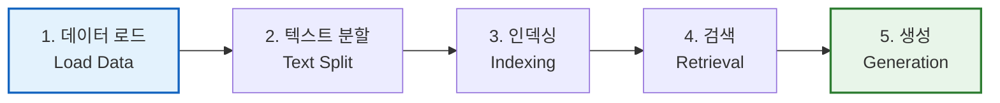
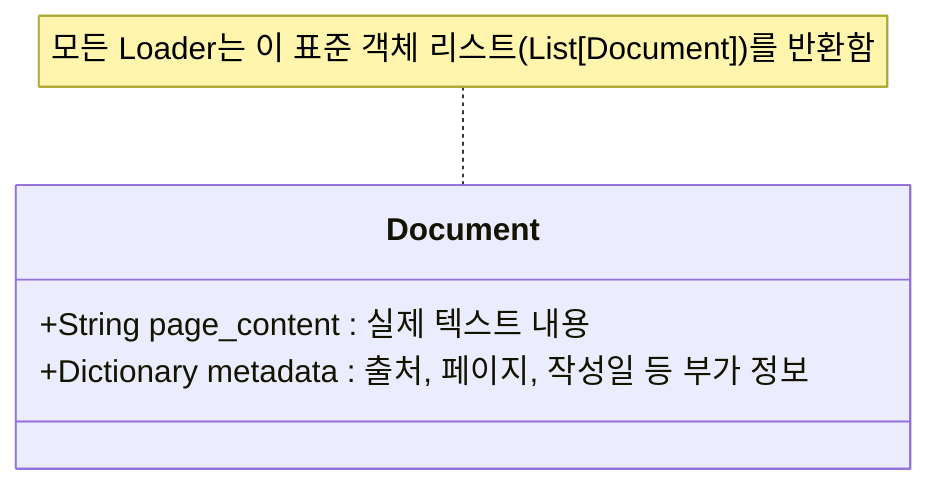
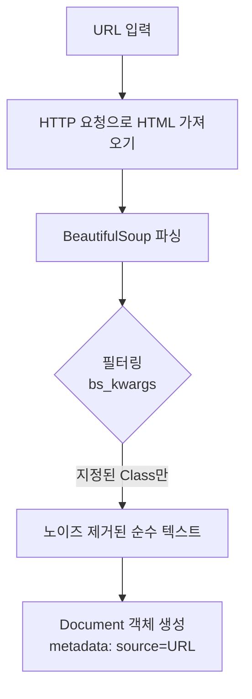
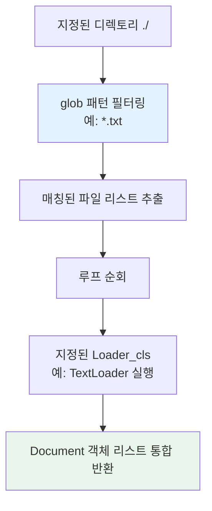

# Part 2. RAG 기법

# 2-1. RAG 개요

### 1) 이론적 개념
RAG는 거대 언어 모델(LLM)의 내재적 지식 한계(최신 정보 부재, 환각 현상 등)를 극복하기 위해, **외부 데이터를 검색(Retrieval)하여 생성(Generation) 과정에 주입하는 하이브리드 아키텍처**입니다. 모델이 사전 학습된 지식뿐만 아니라, 신뢰할 수 있는 외부 문맥(Context)을 기반으로 답변을 생성하도록 유도합니다.

### 2) RAG 파이프라인 5단계 (Mermaid 시각화)

1. **데이터 로드:** 외부 소스(웹, PDF, 텍스트 등)에서 원본 데이터를 수집하여 시스템이 이해할 수 있는 형식으로 변환합니다.
2. **텍스트 분할:** LLM의 컨텍스트 윈도우 제한과 검색 정확도를 높이기 위해 긴 문서를 의미 있는 작은 단위(Chunk)로 나눕니다.
3. **인덱싱:** 분할된 텍스트를 임베딩(벡터)으로 변환하여 벡터 데이터베이스에 저장하고 검색 가능한 구조로 만듭니다.
4. **검색:** 사용자의 질문(Query)을 임베딩하여 벡터 DB에서 의미적으로 가장 유사한 문서(Top-K)를 찾아냅니다.
5. **생성:** 검색된 문서(문맥)와 사용자의 질문을 프롬프트에 결합하여 LLM이 최종 답변을 생성합니다.

### 3) 장단점 및 응용 분야
* **장점:** 환각(Hallucination) 감소, 최신/비공개 데이터 반영 가능, 파인튜닝 대비 비용 및 시간 효율성 우수, 출처(Source) 추적 가능.
* **단점:** 검색 품질(Retrieval Quality)이 최종 답변 품질을 결정하므로 검색기 튜닝이 어렵고, 다단계 파이프라인으로 인해 응답 지연(Latency)이 발생할 수 있음.
* **응용 분야:** 기업 내부 지식 베이스 Q&A, 법률/의료 문서 분석 챗봇, 실시간 뉴스 기반 리포트 생성.

---

## 2-2. RAG - Document Loader 개요

### 1) 이론적 개념
Document Loader는 RAG 파이프라인의 **첫 번째 관문**으로, 다양한 형식의 원본 데이터 소스를 LangChain이 표준으로 정의한 `Document` 객체로 변환하는 역할을 합니다. 이를 통해 이후의 분할(Splitting)과 인덱싱(Indexing) 단계가 일관된 인터페이스로 처리될 수 있도록 합니다.

### 2) Document 객체의 표준 구조 (Mermaid 시각화)


---

## 2-2-1. 웹 문서 (WebBaseLoader)

### 1) 이론적 개념
지정된 URL에서 웹페이지의 HTML을 가져와 텍스트로 추출하는 로더입니다. 내부적으로 `BeautifulSoup` 라이브러리를 활용하여 HTML 파싱을 수행합니다. 웹페이지에는 광고, 내비게이션 바 등 불필요한 노이즈가 많으므로, `bs_kwargs` 파라미터를 통해 특정 클래스(예: `article-header`, `article-content`)만 지정하여 핵심 본문만 추출하는 것이 핵심입니다.

### 2) 작동 원리 시각화


### 3) 장단점 및 응용 분야
* **장점:** 실시간 웹 정보 수집이 가능하며, HTML 구조 분석을 통해 원하는 본문만 정밀하게 추출할 수 있습니다.
* **단점:** 웹사이트의 레이아웃이 변경되면 파싱 로직이 실패할 수 있으며(Fragile), 동적 렌더링(JS 기반) 사이트에는 추가 설정이 필요합니다.
* **응용 분야:** 뉴스 기사 요약, 경쟁사 블로그 모니터링, 위키백과 지식 베이스 구축.

---

## 2-2-2. 텍스트 문서 (TextLoader)

### 1) 이론적 개념
로컬 환경에 저장된 단일 `.txt` 파일을 읽어들이는 가장 기본적이고 단순한 로더입니다. 파일의 전체 내용을 하나의 문자열로 읽어 `page_content`에 할당하고, 파일 경로를 `metadata`의 `source`로 자동 기록합니다.

### 2) 작동 원리 시각화


### 3) 장단점 및 응용 분야
* **장점:** 구조가 매우 단순하여 처리 속도가 빠르고, 외부 종속성(Dependency)이 거의 없어 안정적입니다.
* **단점:** 파일 내의 구조적 정보(제목, 문단 구분 등)를 유지하지 못하고 단순 텍스트 덩어리로 변환되므로, 복잡한 문서에는 부적합합니다.
* **응용 분야:** 단순한 로그 파일 분석, 정리된 텍스트 노트, 전처리된 정제 데이터 로드.

---

## 2-2-3. 디렉토리 폴더 (DirectoryLoader)

### 1) 이론적 개념
단일 파일이 아닌, 특정 디렉토리(폴더) 내에 존재하는 **다수의 파일을 일괄(Batch)로 로드**할 때 사용합니다. `glob` 패턴(예: `*.txt`, `*.pdf`)을 사용하여 확장자별로 파일을 필터링하고, 실제 읽기 작업은 내부적으로 지정된 하위 로더(예: `TextLoader`, `UnstructuredLoader`)에게 위임(Delegation)하는 래퍼(Wrapper) 역할을 합니다.

### 2) 작동 원리 시각화


### 3) 장단점 및 응용 분야
* **장점:** 수십, 수백 개의 파일을 일일이 코드로 지정하지 않고 자동화하여 로드할 수 있어 확장성(Scalability)이 뛰어납니다.
* **단점:** 폴더 내 파일 크기가 너무 크면 메모리 부족(OOM) 오류가 발생할 수 있으므로, 로드 후 즉시 분할(Splitting)하거나 지연 로딩(Lazy Loading) 전략이 필요할 수 있습니다.
* **응용 분야:** 회의록 폴더 전체 분석, 다수의 연구 논문(PDF) 일괄 처리, 고객 문의 내역 텍스트 파일 군(群) 분석.

---

## 2-2-4. CSV 문서 (CSVLoader)

*(※ 제공된 PDF에는 명시적 상세 내용이 없으나, 요청하신 목차 완성을 위해 LangChain 표준 이론을 기반으로 보충합니다.)*

### 1) 이론적 개념
구조화된 표 형식 데이터인 `.csv` 파일을 처리하는 로더입니다. 기본적으로 **CSV의 각 행(Row)을 독립적인 `Document` 객체**로 변환하거나, 지정된 열(Column)을 `page_content`로, 나머지 열을 `metadata`로 매핑하여 구조적 정보를 최대한 보존합니다.

### 2) 작동 원리 시각화
```mermaid
flowchart TD
    A[CSV 파일] --> B[행(Row) 단위 파싱]
    B --> C{매핑 전략}
    C -->|전략 1| D[모든 열을 합쳐 page_content로]
    C -->|전략 2| E[특정 열은 page_content,<br>나머지는 metadata로]
    D & E --> F[Document 객체 리스트 생성]
```

### 3) 장단점 및 응용 분야
* **장점:** 구조화된 데이터의 메타데이터(예: 작성일, 카테고리, 작성자)를 손실 없이 `metadata` 필드에 보존할 수 있어, 이후 벡터 검색 시 메타데이터 필터링(Metadata Filtering)에 매우 유리합니다.
* **단점:** 행(Row) 간의 관계성(Relational Context)이 끊어질 수 있으며, 쉼표(,)가 포함된 텍스트 데이터가 있을 경우 파싱 오류가 발생할 수 있습니다.
* **응용 분야:** 제품 카탈로그 Q&A, 직원 디렉토리 검색, 구조화된 FAQ 데이터베이스 구축.

---

### 💡 강의용 종합 요약 (Key Takeaway)
RAG의 성능은 **"어떤 데이터를, 얼마나 깔끔하게 가져오느냐(Load)"** 에서 50% 이상 결정됩니다. 
* 실시간 정보가 필요하면 **WebBaseLoader**, 
* 단순 텍스트면 **TextLoader**, 
* 대량 파일 처리면 **DirectoryLoader**, 
* 구조화된 데이터면 **CSVLoader**를 선택하여, 모두 동일한 `Document(page_content, metadata)` 표준으로 통일시키는 것이 RAG 파이프라인 구축의 첫 번째 성공 비결입니다.
