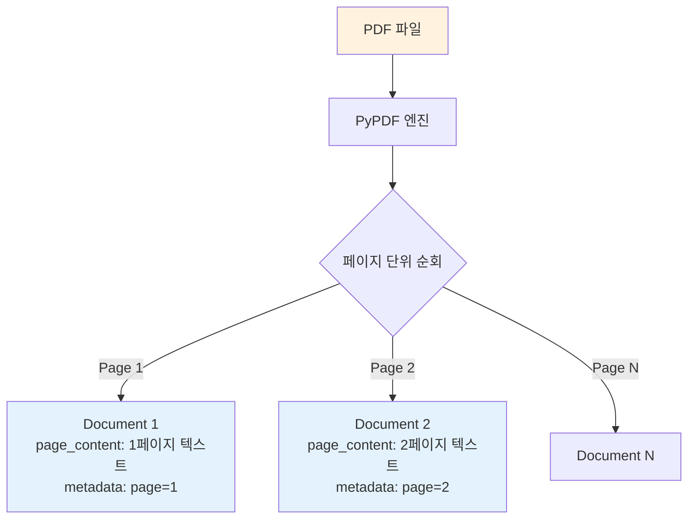
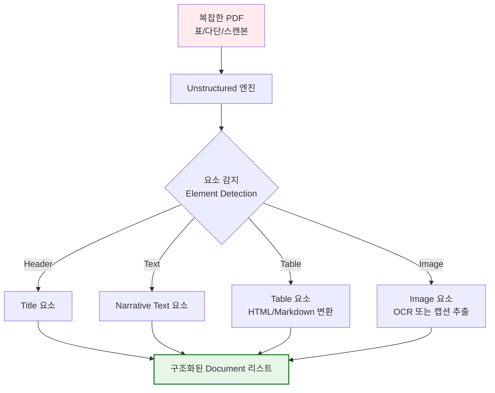
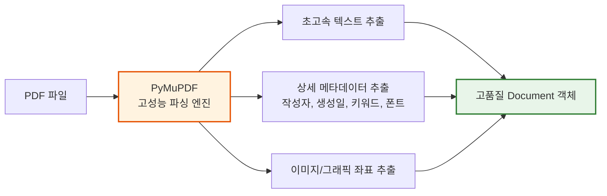
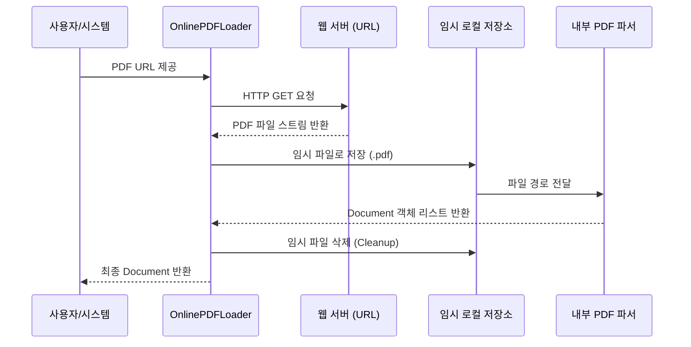
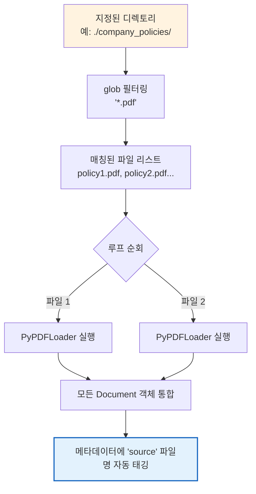

# 2-2-5. PDF 문서

# 2-2-5. PDF 문서 로딩 전략

PDF는 '휴대용 문서 형식(Portable Document Format)'으로, 화면에 보이는 그대로를 유지하는 것이 주목적이기 때문에 내부 텍스트 구조(문단, 표, 헤더)가 깨져 있는 경우가 많습니다. 따라서 문서의 복잡도와 목적에 따라 적절한 로더를 선택해야 합니다.

---

## 2-2-5-1. PDF 문서를 페이지별로 로드 (PyPDFLoader)

### 1) 이론적 개념
LangChain에서 가장 기본적이고 널리 사용되는 PDF 로더입니다. 내부적으로 `pypdf` 라이브러리를 사용하여 PDF 파일을 **페이지(Page) 단위**로 읽어들이며, 각 페이지를 독립적인 `Document` 객체로 반환합니다.

### 2) 작동 원리 시각화 (Mermaid)

### 3) 장단점 및 응용 분야
* **장점:** 가볍고(Lightweight) 처리 속도가 빠르며, 추가적인 무거운 의존성(Dependency) 설치가 필요 없습니다. 페이지 번호 메타데이터가 자동으로 포함되어 청크(Chunk) 관리에 유리합니다.
* **단점:** 다단(Multi-column) 레이아웃, 표(Table), 이미지 내 텍스트 등을 제대로 인식하지 못하고 텍스트가 뒤섞여 추출되는 경우가 많습니다.
* **응용 분야:** 단단(Single-column) 구조의 학술 논문, 간단한 보고서, 초기 RAG 프로토타이핑.

---

## 2-2-5-2. 형식이 없는 PDF 문서 로드 (UnstructuredPDFLoader)

### 1) 이론적 개념
`unstructured` 라이브러리를 기반으로 하며, 레이아웃이 복잡하거나 스캔된 PDF와 같이 '형식이 없는(Unstructured)' 문서를 처리하는 데 특화되어 있습니다. 단순 텍스트 추출을 넘어 문서 내의 **요소(Element)** (예: 제목, 본문 단락, 표, 이미지 캡션)를 식별하여 분리해 냅니다.

### 2) 작동 원리 시각화 (Mermaid)

### 3) 장단점 및 응용 분야
* **장점:** 복잡한 레이아웃을 이해하고 표나 이미지를 별도의 객체로 분리할 수 있어, RAG의 검색 정확도를 획기적으로 높일 수 있습니다.
* **단점:** 처리 속도가 상대적으로 느리며, `unstructured`, `pdf2image`, `tesseract`(OCR용) 등 무거운 외부 라이브러리 설치가 필요합니다.
* **응용 분야:** 재무제표(표 데이터 중요), 스캔된 역사적 문서, 제품 매뉴얼(다단 및 다이어그램 포함).

---

## 2-2-5-3. PDF 문서의 메타데이터를 상세하게 추출 (PyMuPDFLoader)

### 1) 이론적 개념
`PyMuPDF`(내부 모듈명: `fitz`)를 사용하는 로더로, **압도적인 처리 속도**와 **풍부한 메타데이터 추출**이 가장 큰 특징입니다. 텍스트뿐만 아니라 폰트 정보, 이미지, 문서 속성(작성자, 생성일, 키워드 등)을 세밀하게 파싱할 수 있습니다.

### 2) 작동 원리 시각화 (Mermaid)

### 3) 장단점 및 응용 분야
* **장점:** `PyPDFLoader`보다 훨씬 빠르고 텍스트 추출 정확도가 높습니다. 메타데이터가 풍부하여 이후 벡터 DB에서 '작성자'나 '날짜'로 필터링(Metadata Filtering)할 때 매우 유리합니다.
* **단점:** `PyMuPDF` 라이브러리 자체가 C 기반 바이너리를 포함하고 있어, 일부 특정 OS 환경에서 설치 시 오류가 발생할 수 있습니다(최근에는 많이 개선됨).
* **응용 분야:** 대용량 문서 아카이브 구축, 법적 문서 분석(작성자 및 수정 일자 추적 중요), 속도가 중요한 실시간 RAG 파이프라인.

---

## 2-2-5-4. 온라인 PDF 문서 로드 (OnlinePDFLoader)

### 1) 이론적 개념
로컬에 저장된 파일이 아닌, **웹상에 존재하는 PDF 파일의 URL**을 직접 입력받아 처리하는 로더입니다. 내부적으로는 지정된 URL에서 PDF 파일을 임시로 다운로드한 후, 기본 PDF 로더(예: PyPDFLoader)를 실행하여 문서를 반환하는 래퍼(Wrapper) 역할을 합니다.

### 2) 작동 원리 시각화 (Mermaid)

### 3) 장단점 및 응용 분야
* **장점:** 사용자가 수동으로 파일을 다운로드하고 경로를 지정하는 번거로운 과정을 자동화하여 워크플로우를 간소화합니다.
* **단점:** 네트워크 상태에 의존적이며, 접근 권한이 없거나 URL이 변경된 경우 실패합니다. 또한 악성 파일을 다운로드할 수 있는 보안 리스크가 존재합니다.
* **응용 분야:** arXiv 논문 링크를 입력하면 즉시 요약해주는 연구 보조 도구, 정부 부처의 최신 보고서 URL을 자동으로 수집하는 모니터링 봇.

---

## 2-2-5-5. 특정 폴더의 모든 PDF 문서 로드 (PyPDFDirectoryLoader)

### 1) 이론적 개념
`DirectoryLoader`의 PDF 특화 버전입니다. 지정된 디렉토리 경로 내에서 `.pdf` 확장자를 가진 모든 파일을 자동으로 찾아내고, 각 파일에 `PyPDFLoader`를 적용하여 하나의 통합된 `Document` 리스트로 반환합니다.

### 2) 작동 원리 시각화 (Mermaid)

### 3) 장단점 및 응용 분야
* **장점:** 수십, 수백 개의 PDF 파일을 일일이 코드로 지정하지 않고 한 번의 명령으로 배치(Batch) 로드할 수 있어 확장성이 뛰어납니다. 각 문서의 출처(Source) 파일명이 메타데이터에 자동으로 기록됩니다.
* **단점:** 폴더 내 PDF 파일이 매우 크거나 많을 경우, 한 번에 메모리에 로드하려 하면 Out-Of-Memory(OOM) 오류가 발생할 수 있습니다. (이 경우 Lazy Loading 전략이 필요합니다.)
* **응용 분야:** 기업 내규 폴더 전체를 챗봇의 지식 베이스로 구축, 법률 사무소의 사건별 증거 자료 폴더 일괄 분석, 대학 강의 자료실 전체 인덱싱.

---

### 💡 강의용 종합 요약 (Key Takeaway)

PDF 로더 선택은 **"문서의 복잡도"** 와 **"시스템의 제약 조건(속도/메모리)"** 사이의 트레이드오프를 이해하는 것입니다.

| 로더 이름 | 핵심 특징 | 추천 상황 |
| :--- | :--- | :--- |
| **PyPDFLoader** | 표준, 가볍고 빠름 | 단단 구조의 단순 텍스트 PDF, 프로토타이핑 |
| **UnstructuredPDFLoader** | 레이아웃/표/이미지 인식 | 재무제표, 스캔 문서, 복잡한 매뉴얼 |
| **PyMuPDFLoader** | 초고속 + 상세 메타데이터 | 대용량 처리, 저자/날짜 필터링이 중요한 아카이브 |
| **OnlinePDFLoader** | URL 기반 자동 다운로드 | 웹 링크 기반 자동화 수집 파이프라인 |
| **PyPDFDirectoryLoader** | 폴더 내 PDF 일괄 처리 | 기업 내규 폴더, 다량의 강의 자료 일괄 로드 |

강의 시 **"단순히 텍스트를 가져오는 것이 아니라, 문서의 '구조'와 '메타데이터'를 얼마나 잘 보존하느냐가 RAG의 검색 품질을 결정한다"** 는 점을 강조해 주시면 좋습니다.
