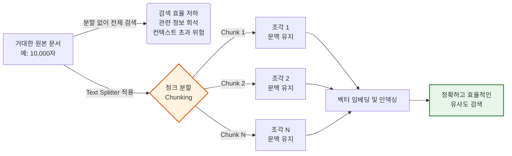
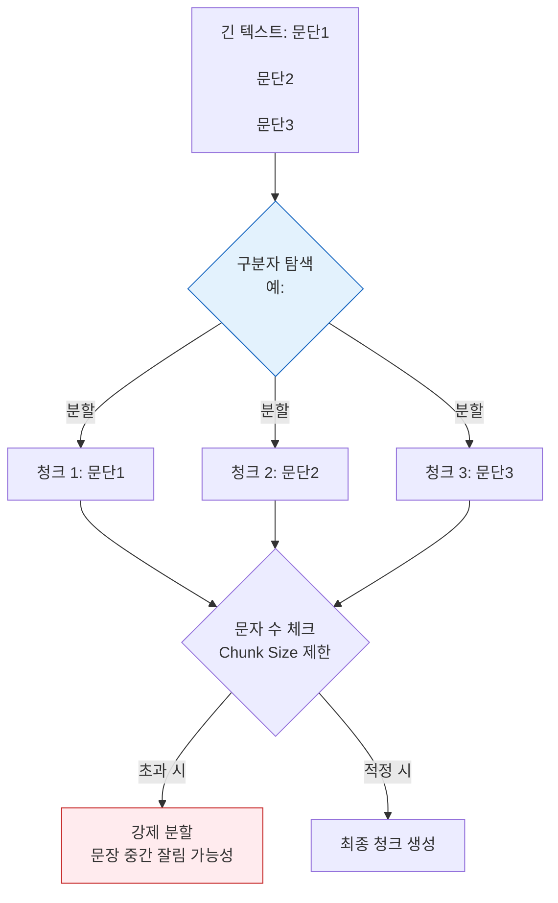
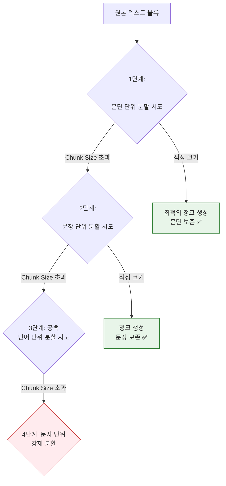
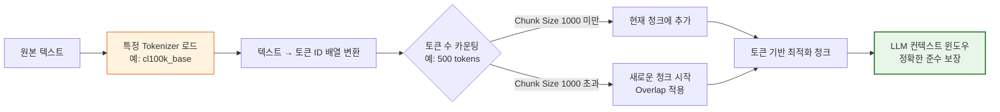

# 2-3. RAG - Text Splitter (텍스트 분할) 개요

### 1) 이론적 개념
LLM은 한 번에 처리할 수 있는 텍스트의 양에 물리적 한계(**컨텍스트 윈도우, Context Window**)가 있습니다. 또한, 거대한 문서 전체를 한 번에 검색하면 관련 없는 정보가 섞여 검색 정확도(Relevance)가 떨어지고 비용이 증가합니다. 
따라서 **Text Splitter**는 로드된 긴 문서를 의미 있는 작은 단위인 **청크(Chunk)** 로 나누는 역할을 합니다. 이때 중요한 두 가지 파라미터가 있습니다.
* **Chunk Size (청크 크기):** 각 조각의 최대 길이.
* **Chunk Overlap (청크 중복):** 인접한 청크 간에 겹치는 길이. 문맥(Context)이 잘리는 것을 방지하여 의미의 연속성을 보장합니다.

### 2) 텍스트 분할의 필요성 시각화 (Mermaid)

---

## 2-3-1. CharacterTextSplitter (문자 기반 분할)

### 1) 이론적 개념
가장 단순하고 직관적인 분할 방식입니다. 지정된 **특정 문자(예: 줄바꿈 `\n\n`, 공백 ` `, 쉼표 `,`)** 를 구분자(Separator)로 사용하여 텍스트를 자르고, **문자(Character) 수**를 기준으로 청크 크기를 측정합니다.

### 2) 작동 원리 시각화 (Mermaid)

### 3) 장단점 및 응용 분야
* **장점:** 
  1. 처리 속도가 매우 빠르고 계산 리소스가 거의 들지 않습니다.
  2. 구현이 단순하여 디버깅이 쉽고 예측 가능합니다.
* **단점:** 
  1. **의미론적(Semantic) 구조를 무시**합니다. 문장이나 단어 중간에서 강제로 잘릴 수 있어 문맥이 파괴될 위험이 큽니다.
  2. '문자 수'는 LLM이 실제로 이해하는 '토큰 수'와 다르기 때문에, 설정한 크기보다 LLM 컨텍스트를 더 많이 소모할 수 있습니다.
* **응용 분야:** 
  - 줄바꿈이나 특정 구분자가 명확하게 규칙적으로 배치된 데이터 (예: 간단한 로그 파일, 시나 대본, 구분자가 명확한 리스트 형태 데이터).

---

## 2-3-2. RecursiveCharacterTextSplitter (재귀적 문자 분할)

### 1) 이론적 개념
LangChain에서 **가장 기본적이고 권장되는(Default)** 분할 방식입니다. 텍스트의 의미론적 구조를 최대한 보존하기 위해, 큰 단위부터 작은 단위로 **단계적(재귀적)으로 분할**을 시도합니다. 
기본적으로 `["\n\n", "\n", " ", ""]` 순서의 구분자 리스트를 사용하며, 청크 크기를 초과할 때까지 더 작은 단위로 쪼개는 방식을 취합니다.

### 2) 작동 원리 시각화 (Mermaid)

### 3) 장단점 및 응용 분야
* **장점:** 
  1. **문맥 보존률이 매우 높습니다.** 가능한 한 문단이나 문장 단위를 유지하려고 노력하므로, 임베딩 모델이 의미를 파악하기에 훨씬 유리합니다.
  2. 대부분의 자연어 문서(에세이, 기사, 보고서)에 범용적으로 적용 가능합니다.
* **단점:** 
  1. 단순 문자 분할보다는 계산 과정이 조금 더 복잡합니다.
  2. 표(Table)나 코드 블록처럼 내부에 공백이나 줄바꿈이 의미 있는 구조에서는 의도치 않게 잘릴 수 있습니다.
* **응용 분야:** 
  - 위키백과, 뉴스 기사, 기업 내규 문서, 학술 논문 등 **대부분의 일반적인 자연어 텍스트 RAG 파이프라인**.

---

## 2-3-3. 토큰 수를 기준으로 텍스트 분할 (Tokenizer 활용)

### 1) 이론적 개념
LLM은 문자(Character)가 아닌 **토큰(Token)** 단위로 텍스트를 이해하고 처리합니다. (예: 영어는 약 1토큰당 0.75단어, 한국어는 1토큰당 2~3글자 정도). 
이 방식은 특정 LLM의 **Tokenizer(예: OpenAI의 Tiktoken, HuggingFace Tokenizer)** 를 로드하여, 실제 모델이 인식하는 토큰 개수를 정확히 세고 이를 기준으로 청크를 분할합니다.

### 2) 작동 원리 시각화 (Mermaid)

### 3) 장단점 및 응용 분야
* **장점:** 
  1. **LLM의 컨텍스트 윈도우 한계를 100% 정확하게 준수**합니다. "문자 수로는 괜찮았는데 토큰 수로는 초과"하는 오류를 원천 차단합니다.
  2. API 비용 예측이 매우 정확해집니다.
  3. 한국어처럼 문자 대비 토큰 비율이 높은 언어에서 문자 기반 분할의 비효율성을 해결합니다.
* **단점:** 
  1. Tokenizer 모델을 로드하고 토큰화 과정을 거치므로, 단순 문자 카운팅보다 **처리 속도가 느리고 리소스를 더 소모**합니다.
  2. 사용하는 LLM 모델이 변경될 때마다 해당 모델에 맞는 Tokenizer로 설정을 변경해 주어야 합니다.
* **응용 분야:** 
  - 컨텍스트 윈도우가 엄격하게 제한된 모델 사용 시.
  - API 토큰 비용 최적화가 최우선인 상용 서비스.
  - 다국어(특히 한국어, 일본어 등) 문서를 정밀하게 처리해야 하는 고급 RAG 시스템.

---

### 💡 강의용 종합 요약 (Key Takeaway)

| 분할 방식 | 핵심 기준 | 문맥 보존 | 처리 속도 | 추천 상황 |
| :--- | :--- | :---: | :---: | :--- |
| **Character** | 문자 수 | 낮음 | 매우 빠름 | 규칙적인 구분자가 있는 단순 데이터 |
| **Recursive** | 의미 단위(문단→문장) | **높음** | 빠름 | **일반적인 자연어 문서 (Default)** |
| **Tokenizer** | 실제 토큰 수 | 중간~높음 | 상대적으로 느림 | LLM 컨텍스트 한계 엄수, 비용 최적화 |

**강의 팁:** 수강생들에게 *"문자 1,000자는 LLM에게 토큰 1,000개가 아닐 수 있습니다. RAG의 검색 품질은 '얼마나 의미 있는 덩어리(Chunk)로 잘랐는가'에서 50% 이상 결정되므로, 단순한 문서가 아니라면 무조건 **RecursiveCharacterTextSplitter**로 시작하여 필요 시 **Tokenizer** 기반으로 정밀 조정하는 것을 권장합니다."* 라고 강조해 주시면 좋습니다.
