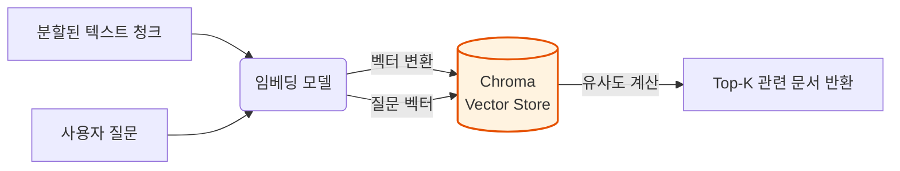
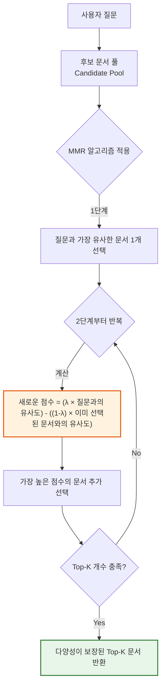

# 2-5. RAG－Vector Store

### 1) 이론적 개념
벡터 저장소(Vector Store)는 RAG 파이프라인의 **장기 기억(Long-term Memory)** 역할을 합니다. 텍스트 분할기(Text Splitter)를 거친 청크(Chunk)들을 임베딩 모델이 고차원 벡터로 변환하면, 이 벡터들을 저장하고 나중에 사용자의 질문 벡터와 **유사도(Similarity)** 를 계산하여 가장 관련성 높은 문서를 빠르게 찾아내는 데이터베이스입니다.

---

## 2-5-1. Chroma (크로마)

### 1) 이론적 개념
Chroma는 오픈소스 AI 애플리케이션을 위해 구축된 **경량 벡터 데이터베이스**입니다. Python과 JavaScript를 기본적으로 지원하며, 개발자의 로컬 머신(In-Memory)에서 실행하거나 디스크에 영구 저장(Persistent)할 수 있어 RAG 프로토타이핑과 중소규모 애플리케이션에 가장 널리 사용됩니다.

### 2) Chroma의 역할 시각화 (Mermaid)


### 3) 장단점 및 응용 분야
* **장점:** 
  1. **설치 및 사용이 매우 간편**하여 로컬 환경에서 즉시 실행 가능합니다.
  2. 메타데이터 필터링과 다양한 검색 모드(Similarity, MMR)를 기본 지원합니다.
  3. LangChain, LlamaIndex 등 주요 프레임워크와 네이티브 통합이 잘 되어 있습니다.
* **단점:** 
  1. 수억 개 이상의 벡터를 다루는 초대규모 엔터프라이즈 환경에서는 Milvus나 Pinecone 같은 분산형 벡터 DB보다 성능과 확장성에서 밀릴 수 있습니다.
* **응용 분야:** 
  - 개인용 AI 비서, 로컬 RAG 시스템, 스타트업의 초기 MVP(최소 기능 제품) 개발, 교육용 실습 환경.

---

## 2-5-1-1. 유사도 기반 검색 (Similarity Search)

### 1) 이론적 개념
벡터 저장소에서 가장 기본적이고 널리 사용되는 검색 방식입니다. 사용자의 질문을 벡터로 변환한 후, 데이터베이스에 저장된 모든 벡터와의 **거리(또는 유사도)** 를 계산합니다. 주로 **코사인 유사도(Cosine Similarity)** 를 사용하며, 유사도 점수가 가장 높은 상위 $K$개의 문서(Top-K)를 반환합니다.

### 2) 작동 원리 시각화 (Mermaid)
```mermaid
flowchart TD
    A[사용자 질문: "사과 효능"] --> B(임베딩 모델)
    B -->|질문 벡터 Q| C{벡터 DB 내<br>모든 문서 벡터와 비교}
    
    C -->|코사인 유사도 계산| D1["문서 1 (유사도 0.92)"]
    C -->|코사인 유사도 계산| D2["문서 2 (유사도 0.88)"]
    C -->|코사인 유사도 계산| D3["문서 3 (유사도 0.85)"]
    C -->|코사인 유사도 계산| D4["문서 4 (유사도 0.40)"]
    
    D1 & D2 & D3 & D4 --> E[점수 기준 내림차순 정렬]
    E --> F[Top-3 문서 반환<br>(문서 1, 2, 3)]
    
    style C fill:#e3f2fd,stroke:#1565c0
    style F fill:#e8f5e9,stroke:#2e7d32,stroke-width:2px
```

### 3) 장단점 및 응용 분야
* **장점:** 
  1. 알고리즘이 단순하여 검색 속도가 매우 빠릅니다.
  2. 의미적 유사성(Semantic Similarity)을 잘 포착하여 키워드가 정확히 일치하지 않아도 관련 문서를 찾아냅니다.
* **단점:** 
  1. **중복성(Redundancy) 문제:** 상위 $K$개 문서가 서로 너무 유사한 내용(예: 같은 문단의 반복)을 포함할 수 있어, 답변의 다양성이 떨어질 수 있습니다.
* **응용 분야:** 
  - 단순한 사실 확인(Q&A), 특정 용어에 대한 정의 검색, 일반적인 문서 검색.

---

## 2-5-1-2. MMR (Maximum Marginal Relevance Search)

### 1) 이론적 개념
유사도 검색의 '중복성 문제'를 해결하기 위해 고안된 알고리즘입니다. MMR은 단순히 질문과 가장 유사한 문서만 뽑는 것이 아니라, **"질문과의 관련성(Relevance)은 높으면서, 이미 선택된 문서들과는 다른 다양성(Diversity)을 가진 문서"** 를 선택합니다. 

### 2) 작동 원리 시각화 (Mermaid)

*(※ λ(람다)는 관련성과 다양성 사이의 균형을 조절하는 하이퍼파라미터입니다.)*

### 3) 장단점 및 응용 분야
* **장점:** 
  1. 검색 결과의 **다양성(Diversity)** 을 보장하여, 사용자가 더 폭넓고 종합적인 정보를 얻을 수 있습니다.
  2. 유사한 문서가 중복으로 반환되는 것을 방지하여 LLM의 컨텍스트 윈도우를 효율적으로 사용합니다.
* **단점:** 
  1. 단순 유사도 검색보다 계산량이 많아 검색 속도가 다소 느릴 수 있습니다.
  2. λ 값을 잘못 설정하면 너무 다양해져서 정작 가장 핵심적인 문서가 누락될 수 있습니다.
* **응용 분야:** 
  - 여러 관점이 필요한 주제에 대한 요약(Summarization), 브레인스토밍 지원, 뉴스 기사 클러스터링, 제품 비교 검색.

---

## 2-5-1-3. 벡터스토어에 메타데이터 추가 (Metadata Filtering)

### 1) 이론적 개념
벡터 임베딩은 텍스트의 '의미'만 포착할 뿐, '작성일자', '작성자', '문서 유형', '부서'와 같은 구조화된 정보는 잃어버립니다. **메타데이터(Metadata)** 는 각 벡터 청크에 이러한 부가 정보를 키-값(Key-Value) 쌍으로 태깅(Tagging)하여 저장하는 방식입니다. 이를 통해 **하이브리드 검색(Hybrid Search)** 이 가능해집니다.

### 2) 작동 원리 시각화 (Mermaid)
```mermaid
flowchart LR
    subgraph "인덱싱 단계"
        A[원본 문서] --> B[텍스트 분할]
        B --> C["청크 1: 텍스트 + {source: '규정.pdf', date: '2024-01', dept: 'HR'}"]
        C --> D[(Chroma DB<br>벡터 + 메타데이터 저장)]
    end

    subgraph "검색 단계 (하이브리드)"
        E[사용자 질문: "올해 휴가 규정 알려줘"] --> F{1. 메타데이터 필터링<br>date >= '2024-01' AND dept == 'HR'}
        F -->|필터링된 벡터 풀| G{2. 벡터 유사도 검색}
        G --> H[정확하고 최신인 규정 문서 반환]
    end

    style D fill:#fff3e0,stroke:#e65100
    style F fill:#e3f2fd,stroke:#1565c0,stroke-width:2px
```

### 3) 장단점 및 응용 분야
* **장점:** 
  1. **검색 정확도(Accuracy) 획기적 향상:** 의미적으로 유사하지만 시효가 지난 문서나 잘못된 부서의 문서를 사전에 차단(Pre-filtering)할 수 있습니다.
  2. 다중 테넌트(Multi-tenant) 환경에서 사용자 권한에 따라 접근 가능한 문서만 검색하도록 제어할 수 있습니다.
* **단점:** 
  1. 데이터 로드 단계에서 메타데이터를 추출하고 정제하는 전처리 과정이 추가로 필요합니다.
  2. 메타데이터 스키마를 잘못 설계하면 필터링 로직이 복잡해지고 유지보수가 어려워집니다.
* **응용 분야:** 
  - 기업 내부 지식 검색(부서/권한별 필터링), 법률 문서 검색(판례 연도 필터링), 의료 기록 분석(환자 ID/날짜 필터링), 뉴스 아카이브 검색.

---

### 💡 강의용 종합 요약 (Key Takeaway)

벡터 저장소는 RAG의 **"지능형 도서관 사서"** 입니다. 
1. **Chroma**는 가볍고 다루기 쉬운 도서관 건물이고,
2. **Similarity Search**는 "이 주제와 비슷한 책 3권만 줘"라고 요청하는 기본 방식이며,
3. **MMR**은 "비슷하되, 서로 다른 관점을 가진 책 3권을 줘"라고 요청하여 중복을 피하는 고급 방식이고,
4. **Metadata**는 "2024년 이후에 출판된 경영학 도서 중에서만 찾아줘"라고 조건을 거는 정밀 검색 도구입니다.

실무에서는 **단순 유사도 검색만으로 부족할 때 MMR을 고려**하고, **도메인 특화 정확도가 필요할 때 메타데이터 필터링을 필수로 적용**하는 것이 RAG 성능을 높이는 정석입니다.
