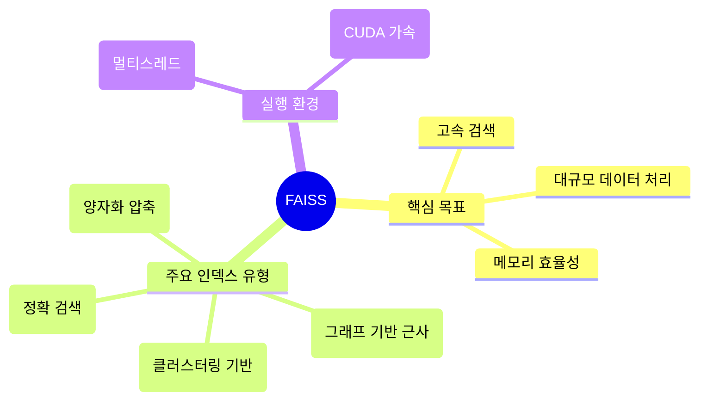
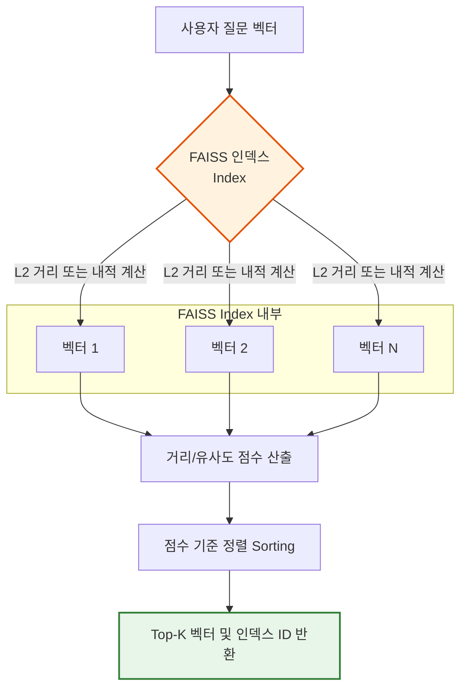
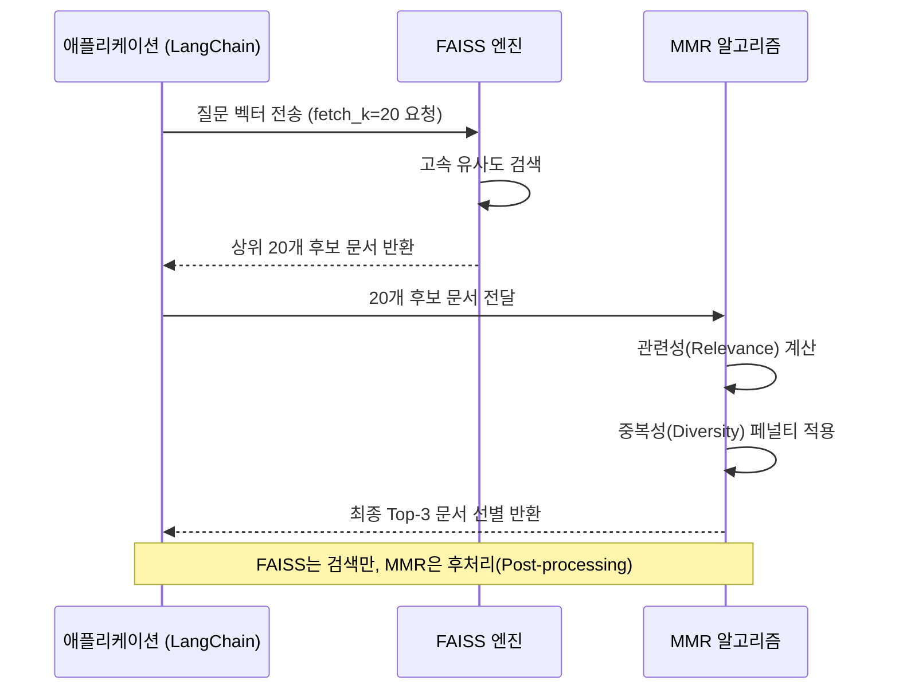

# 2-5-2. FAISS

# 2-5-2. FAISS (Facebook AI Similarity Search) 개요

### 1) 이론적 개념
FAISS는 Meta(구 Facebook) AI Research에서 개발한 **고성능 벡터 유사도 검색 라이브러리**입니다. 엄밀히 말하면 완전한 데이터베이스(DB)라기보다는, 수십억 개의 벡터를 밀집(Dense) 벡터 공간에서 고속으로 검색하고 클러스터링하기 위한 **핵심 엔진(Library)** 에 가깝습니다. RAG 파이프라인에서 벡터 저장소(Vector Store)로 널리 사용되며, 특히 대규모 데이터셋과 GPU 가속화에 최적화되어 있습니다.

### 2) FAISS의 아키텍처 및 특징 시각화 (Mermaid)

### 3) 장단점 및 응용 분야
* **장점:** 
  1. **압도적인 검색 속도:** C++로 작성되어 있으며, SIMD 명령어와 GPU를 완벽하게 활용하여 타사 DB 대비 월등히 빠른 검색 속도를 제공합니다.
  2. **유연한 인덱스 구조:** 데이터 규모와 정확도 요구사항에 따라 Flat(완전 탐색), IVF(역파일 인덱스), HNSW(근사 최근접 이웃) 등 다양한 알고리즘을 선택할 수 있습니다.
  3. **메모리 효율성:** 벡터 양자화(PQ) 기술을 통해 벡터 크기를 대폭 압축하여 RAM 사용량을 줄일 수 있습니다.
* **단점:** 
  1. **메타데이터 관리 부재:** Chroma나 Pinecone과 달리 벡터 자체 외의 메타데이터(문서 속성 등)를 직접 관리하는 기능이 약하여, 메타데이터 필터링이 필요할 경우 별도의 로직이 필요합니다.
  2. **분산 처리 미지원:** 단일 노드(서버) 내에서의 검색에 최적화되어 있으며, 여러 서버에 걸친 자동 샤딩(Sharding)이나 클러스터링 기능은 제공하지 않습니다.
* **응용 분야:** 
  - 수백만~수십억 개의 벡터를 다루는 대규모 추천 시스템, 이미지/동영상 유사도 검색, 고성능이 요구되는 엔터프라이즈 RAG 시스템.

---

## 2-5-2-1. 유사도 기반 검색 (Similarity Search)

### 1) 이론적 개념
FAISS는 벡터 간의 거리를 계산하여 유사도를 측정합니다. 가장 기본적으로 **L2 거리(Euclidean Distance)** 와 **내적(Inner Product, IP)** 을 지원하며, 벡터를 정규화한 경우 내적은 **코사인 유사도(Cosine Similarity)** 와 동일하게 작동합니다. FAISS의 핵심은 수백만 개의 벡터 중에서도 $O(1)$에 수렴하는 고속의 거리 계산 엔진을 보유하고 있다는 점입니다.

### 2) 작동 원리 시각화 (Mermaid)

### 3) 장단점 및 응용 분야
* **장점:** 인덱스 유형(예: `IndexFlatL2`)에 따라 100% 정확한 Exhaustive Search(완전 탐색)가 가능하며, 근사 검색(ANN) 인덱스를 사용하면 속도를 극대화하면서도 높은 정확도를 유지할 수 있습니다.
* **단점:** 완전 탐색(Flat)의 경우 데이터가 기하급수적으로 늘어날수록 검색 시간이 선형적으로 증가합니다.
* **응용 분야:** 소규모 데이터셋에서의 정밀 검색, 대규모 데이터셋에서의 실시간 얼굴 인식 또는 제품 추천.

---

## 2-5-2-2. MMR (Maximum Marginal Relevance Search)

### 1) 이론적 개념
FAISS 자체는 순수한 벡터 검색 엔진이므로 MMR 알고리즘이 내장되어 있지 않습니다. 하지만 LangChain과 같은 프레임워크를 통해 FAISS를 Vector Store로 사용할 경우, **프레임워크 레벨에서 MMR을 지원**합니다. 
기본적으로 FAISS에서 Top-K보다 더 많은 후보군(예: Top-20)을 먼저 가져온 후, 프레임워크가 Python 단에서 MMR 알고리즘(관련성 점수와 기존 선택 문서와의 유사도 차감)을 적용하여 최종 Top-K를 선별합니다.

### 2) 작동 원리 시각화 (Mermaid)

### 3) 장단점 및 응용 분야
* **장점:** FAISS의 압도적인 검색 속도를 유지하면서도, 결과물의 다양성을 확보할 수 있습니다.
* **단점:** FAISS 엔진 내부가 아닌 외부(프레임워크)에서 후처리가 이루어지므로, `fetch_k` 값을 너무 크게 설정하면 메모리 및 연산 오버헤드가 발생할 수 있습니다.
* **응용 분야:** 다양한 관점이 필요한 뉴스 요약, 브레인스토밍 아이디어 도출, 중복 콘텐츠가 많은 데이터셋 검색.

---

## 2-5-2-3. FAISS DB를 로컬에 저장하기 (Persistence)

### 1) 이론적 개념
FAISS는 인메모리(In-Memory) 기반으로 동작하지만, 생성된 인덱스(Index)를 **직렬화(Serialization)** 하여 로컬 디스크에 바이너리 파일(보통 `.index` 확장자)로 영구 저장할 수 있습니다. 플리케이션 재시작 시 이 파일을 메모리로 다시 로드(Load)하여 인덱스를 재구성함으로써, 매번 데이터를 처음부터 임베딩하고 인덱싱하는 시간과 비용을 절약할 수 있습니다.

### 2) 저장 및 로드 프로세스 시각화 (Mermaid)

### 3) 장단점 및 응용 분야
* **장점:** 
  1. **초기 구동 시간 단축:** 대용량 문서의 임베딩 및 인덱싱은 매우 시간이 오래 걸리는 작업인데, 저장된 인덱스를 로드하면 수 초 내에 검색 준비가 완료됩니다.
  2. **외부 의존성 최소화:** 별도의 DB 서버를 구축할 필요 없이 로컬 파일 시스템만으로 영속성을 확보할 수 있습니다.
* **단점:** 
  1. **동적 업데이트의 어려움:** FAISS 인덱스는 한 번 생성되면 새로운 벡터를 동적으로 추가(Insert)하는 기능이 제한적입니다. 새로운 데이터가 추가되면 기존 인덱스를 삭제하고 전체 데이터를 다시 인덱싱하거나, 별도의 병합 로직이 필요합니다.
  2. **메타데이터 별도 관리:** 벡터만 저장되므로, 문서의 메타데이터는 별도의 JSON이나 Pickle 파일로 저장하고 로드 시 동기화해야 하는 번거로움이 있습니다.
* **응용 분야:** 
  - 데이터 업데이트 주기가 길고(예: 월간 보고서, 정적 매뉴얼), 빠른 응답 속도가 요구되는 로컬 기반 RAG 애플리케이션.

---

### 💡 강의용 종합 요약 및 Chroma와의 비교 (Key Takeaway)

FAISS와 Chroma의 선택은 **"데이터 규모"** 와 **"관리 편의성"** 의 트레이드오프입니다.

| 구분 | FAISS (Meta) | Chroma |
| :--- | :--- | :--- |
| **본질** | 고속 벡터 검색 **라이브러리** | 풀스택 벡터 **데이터베이스** |
| **강점** | 압도적인 검색 속도, 대규모 데이터, GPU 지원 | 메타데이터 필터링, 쉬운 사용법, 동적 업데이트 |
| **약점** | 메타데이터 관리 불편, 동적 추가 어려움 | 초대규모 데이터(수억 건) 처리 시 성능 한계 |
| **저장 방식** | `.index` 바이너리 파일 | SQLite + 바이너리 파일 (내장 DB) |
| **추천 상황** | **수백만 건 이상의 대규모 벡터**, 속도 최우선 | **프로토입, 중소규모 데이터**, 메타데이터 필터링 필수 |

**강의 팁:** 수강생들에게 *"FAISS는 F1 레이싱카처럼 순수한 '속도'에 미친 엔진이고, Chroma는 에어컨과 네비게이션이 달린 '세단'처럼 관리가 편한 자동차입니다. 데이터가 적고 기능이 다양해야 하면 Chroma를, 데이터가 어마어마하게 많고 속도만 중요하면 FAISS를 선택하세요."* 라고 비유해 주시면 직관적인 이해를 도울 수 있습니다.
