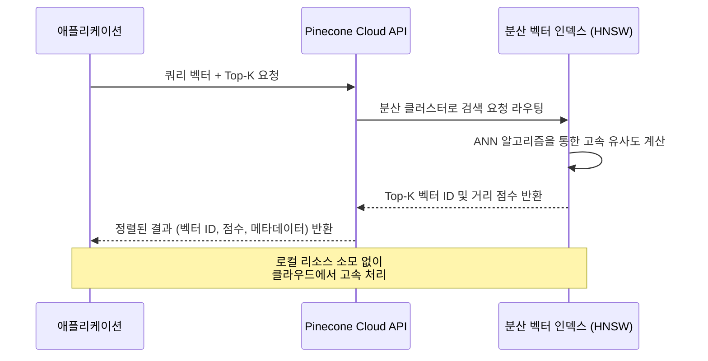

# 2-5-3. Pinecone (파인콘) 개요

### 1) 이론적 개념
Pinecone은 벡터 검색을 위해 특화된 **완전 관리형(Fully Managed) 클라우드 네이티브 벡터 데이터베이스**입니다. FAISS나 Chroma가 로컬 환경이나 자체 서버에 구축하는 라이브러리/경량 DB인 반면, Pinecone은 인프라 관리(서버 프로비저닝, 인덱스 최적화, 확장성 관리)를 제공업체가 전담하며, 사용자는 API를 통해 벡터 저장 및 검색만 수행하면 됩니다.

### 2) Pinecone의 아키텍처 특징 시각화 (Mermaid)
```mermaid
mindmap
  root((Pinecone))
    완전 관리형 Managed
      서버 관리 불필요
      자동 스케일링
      고가용성(HA) 보장
    대규모 데이터 처리
      수십억 개 벡터 지원
      분산 클러스터 아키텍처
    보안 및 엔터프라이즈
      SOC2, HIPAA 준수
      VPC 피어링 지원
      역할 기반 접근 제어(RBAC)
```

### 3) 장단점 및 응용 분야
* **장점:** 
  1. **운영 오버헤드 제로:** 인프라 구축, 모니터링, 패치 등 유지보수 비용이 전혀 없습니다.
  2. **압도적인 확장성:** 데이터가 기하급수적으로 늘어나도 자동으로 클러스터를 확장하여 일관된 저지연(Low Latency) 검색을 제공합니다.
  3. **엔터프라이즈급 보안:** 기업용 보안 인증을 획득하여 기밀 데이터를 다루는 상용 서비스에 안전하게 적용 가능합니다.
* **단점:** 
  1. **비용:** 사용량(저장 용량, API 호출 수)에 따라 과금되므로, 대용량 트래픽 발생 시 비용이 급증할 수 있습니다.
  2. **벤더 락인(Vendor Lock-in):** Pinecone 고유의 아키텍처에 종속되므로, 향후 다른 솔루션으로 마이그레이션 시 비용과 노력이 발생합니다.
  3. **오프라인 사용 불가:** 인터넷 연결이 필수적입니다.
* **응용 분야:** 
  - 대규모 사용자가 동시에 접속하는 상용 챗봇 서비스, 전사적 지식 관리 시스템(Enterprise RAG), 실시간 추천 엔진.

---

## 2-5-3-1. 유사도 기반 검색 (Similarity Search)

### 1) 이론적 개념
Pinecone은 **근사 최근접 이웃(ANN, Approximate Nearest Neighbor)** 알고리즘, 특히 **HNSW(Hierarchical Navigable Small World)** 를 클라우드 분산 환경에 최적화하여 구현했습니다. 
사용자의 쿼리 벡터가 입력되면, Pinecone은 코사인 유사도(Cosine), 유클리드 거리(L2), 또는 내적(Dot Product) 중 지정된 거리 측정 방식을 사용하여 수십억 개의 벡터 중에서도 밀리초(ms) 단위로 가장 유사한 Top-K 벡터를 찾아냅니다.

### 2) 작동 원리 시각화 (Mermaid)


### 3) 장단점 및 응용 분야
* **장점:** 
  1. **일관된 성능:** 데이터 규모가 커져도 로컬 메모리 한계에 구애받지 않고 안정적인 검색 속도를 유지합니다.
  2. **유연한 거리 측정:** 애플리케이션의 목적에 따라 Cosine(방향 유사성), L2(절대적 거리), Dot Product(크기+방향)를 자유롭게 선택할 수 있습니다.
* **단점:** 
  1. 로컬 FAISS처럼 인덱스 파라미터(m, ef_construction 등)를 세밀하게 튜닝하여 속도와 정확도의 트레이드오프를 직접 제어하기는 어렵습니다.
* **응용 분야:** 
  - 실시간 다국어 번역 검색, 대규모 이미지/동영상 콘텐츠 유사도 검색, 실시간 개인화 추천 피드.

---

## 2-5-3-2. 메타데이터 필터링 (Metadata Filtering)

### 1) 이론적 개념
Pinecone은 각 벡터에 JSON 형식의 키-값(Key-Value) 메타데이터를 태깅할 수 있으며, 이를 활용한 **고급 필터링**을 지원합니다. 
특히 Pinecone은 **선필터링(Pre-filtering)** 을 강력하게 최적화했습니다. 선필터링은 벡터 유사도 검색(ANN)을 수행하기 **전에** 메타데이터 조건에 부합하는 후보군(Pool)을 먼저 좁혀놓고, 그 좁혀진 후보군 내에서만 유사도 계산을 수행하는 방식입니다.

### 2) 작동 원리 시각화 (Mermaid)
```mermaid
flowchart TD
    A[사용자 쿼리<br>"2024년 마케팅 전략 알려줘"] --> B{Pinecone 쿼리 요청}
    
    B -->|1. 메타데이터 조건 전달| C[선필터링 Pre-filtering<br>조건: year == 2024 AND dept == 'Marketing']
    
    C -->|후보군 축소| D[필터링된 벡터 서브셋<br>예: 10,000,000개 → 50,000개]
    
    D -->|2. 벡터 유사도 계산| E[ANN 검색 실행]
    
    E --> F[Top-K 관련 문서 반환]
    
    style C fill:#fff3e0,stroke:#e65100,stroke-width:2px
    style F fill:#e8f5e9,stroke:#2e7d32,stroke-width:2px
```

### 3) 장단점 및 응용 분야
* **장점:** 
  1. **검색 정확도(Accuracy) 극대화:** 의미적으로는 유사하지만, 시기나 부서가 잘못된 문서를 원천 차단하여 LLM의 환각(Hallucination)을 방지합니다.
  2. **성능 최적화:** 전체 데이터베이스를 검색하는 대신 좁혀진 후보군만 ANN 검색하므로, 오히려 필터링이 검색 속도를 향상시키는 효과를 가져올 수 있습니다.
  3. **복합 연산자 지원:** `$eq`(같음), `$ne`(다름), `$in`(리스트 포함), `$gt`(초과) 및 `$and`, `$or` 논리 연산자를 지원하여 정교한 조건 설정이 가능합니다.
* **단점:** 
  1. 메타데이터 스키마를 잘못 설계하면(예: 너무 세분화된 키 생성), 필터링 조건이 복잡해지고 관리가 어려워집니다.
  2. 필터링 조건이 너무 엄격하면 후보군이 0개가 되어 검색 결과가 전혀 나오지 않을 수 있습니다(Zero-result 문제).
* **응용 분야:** 
  - **멀티 테넌트 SaaS:** `user_id` 또는 `company_id`로 필터링하여 다른 고객의 데이터가 검색되지 않도록 격리.
  - **시계열 RAG:** "2023년 이후의 재무제표만 검색" 등 최신성(Recency) 보장.
  - **권한 기반 검색:** 사용자의 역할(Role)에 따라 접근 가능한 문서(`access_level: 'public'`)만 필터링.

---

### 💡 강의용 종합 요약 및 비교 (Key Takeaway)

벡터 저장소 선택은 프로젝트의 **규모(Scale)** 와 **운영 리소스(Operations)** 에 따라 결정됩니다.

| 구분 | Chroma / FAISS (로컬/자체 구축) | Pinecone (완전 관리형 클라우드) |
| :--- | :--- | :--- |
| **인프라 관리** | 사용자가 직접 관리 (설치, 튜닝, 백업) | **제공업체가 전담 (Zero Maintenance)** |
| **데이터 규모** | 수백만 ~ 수천만 건 (RAM/GPU 한계) | **수십억 건 이상 (무한 수평 확장)** |
| **비용 구조** | 초기 하드웨어 비용 + 유지보수 인건비 | **사용량 기반 종량제 (Pay-as-you-go)** |
| **메타데이터 필터링** | 기본적 지원 (Chroma), 제한적 (FAISS) | **고도로 최적화된 선필터링(Pre-filtering) 지원** |
| **추천 상황** | 프로토타입, 기밀 데이터 로컬 처리, 예산 제한 | **상용 서비스 출시, 대규모 데이터, 빠른 Time-to-Market** |

**강의 팁:** 수강생들에게 *"Chroma나 FAISS는 직접 운전하고 정비해야 하는 '자가용'이라면, Pinecone은 운전기사와 정비사가 모두 포함된 '리무진 서비스'입니다. 개발자가 인프라 고민 없이 비즈니스 로직과 RAG 품질에만 집중하고 싶다면 Pinecone이 가장 합리적인 선택입니다."* 라고 비유해 주시면 완벽하게 이해시킬 수 있습니다.
