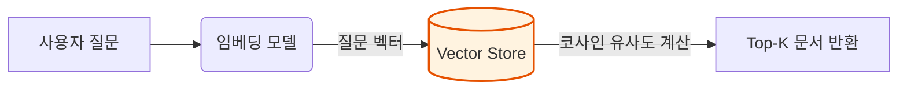
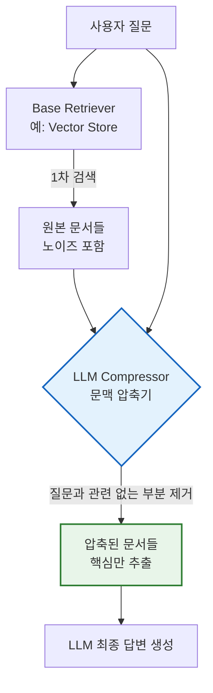
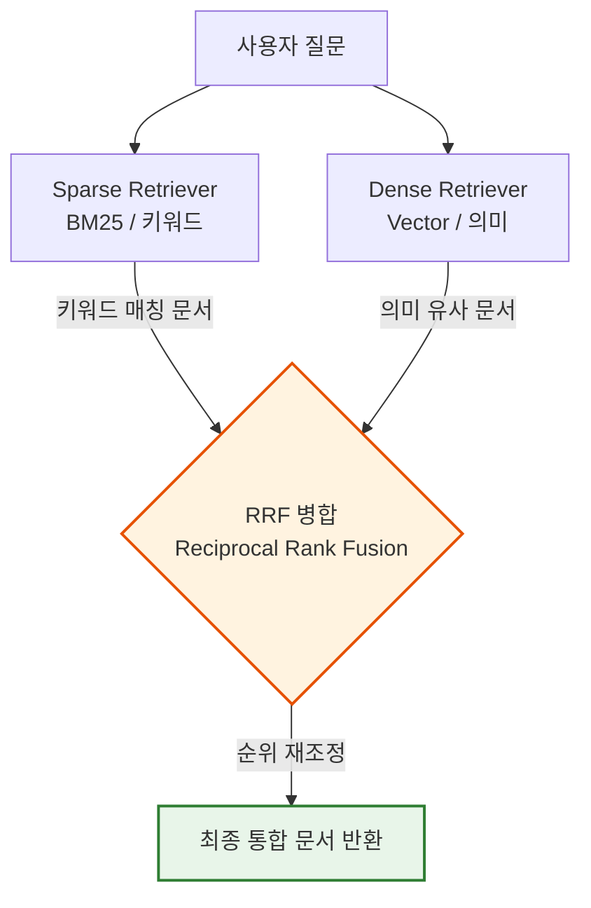
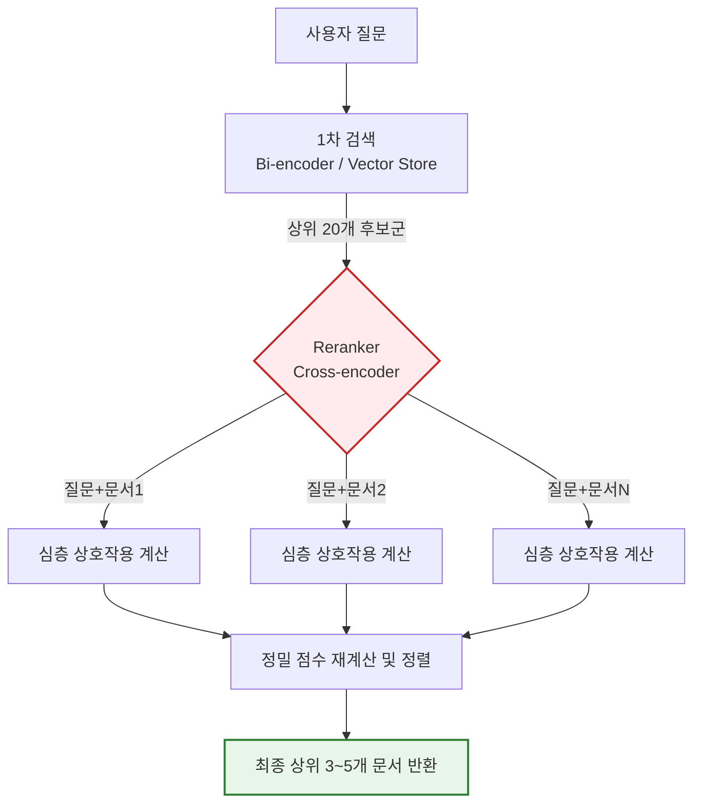

# 2-6. RAG - Retriever (검색기) 개요

### 1) 이론적 개념
LangChain에서 **Retriever(검색기)** 는 사용자의 텍스트 질문(Query)을 입력으로 받아, 관련성 높은 **문서(Document) 리스트를 반환하는 인터페이스**입니다. 벡터 저장소(Vector Store)를 감싸고 있는 경우가 가장 많지만, 단순히 벡터 유사도만 사용하는 것을 넘어 다양한 알고리즘을 결합하여 검색 품질을 높이는 고급 기법들이 존재합니다.

---

## 2-6-1. Vector Store Retriever (벡터 저장소 검색기)

### 1) 이론적 개념
가장 기본적이고 표준적인 검색기입니다. 내부적으로 벡터 저장소(Vector Store)를 래핑(Wrap)하여, 사용자의 질문을 임베딩으로 변환한 후 **유사도 검색(Similarity Search)** 을 수행합니다. 기본적으로 유사도 점수가 가장 높은 상위 $K$개의 문서를 반환합니다.

### 2) 작동 원리 시각화 (Mermaid)


### 3) 장단점 및 응용 분야
* **장점:** 구조가 단순하고 검색 속도가 매우 빠르며, 의미적 유사성(Semantic Similarity)을 잘 포착합니다.
* **단점:** **"Lost in the middle(중간 정보 망각)"** 현상이 발생할 수 있습니다. 또한, 질문과 완전히 다른 단어지만 같은 의미를 가진 문서는 잘 찾지만, 정확한 고유명사나 키워드가 포함된 문서는 놓칠 수 있습니다.
* **응용 분야:** 일반적인 챗봇, 단순한 사실 확인(Fact-checking) Q&A, 프로토타입 개발.

---

## 2-6-2. Contextual Compression (문맥 압축)

### 1) 이론적 개념
Vector Store Retriever가 가져온 문서들은 종종 질문과 관련 없는 '노이즈(Noise)'를 포함하고 있습니다. Contextual Compression은 **기본 검색기(Base Retriever)와 LLM을 결합**하여, 검색된 문서에서 질문과 관련된 부분만 **추출(Extract)하거나 압축(Compress)** 하는 후처리(Post-processing) 기법입니다.

### 2) 작동 원리 시각화 (Mermaid)


### 3) 장단점 및 응용 분야
* **장점:** LLM에 주입되는 컨텍스트의 양을 줄여 **토큰 비용을 절감**하고, 노이즈를 제거하여 LLM의 환각(Hallucination)을 줄이고 답변 정확도를 높입니다.
* **단점:** 압축 과정에 LLM을 추가로 호출해야 하므로 **지연 시간(Latency)이 증가**하고 API 비용이 추가로 발생합니다.
* **응용 분야:** 장문의 법률/의료 문서 분석, 기술 매뉴얼에서 특정 오류 코드에 대한 정확한 조치 사항만 추출할 때.

---

## 2-6-3. Ensemble Retriever (앙상블 검색기)

### 1) 이론적 개념
서로 다른 특성을 가진 **두 개 이상의 검색기를 결합**하여 단일 검색기의 한계를 보완하는 기법입니다. 가장 대표적인 조합은 **BM25(키워드 기반 희소 검색)** 와 **Vector Store(의미 기반 밀집 검색)** 를 함께 사용하는 것입니다. 두 검색기의 결과를 **RRF(Reciprocal Rank Fusion, 역순위 융합)** 알고리즘으로 병합합니다.

### 2) 작동 원리 시각화 (Mermaid)


### 3) 장단점 및 응용 분야
* **장점:** 키워드 검색의 **정확한 용어 매칭**과 벡터 검색의 **의미 파악**이라는 두 가지 장점을 모두 취할 수 있어 검색 재현율(Recall)이 획기적으로 향상됩니다.
* **단점:** 두 개의 검색기를 동시에 실행하므로 시스템 복잡도가 증가하고, RRF 병합 계산으로 인해 검색 속도가 다소 느려질 수 있습니다.
* **응용 분야:** 기업 내부 검색(사내 용어와 일반적인 질문이 혼재), 전자상거래 제품 검색, 학술 논문 검색.

---

## 2-6-4. RAG-Fusion (RAG 퓨전)

### 1) 이론적 개념
사용자의 질문이 모호하거나 부정확할 때, **LLM을 이용해 원래 질문에서 파생된 여러 개의 하위 질문(Sub-queries)을 자동 생성**합니다. 각 하위 질문에 대해 독립적으로 문서를 검색한 후, 모든 결과를 RRF(역순위 융합)로 합쳐 최종 검색 결과를 만드는 기법입니다.

### 2) 작동 원리 시각화 (Mermaid)
```mermaid
flowchart TD
    A[원본 질문: "파이썬이 느린 이유"] --> B{LLM<br>질문 다중 생성}
    
    B -->|생성 1| C1["파이 성능 병목 현상"]
    B -->|생성 2| C2["파이썬 GIL과 속도"]
    B -->|생성 3| C3["파이썬 vs C++ 실행 속도"]
    
    C1 & C2 & C3 --> D[병렬 벡터 검색]
    D --> E{RRF 병합<br>중복 제거 및 순위 통합}
    E --> F[최종 고품질 문서 반환]
    
    style B fill:#e3f2fd,stroke:#1565c0,stroke-width:2px
    style E fill:#fff3e0,stroke:#e65100,stroke-width:2px
```

### 3) 장단점 및 응용 분야
* **장점:** 사용자의 부정확한 질문을 보완하여 **검색의 재현율(Recall)을 극대화**합니다. 다양한 관점의 문서를 확보할 수 있어 답변의 풍요로움이 증가합니다.
* **단점:** 질문 생성과 다중 검색을 수행해야 하므로 **LLM 호출 비용과 지연 시간이 크게 증가**합니다.
* **응용 분야:** 복잡한 연구 주제 조사, 브레인스토밍 지원, 사용자가 명확한 키워드를 모르는 일반 소비자 대상 챗봇.

---

## 2-6-5. Reranker (Cross-Encoder) (재순위화)

### 1) 이론적 개념
초기 검색(Vector Store)은 **Bi-encoder**를 사용하여 질문과 문서를 각각 독립적으로 임베딩한 뒤 거리를 계산합니다. 이는 빠르지만 정밀도가 떨어집니다. **Reranker(Cross-encoder)** 는 질문과 문서를 **하나의 쌍(Pair)으로 어** 심층 신경망에 함께 통과시켜, 두 텍스트 간의 상호작용(Attention)을 계산하여 유사도 점수를 다시 매기는(Re-scoring) 모델입니다.

### 2) 작동 원리 시각화 (Mermaid)


### 3) 장단점 및 응용 분야
* **장점:** **가장 높은 검색 정밀도(Precision)** 를 제공합니다. Bi-encoder가 놓친 미묘한 뉘앙스나 논리적 관계를 Cross-encoder가 완벽하게 파악하여 순위를 재조정합니다.
* **단점:** 질문과 문서의 모든 조합을 신경망에 통과시켜야 하므로 **계산 비용이 매우 크고 속도가 느립니다.** 따라서 1차 검색으로 후보군을 먼저 좁힌 후 사용하는 것이 필수적입니다.
* **응용 분야:** 의료/법률/금융 등 **높은 정확도가 요구되는 엔터프라이즈 RAG**, 최종 답변의 품질을 최우선으로 하는 상용 서비스.

---

### 💡 강의용 종합 요약 및 선택 가이드 (Key Takeaway)

고급 Retriever 기법들은 **"속도(Speed)"와 "정확도(Accuracy)" 사이의 트레이드오프**를 관리하는 도구입니다.

| 검색기 유형 | 핵심 메커니즘 | 속도 | 정확도 | 추천 상황 |
| :--- | :--- | :---: | :---: | :--- |
| **Vector Store** | 벡터 유사도 (Bi-encoder) | ⚡ 매우 빠름 | 보통 | 기본 RAG, 실시간 응답 필수 |
| **Contextual Compression** | LLM으로 노이즈 제거 | 🐢 느림 | 높음 | 문서가 너무 길고 노이즈가 많을 때 |
| **Ensemble** | 키워드(BM25) + 벡터 병합 | 🏃 보통 | 높음 | 고유명사/키워드와 의미가 모두 중요할 때 |
| **RAG-Fusion** | 다중 질문 생성 후 병합 | 🐢 느림 | 매우 높음 | 사용자 질문이 모호하거나 복잡할 때 |
| **Reranker** | Cross-encoder 심층 재평가 |  매우 느림 | **최상** | 비용/속도 상관없이 정확도가 생명일 때 |

**강의 팁:** 수강생들에게 다음과 같이 비유해 주시면 완벽하게 이해시킬 수 있습니다.
> *"Vector Store Retriever는 **사서**가 제목만 보고 책을 빨리 찾아주는 것이고, Reranker(Cross-encoder)는 **교수님**이 책의 내용을 한 줄 한 줄 읽으며 정확히 맞는지 검증하는 것입니다. 사서만 믿으면 틀린 책을 가져올 수 있고, 교수님만 믿으면 시간이 너무 오래 걸립니다. 그래서 실무에서는 **사서(Vector)로 20권을 먼저 추린 뒤, 교수님(Reranker)에게 5권만 검증**시키는 하이브리드 파이프라인을 가장 많이 사용합니다."*
