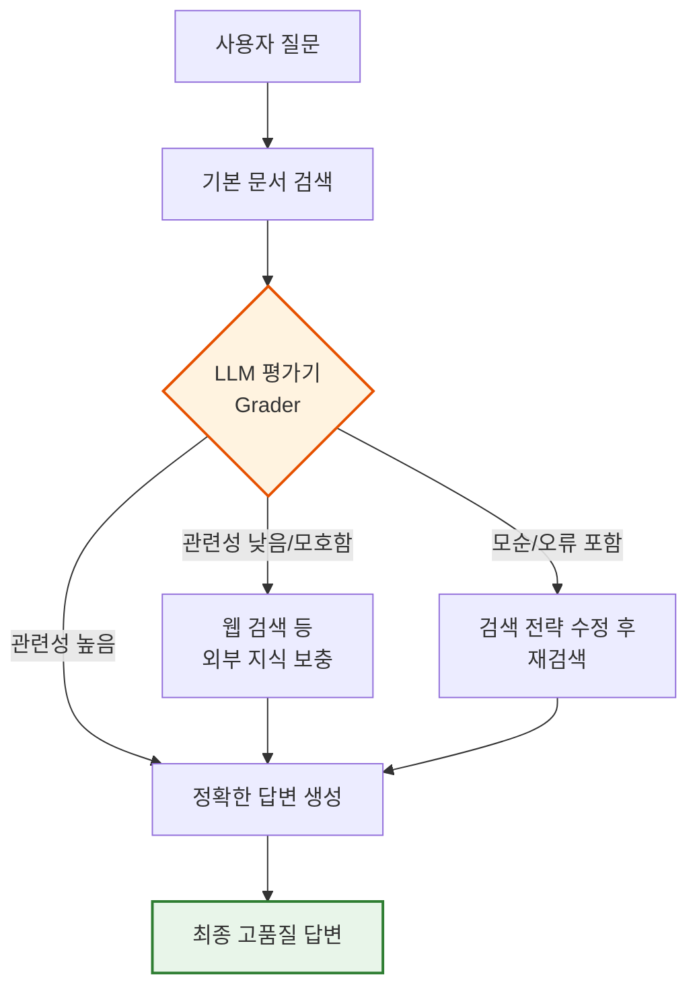
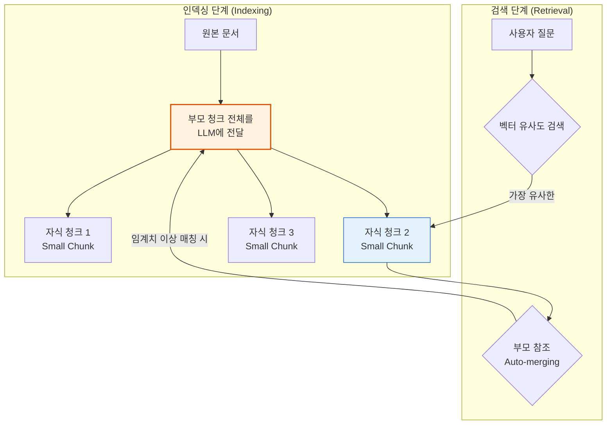

# 2-7. RAG 최적화 (RAG Optimization) 개요

### 1) 이론적 개념
기본 RAG는 단순한 '검색 후 생성' 구조이므로, 복잡한 질문이나 방대한 데이터에서는 한계를 드러냅니다. RAG 최적화는 파이프라인의 병목현상을 해결하기 위해 **① 데이터가 저장되는 방식(Indexing)**, **② 질문이 이해되는 방식(Query)**, **③ 답변이 생성되는 방식(Generator)** 을 다각도로 고도화하는 과정입니다.

---

## 2-7-1. 생성 최적화 (Generator Enhancement)

### 1) 이론적 개념
검색된 문서(Context)를 바탕으로 LLM이 최종 답변을 생성하는 단계를 최적화합니다. 단순히 프롬프트에 문서를 주입하는 것을 넘어, **LLM 스스로 검색된 정보의 신뢰도를 평가하거나, 답변 생성 과정을 논리적으로 분해**하도록 유도하여 환각(Hallucination)을 줄이고 정확도를 높입니다. 대표적인 기법으로 **Self-RAG(자기 성찰 RAG)** 나 **CRAG(Corrective RAG)** 가 있습니다.

### 2) 작동 원리 시각화 (Mermaid) - CRAG (Corrective RAG) 예시


### 3) 장단점 및 응용 분야
* **장점:** 
  1. LLM이 수동적인 생성기를 넘어 **능동적인 검증기(Verifier)** 역할을 수행하여 답변의 사실성(Factuality)을 크게 높입니다.
  2. 잘못된 문맥이 주입되었을 때 웹 검색 등으로 동적으로 보완하는 유연성을 확보합니다.
* **단점:** 
  1. 평가(Grading) 및 재검색 과정을 거치므로 **지연 시간(Latency)과 큰 비용이 증가**합니다.
  2. 평가 프롬프트를 잘못 설계하면 LLM이 올바른 문서를 잘못 평가하여 답변 품질이 떨어질 수 있습니다.
* **응용 분야:** 
  - 의료/법률/금융 등 **사실 오류가 치명적인 도메인**, 뉴스 팩트체크, 복잡한 추론이 필요한 기술 지원 챗봇.

---

## 2-7-2. 인덱싱 최적화 (Indexing Enhancement)

### 1) 이론적 개념
데이터를 벡터 DB에 저장하는 방식을 고도화하여 검색의 재현율(Recall)과 정밀도(Precision)를 동시에 잡는 기법입니다. 가장 대표적인 방법은 **부모-자식 청킹(Parent-Child Chunking / Auto-merging)** 과 **GraphRAG(지식 그래프 결합)** 입니다. 작은 청크로 검색하되, 실제 LLM에는 더 큰 문맥(부모)을 제공하여 'Lost in the middle' 현상을 방지합니다.

### 2) 작동 원리 시각화 (Mermaid) - 부모-자식 청킹 (Auto-merging)


### 3) 장단점 및 응용 분야
* **장점:** 
  1. **검색 정밀도와 문맥 보존의 트레이드오프를 완벽하게 해결**합니다. 세밀한 검색(Small chunk)과 풍부한 문맥(Large chunk)을 동시에 확보합니다.
  2. GraphRAG를 적용하면 벡터 검색이 놓치기 쉬운 '개체 간의 관계(Entity Relationship)' 기반 추론이 가능해집니다.
* **단점:** 
  1. 인덱싱 단계에서 메타데이터(부모-자식 매핑)를 구축하는 로직이 복잡해집니다.
  2. 벡터 DB의 저장 용량이 증가하며, GraphRAG의 경우 지식 그래프 구축 비용이 매우 높습니다.
* **응용 분야:** 
  - 장문의 기술 매뉴얼, 법률 계약서, 학술 논문, 기업 조직도 및 관계도 기반 Q&A.

---

## 2-7-3. 쿼리 최적화 (Query Enhancement)

### 1) 이론적 개념
사용자의 질문(Query)이 모호하거나 너무 복잡할 때, **검색기에 전달되기 전에 질문 자체를 변형(Transform)하거나 분해(Decomposition)** 하는 기법입니다. LLM을 활용하여 원래 질문을 더 검색하기 좋은 형태로 재작성하거나, 여러 개의 하위 질문(Sub-queries)으로 개어 검색의 재현율을 극대화합니다.

### 2) 작동 원리 시각화 (Mermaid) - 쿼리 분해 (Query Decomposition)
```mermaid
flowchart TD
    A[복잡한 사용자 질문<br>"2023년과 2024년 우리 회사 매출 차이와<br>주요 원인은?"] --> B{LLM 쿼리 분해기<br>Decomposer}
    
    B -->|생성| C1["2023년 총 매출액은 얼마인가?"]
    B -->|생성| C2["2024년 총 매출액은 얼마인가?"]
    B -->|생성| C3["2023년과 2024년 매출 변동의<br>주요 원인은 무엇인가?"]
    
    C1 & C2 & C3 --> D[병렬 벡터 검색<br>Parallel Retrieval]
    D --> E[검색 결과 통합<br>Context Synthesis]
    E --> F[LLM 최종 답변 생성]
    
    style B fill:#e3f2fd,stroke:#1565c0,stroke-width:2px
    style F fill:#e8f5e9,stroke:#2e7d32,stroke-width:2px
```

### 3) 장단점 및 응용 분야
* **장점:** 
  1. 사용자가 한 번에 여러 정보를 요구하는 **복합 질문(Complex/Multi-hop Query)을 완벽하게 처리**할 수 있습니다.
  2. 질문 재작성(Query Rewriting)을 통해 오타나 모호한 표현을 교정하여 검색 실패율을 크게 낮춥니다.
* **단점:** 
  1. 질문을 분해하고 재작성하는 과정에서 **LLM 호출이 추가**되어 응답 속도가 느려집니다.
  2. 하위 질문이 너무 많아지면 검색 비용이 기하급수적으로 증가할 수 있습니다.
* **응용 분야:** 
  - 데이터 분석 에이전트, 비교 분석이 필요한 제품 리뷰 요약, 복잡한 조건이 포함된 고객 지원 챗봇.

---

### 💡 강의용 종합 요약 및 파이프라인 선택 가이드 (Key Takeaway)

RAG 최적화는 **"어느 단계에서 정보가 손실되거나 왜곡되는가?"** 를 진단하고 처방하는 과정입니다.

| 최적화 축 | 핵심 해결 과제 | 대표 기법 | 비용/속도 영향 |
| :--- | :--- | :--- | :--- |
| **인덱싱 (Indexing)** | 문서가 잘게 쪼개지며 문맥 소실, 관계성 파악 실패 | 부모-자식 청킹, GraphRAG, 메타데이터 태깅 | 인덱싱 시간 증가, 저장 용량 증가 |
| **쿼리 (Query)** | 사용자 질문이 모호하거나 너무 복잡하여 검색 실패 | 쿼리 재작성, 쿼리 분해(Decomposition), HyDE | 질문당 LLM 호출 증가, 지연 시간 증가 |
| **생성 (Generator)** | 검색된 문서가 부정확하거나 LLM이 환각 발생 | Self-RAG, CRAG, Chain-of-Thought 프롬프팅 | 답변당 LLM 호출 증가, 지연 시간 증가 |

**강의 팁 (비유를 통한 이해):**
> *"RAG 파이프라인을 **'도서관에서 책을 찾아 답변하는 사서'** 에 비유해 봅시다.*
> *1. **인덱싱 최적화**는 도서관의 '도서 분류 체계'를 개선하여 책을 찾기 쉽게 만드는 것입니다.*
> *2. **쿼리 최적화**는 이용자가 두서없이 묻는 질문을 사서가 먼저 '명확한 검색어'로 번역해 주는 것입니다.*
> *3. **생성 최적화**는 사서가 가져온 책이 틀린 책인지 먼저 확인하고, 맞다면 완벽하게 요약해서 이용자에게 전달하는 '검수 과정'을 거치는 것입니다.*
> *실무에서는 이 세 가지를 균형 있게 조합하여 **'정확도(Accuracy)'와 '응답 속도(Latency)'의 최적점(Sweet Spot)** 을 찾아야 합니다."*
