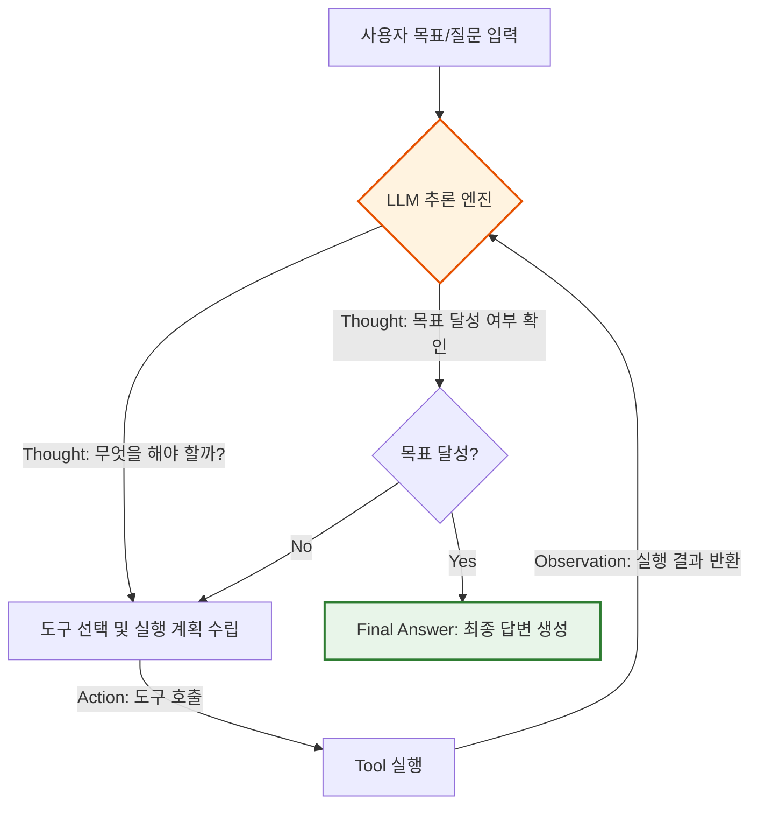
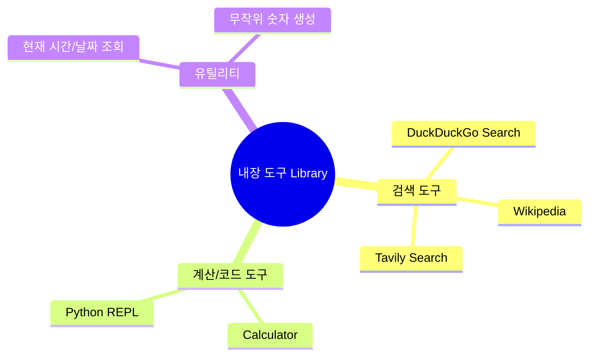
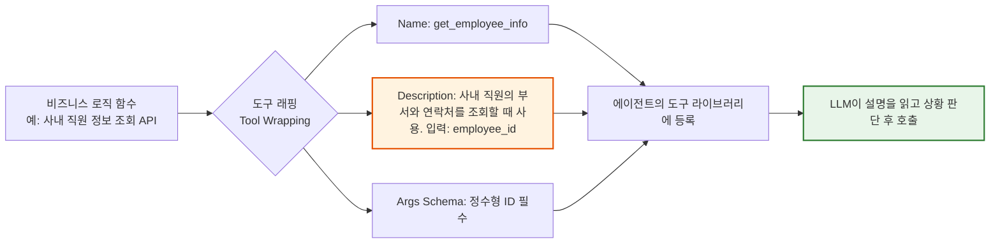
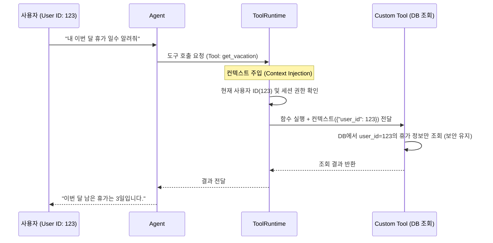

# Part 3. Agents & Tools (에이전트 및 도구) 개요

## 3-1. Agent 개요

### 1) 이론적 개념
에이전트(Agent)는 단순히 프롬프트를 LLM에 전달하는 것을 넘어, **LLM을 '추론 엔진(Reasoning Engine)'으로 사용**하여 주어진 목표를 달성하기 위해 어떤 행동을 취할지 스스로 결정하는 시스템입니다. 
가장 대표적인 패턴인 **ReAct (Reasoning + Acting)** 는 에이전트가 ① 현재 상황을 사고하고(Thought), ② 도구를 사용하여 행동을 취하며(Action), ③ 그 결과를 관찰(Observation)하여 목표 달성 시까지 이 과정을 반복합니다.

### 2) 에이전트 작동 원리 시각화 (Mermaid)

### 3) 장단점 및 응용 분야
* **장점:** 
  1. **동적 문제 해결:** 미리 정의된 정적 파이프라인(Chain)으로는 처리할 수 없는 예측 불가능하거나 복잡한 다단계 작업을 처리할 수 있습니다.
  2. **확장성:** 새로운 도구를 추가하기만 하면 에이전트의 능력이 즉시 확장됩니다.
* **단점:** 
  1. **예측 불가능성:** LLM의 판단에 의존하므로 무한 루프에 빠지거나 의도하지 않은 도구를 호출할 수 있습니다.
  2. **비용 및 지연 시간:** 여러 차례의 LLM 호출(Thought-Action-Observation 반복)이 필요하여 토큰 비용과 응답 시간이 증가합니다.
* **응용 분야:** 
  - 자율형 개인 비서, 복잡한 데이터 분석 및 리포트 작성, 다단계 웹 서핑이 필요한 심층 조사 봇.

---

## 3-2. 내장 도구 (Built-in Tools)

### 1) 이론적 개념
LangChain 등 프레임워크에서 기본적으로 제공하는, 이미 구현되고 테스트된 도구들의 모음입니다. 에이전트는 이러한 내장 도구의 **이름(Name)** 과 **설명(Description)** 을 읽고, 현재 상황에 필요한 도구를 자동으로 선택하여 호출합니다.

### 2) 내장 도구의 역할 시각화 (Mermaid)

### 3) 장단점 및 응용 분야
* **장점:** 
  1. **즉시 사용 가능:** 별도의 개발 없이 import만 하면 되므로 프로토타이핑 속도가 매우 빠릅니다.
  2. **안정성:** 프레임워크 커뮤니티에 의해 지속적으로 유지보수되고 검증된 도구들입니다.
* **단점:** 
  1. **범용성 한계:** 특정 기업의 내부 비즈니스 로직이나 독점 API에는 대응할 수 없습니다.
  2. **외부 의존성:** 검색 도구 등의 경우 외부 서비스의 API 제한(Rate Limit)이나 장애에 영향을 받습니다.
* **응용 분야:** 
  - 일반적인 상식 질문 답변, 빠른 프로토타입 개발, 기본적인 수학 계산이 필요한 챗봇.

---

## 3-3. 커스텀 도구 (Custom Tools)

### 1) 이론적 개념
내장 도구로 해결할 수 없는 특정 비즈니스 요구사항을 충족하기 위해 개발자가 직접 정의하는 도구입니다. 
커스텀 도구의 핵심은 **코드 자체가 아니라 '도구 설명(Description)'** 입니다. LLM은 코드를 읽을 수 없으므로, 도구가 무엇을 하는지, 어떤 입력 파라미터를 요구하는지에 대한 명확한 자연어 설명이 에이전트가 해당 도구를 올바르게 사용할지 말지를 결정합니다.

### 2) 커스텀 도구 설계 원리 시각화 (Mermaid)

### 3) 장단점 및 응용 분야
* **장점:** 
  1. **무한한 확장성:** 데이터베이스 쿼리, 사내 ERP 연동, 맞춤형 계산기 등 비즈니스에 필요한 어떤 기능도 에이전트의 능력으로 만들 수 있습니다.
  2. **보안 및 통제:** 외부로 데이터를 보내지 않고 사내망 내에서만 실행되는 도구를 만들어 안전하게 활용할 수 있습니다.
* **단점:** 
  1. **개발 및 유지보수 비용:** 도구의 예외 처리(Error Handling), 입력값 검증, LLM이 이해하기 쉬운 설명 작성에 노력이 필요합니다.
  2. **환각 위험:** 도구의 설명이 모호하면 LLM이 잘못된 파라미터로 도구를 호출하여 오류를 발생시킬 수 있습니다.
* **응용 분야:** 
  - 사내 IT 헬프데스크 봇(티켓 조회 도구), 맞춤형 금융 상품 추천기(실시간 금리 조회 도구), 이커머스 주문 상태 추적 봇.

---

## 3-4. ToolRuntime & 컨텍스트 (Context)

### 1) 이론적 개념
도구가 실행될 때 필요한 **환경(Environment)과 상태(State) 정보**를 관리하는 계층입니다. 
단순히 함수를 호출하는 것을 넘어, ToolRuntime은 도구가 실행되는 동안 **누가(사용자 ID), 어디서(세션 정보), 어떤 권한으로** 요청했는지에 대한 컨텍스트를 도구에 주입(Injection)합니다. 이를 통해 도구는 맥락을 이해하고 안전하게 실행될 수 있습니다.

### 2) ToolRuntime의 컨텍스트 주입 시각화 (Mermaid)

### 3) 장단점 및 응용 분야
* **장점:** 
  1. **보안 및 격리(Security & Isolation):** 멀티 테넌트 환경에서 사용자의 컨텍스트를 명시적으로 전달함으로써, 다른 사용자의 데이터가 잘못 조회되는 것을 원천 차단합니다.
  2. **상태 유지(Statefulness):** 대화의 흐름이나 이전 도구의 실행 결과를 컨텍스트에 저장하여, 다음 도구가 이를 참조하게 할 수 있습니다.
  3. **관측 가능성(Observability):** 런타임 레벨에서 도구 실행 시간, 성공/실패 여부, 사용된 컨텍스트를 로깅하여 디버깅이 용이합니다.
* **단점:** 
  1. **아키텍처 복잡성 증가:** 컨텍스트 객체를 설계하고, 모든 도구가 이를 올바르게 처리하도록 일관성을 유지하는 것이 기술적으로 까다롭습니다.
* **응용 분야:** 
  - 엔터프라이즈급 SaaS 애플리케이션, 개인화된 의료/금융 어시스턴트, 다단계 워크플로우가 필요한 복잡한 비즈니스 자동화 시스템.

---

### 💡 강의용 종합 요약 (Key Takeaway)

에이전트 시스템은 **"두뇌(LLM)"**, **"손발(Tools)"**, **"작업 환경(Runtime/Context)"** 의 조화로 이루어집니다.

| 구성 요소 | 비유 | 핵심 이론 포인트 |
| :--- | :--- | :--- |
| **Agent** | **프로젝트 매니저** | ReAct 패턴을 통해 스스로 생각하고 계획을 수정하며 목표를 달성함. |
| **내장 도구** | **기본 사무용품** | 계산기, 인터넷 검색 등 즉시 사용 가능하나 범용적임. |
| **커스텀 도구** | **맞춤형 전문 장비** | LLM이 이해할 수 있는 **'명확한 설명(Description)'** 이 생명임. |
| **Runtime/컨텍스트**| **보안 인증서 및 작업 지시서** | 도구가 **'누구의 요청인지'** 를 알고 안전하게 실행되도록 환경을 제공함. |

**강의 팁:** 수강생들에게 *"에이전트에게 도구를 주는 것은 칼을 주는 것과 같습니다. 칼이 얼마나 날카로운지(코드 성능)도 중요하지만, 에이전트가 '이 칼을 언제, 어떻게 써야 하는지'(도구 설명)를 정확히 알고, 안전한 작업대 위에서(Runtime 컨텍스트) 사용하는지가 실제 프로덕션의 성패를 가릅니다."* 라고 강조해 주시면 개념을 완벽하게 이해시킬 수 있습니다.
