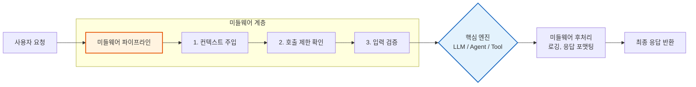
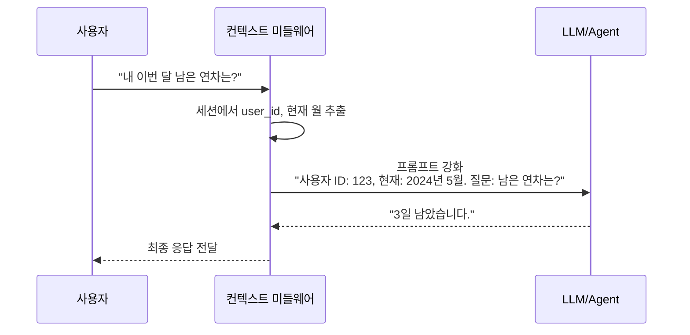
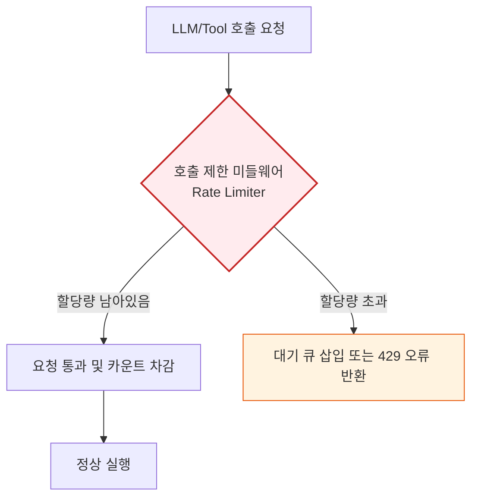
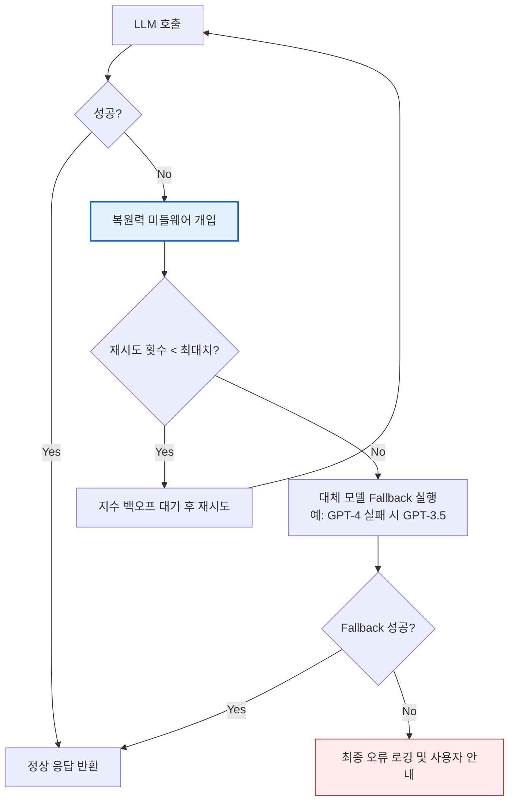
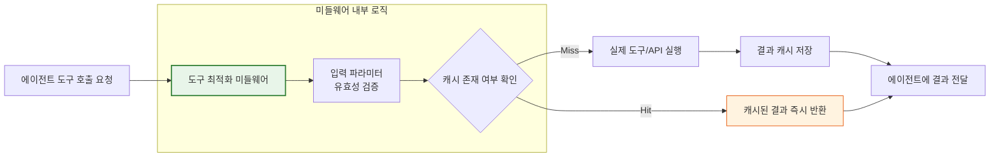

# Part 4. 미들웨어 & 가드레일 (Middleware & Guardrails)

## 4-1. 미들웨어(Middleware) 개요

### 1) 이론적 개념
LLM 및 에이전트 아키텍처에서 **미들웨어(Middleware)** 는 사용자 요청과 핵심 로직(LLM 호출 또는 도구 실행) 사이에서 **가로채기(Interception) 및 전처리/후처리**를 수행하는 소프트웨어 계층입니다. 
비즈니스 로직 자체를 변경하지 않고도 로깅, 보안 검증, 컨텍스트 주입, 재시도 등의 **횡단 관심사(Cross-cutting Concerns)** 를 중앙에서 관리하여 시스템의 안정성과 유지보수성을 높입니다.

### 2) 미들웨어의 역할 시각화 (Mermaid)

### 3) 장단점 및 응용 분야
* **장점:** 핵심 로직과 부가 기능을 분리(Separation of Concerns)하여 코드가 간결해지고, 미들웨어만 교체하거나 추가하여 시스템 동작을 유연하게 제어할 수 있습니다.
* **단점:** 미들웨어 체인이 너무 길어지면 요청 처리 지연(Latency)이 발생하고, 오류 발생 시 디버깅이 복잡해질 수 있습니다.
* **응용 분야:** 엔터프라이즈 LLM 게이트웨이, 멀티 테넌트 SaaS AI 서비스, 고가용성이 요구되는 프로덕션 에이전트 시스템.

---

## 4-2. 내장 미들웨어 (Built-in Middleware)

프레임워크에서 제공하는 표준 미들웨어는 개발자가 직접 구현할 필요 없이 설정만으로 강력한 운영 기능을 제공합니다.

### 4-2-1. 컨텍스트 관리 미들웨어 (Context Management)

#### 1) 이론적 개념
사용자의 세션 정보, 권한, 이전 대화 이력, 현재 시간 등 **실행 환경에 필요한 메타데이터를 자동으로 추출하여 LLM 프롬프트나 도구 실행 환경에 주입(Injection)** 하는 미들웨어입니다. 개발자가 매번 컨텍스트를 수동으로 전달하는 번거로움을 없앱니다.

#### 2) 작동 원리 시각화 (Mermaid)

#### 3) 장단점 및 응용 분야
* **장점:** 일관된 상태 관리가 가능하며, 멀티 테넌트 환경에서 사용자별 맞춤형 응답을 제공하기 쉽습니다.
* **단점:** 불필요한 컨텍스트가 과도하게 주입되면 토큰 사용량이 증가하고, 민감 정보(PII)가 실수로 유출될 위험이 있습니다.
* **응용 분야:** 개인 비서 AI, 사내 업무 자동화 봇(권한 기반 데이터 접근), 다중 턴 대화형 챗봇.

---

### 4-2-2. 호출 제한 미들웨어 (Rate Limiting)

#### 1) 이론적 개념
LLM API 호출 빈도나 도구 실행 횟수를 제어하여 **비용 폭탄(Cost Spike)을 방지**하고, 외부 API의 할당량(Quota) 초과 또는 악의적인 과부하(DDoS)로부터 시스템을 보호합니다. 토큰 버킷(Token Bucket)이나 누수 버킷(Leaky Bucket) 알고리즘을 주로 사용합니다.

#### 2) 작동 원리 시각화 (Mermaid)

#### 3) 장단점 및 응용 분야
* **장점:** 예측 가능한 비용 관리가 가능하며, 시스템 전체의 안정성과 공정성(Fair Usage)을 보장합니다.
* **단점:** 제한 임계값을 너무 낮게 설정하면 정상적인 사용자의 경험(UX)이 저하(지연 또는 거부)될 수 있습니다.
* **응용 분야:** 공개된 AI API 서비스, 비용 민감도가 높은 스타트업, 외부 유료 API를 연동한 에이전트.

---

### 4-2-3. 복원력 미들웨어 (Resilience)

#### 1) 이론적 개념
외부 LLM API 장애, 네트워크 불안정, 도구 실행 실패 등 **예상치 못한 오류에 대해 시스템이 자동으로 복구되도록 돕는 미들웨어**입니다. 주요 기법으로는 **지수 백오프(Exponential Backoff) 재시도**, **대체 모델 폴백(Fallback Model)**, **서킷 브레이커(Circuit Breaker)** 가 있습니다.

#### 2) 작동 원리 시각화 (Mermaid)

#### 3) 장단점 및 응용 분야
* **장점:** 일시적인 네트워크 오류나 API 장애 시 사용자에게 투명한(Seamless) 경험을 제공하며, 시스템 가용성(SLA)을 극대화합니다.
* **단점:** 재시도 로직으로 인해 응답 지연 시간이 길어질 수 있으며, Fallback 모델 사용 시 응답 품질이 일시적으로 하락할 수 있습니다.
* **응용 분야:** 금융/의료 등 중단이 허용되지 않는 미션 크리티컬(Mission-Critical) AI 서비스, 복잡한 다단계 에이전트 워크플로우.

---

### 4-2-4. 도구 최적화 미들웨어 (Tool Optimization)

#### 1) 이론적 개념
에이전트가 도구를 호출하기 직전에 개입하여 **입력값 스키마 검증(Schema Validation)**, **결과 캐싱(Caching)**, **병렬 실행 최적화(Parallel Execution)** 를 수행합니다. 특히 동일한 질문에 대한 도구 호출 결과를 캐싱하여 불필요한 외부 API 호출을 막는 것이 핵심입니다.

#### 2) 작동 원리 시각화 (Mermaid)

#### 3) 장단점 및 응용 분야
* **장점:** 불필요한 외부 API 호출을 차단하여 비용과 지연 시간을 획기적으로 줄이고, 잘못된 파라미터로 인한 도구 충돌(Crash)을 사전에 방지합니다.
* **단점:** 캐시 무효화(Cache Invalidation) 전략을 잘못 설계하면 사용자가 오래된(Stale) 데이터를 받을 수 있습니다.
* **응용 분야:** 실시간 주가/날씨 조회 봇, 동일한 데이터 분석 쿼리를 반복 실행하는 BI 에이전트, 외부 레거시 시스템 연동 봇.

---

### 💡 강의용 종합 요약 (Key Takeaway)

미들웨어는 LLM 애플리케이션이 **"실험실 데모"에서 "견고한 프로덕션 서비스"로 도약**하게 만드는 필수 요소입니다.

| 미들웨어 유형 | 해결하는 핵심 문제 | 비유 |
| :--- | :--- | :--- |
| **컨텍스트 관리** | "누가, 어떤 상황에서 말하는지" 정보 소실 | **비서:** 사장님 일정을 미리 챙겨서 보고하는 역할 |
| **호출 제한** | 비용 폭탄, API 할당량 초과 | **교통경찰:** 차량(요청)의 진입 속도와 대수를 통제 |
| **복원력** | 외부 API 장애, 네트워크 불안정 | **비상 발전기:** 정전 시 자동으로 백업 전원을 공급 |
| **도구 최적화** | 불필요한 도구 호출, 잘못된 입력값 | **검문소:** 차량(입력)의 안전을 점검하고, 이미 간 경로는 기억 |

**강의 팁:** 수강생들에게 *"LLM 모델의 성능(지능)도 중요하지만, 이 미들웨어들이 없었다면 그 지능은 비용 폭탄이나 시스템 다운으로 이어졌을 것입니다. 훌륭한 AI 엔지니어는 모델의 지능만큼이나 이 '보이지 않는 인프라'를 잘 설계하는 사람입니다."* 라고 강조해 주시면 미들웨어의 실무적 가치를 완벽하게 전달할 수 있습니다.
