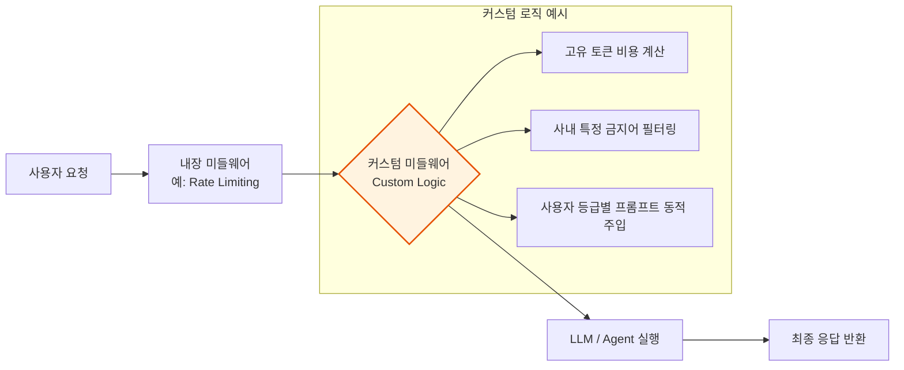
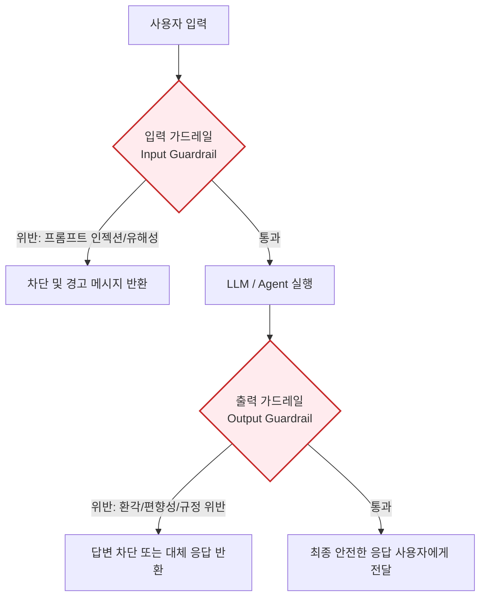
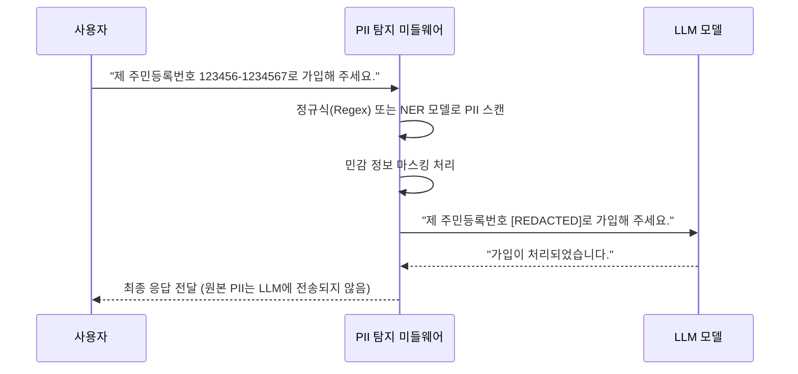
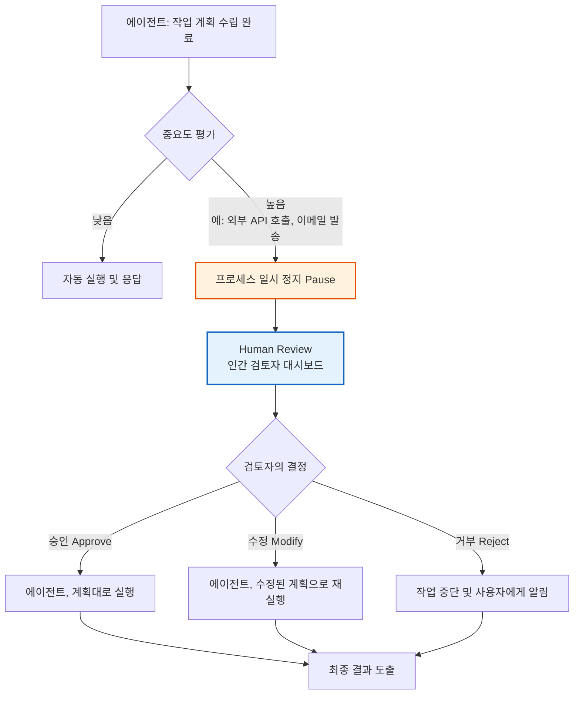

# Part 4. 미들웨어 & 가드레일 (심화)

## 4-3. 커스텀 미들웨어 (Custom Middleware)

### 1) 이론적 개념
프레임워크에서 제공하는 내장 미들웨어로 해결할 수 없는 **특정 비즈니스 로직이나 조직의 고유한 규칙**을 적용하기 위해 개발자가 직접 설계하는 미들웨어입니다. 요청(Request)이나 응답(Response)의 생명주기(Lifecycle) 특정 지점에 가로채기(Hook) 로직을 삽입하여 동작을 제어합니다.

### 2) 작동 원리 시각화 (Mermaid)

### 3) 장단점 및 응용 분야
* **장점:** 
  1. **무한한 유연성:** 조직의 보안 정책, 과금 모델, 특수한 포맷팅 요구사항 등 어떤 비즈니스 로직도 파이프라인에 통합할 수 있습니다.
  2. **핵심 로직 분리:** 비즈니스 규칙을 LLM 호출 코드와 분리하여 유지보수성을 극대화합니다.
* **단점:** 
  1. **개발 및 테스트 비용:** 직접 구현해야 하므로 버그 발생 가능성이 있으며, 미들웨어 체인이 길어질수록 디버깅이 복잡해집니다.
  2. **성능 오버헤드:** 복잡한 커스텀 로직은 요청 처리 지연(Latency)을 유발할 수 있습니다.
* **응용 분야:** 
  - 사내 규정 위반 단어를 실시간으로 차단하는 필터, 사용자 구독 등급에 따라 다른 LLM 모델을 라우팅하는 로직, 자체적인 사용량 과금 로깅 시스템.

---

## 4-4. 가드레일(Guardrails) 개요

### 1) 이론적 개념
가드레일은 LLM 애플리케이션이 **안전(Safety), 보안(Security), 규정 준수(Compliance)** 를 위반하지 않도록 보호하는 일련의 규칙과 검증 계층입니다. 크게 **입력 가드레일(Input Guardrails)** 과 **출력 가드레일(Output Guardrails)** 로 나뉘며, 악의적인 프롬프트 인젝션, 유해한 콘텐츠 생성, 할루시네이션 등을 방지합니다.

### 2) 가드레일 아키텍처 시각화 (Mermaid)

### 3) 장단점 및 응용 분야
* **장점:** 
  1. **브랜드 리스크 최소화:** AI가 부적절한 발언을 하여 기업의 평판이 훼손되는 것을 사전에 방지합니다.
  2. **규제 대응:** GDPR, AI Act 등 글로벌 AI 규제에 대한 준수(Compliance) 증빙 자료로 활용 가능합니다.
* **단점:** 
  1. **False Positive(위양성):** 정상적인 요청을 유해하다고 잘못 판단하여 차단할 수 있어 사용자 경험(UX)을 해칠 수 있습니다.
  2. **지연 시간 증가:** 입력과 출력 모두에서 추가적인 검증 모델이나 규칙 엔진을 통과해야 하므로 응답 속도가 느려집니다.
* **응용 분야:** 
  - 대중에게 공개된 고객 지원 챗봇, 교육용 AI 튜터, 금융/의료 등 규제가 엄격한 산업군의 AI 어시스턴트.

---

## 4-5. PII 탐지 (Personally Identifiable Information Detection)

### 1) 이론적 개념
PII(개인 식별 정보) 탐지는 가드레일의 가장 중요한 하위 분야 중 하나입니다. 사용자의 입력이나 LLM의 출력에 **주민등록번호, 전화번호, 이메일, 신용카드 번호, 의료 기록** 등이 포함되어 있는지 실시간으로 탐지하여 **마스킹(Masking)** 또는 **삭제(Redaction)** 하는 기술입니다. 이를 통해 LLM 제공업체로 민감 데이터가 유출되는 것을 원천 차단합니다.

### 2) PII 탐지 및 마스킹 흐름 시각화 (Mermaid)

### 3) 장단점 및 응용 분야
* **장점:** 
  1. **데이터 유출 방지:** 외부 LLM API를 사용하더라도 사내 기밀이나 고객 개인정보가 서버를 떠나지 않도록 보장합니다.
  2. **법적 준수:** 개인정보보호법, GDPR 등 데이터 프라이버시 규정을 쉽게 준수할 수 있습니다.
* **단점:** 
  1. **탐지 정확도의 한계:** 정규식만 사용하면 변형된 PII를 놓칠 수 있고, NER 모델을 사용하면 추가적인 연산 비용이 발생합니다.
  2. **문맥 소실:** 과도한 마스킹은 LLM이 문맥을 이해하는 데 방해가 될 수 있습니다.
* **응용 분야:** 
  - 병원 차트 분석 AI, 은행 고객 문의 응대 봇, 이력서 자동 스크리닝 시스템.

---

## 4-6. Human-in-the-Loop (HITL, 인간 참여 루프)

### 1) 이론적 개념
완전 자동화된 AI 시스템에서 발생할 수 있는 치명적 오류를 방지하기 위해, **중요한 의사결정 지점에서 인간의 개입(승인, 수정, 거부)을 필수적으로 요구하는 아키텍처 패턴**입니다. 에이전트가 도구를 실행하거나 최종 답변을 생성하기 직전에 프로세스를 일시 정지(Pause)하고 사용자의 확인을 기다립니다.

### 2) HITL 작동 흐름 시각화 (Mermaid)

### 3) 장단점 및 응용 분야
* **장점:** 
  1. **최고 수준의 안전성과 책임 소재 명확화:** AI의 환각이나 잘못된 도구 호출로 인한 실제 피해(금전 손실, 명예 훼손 등)를 원천 봉쇄합니다.
  2. **AI의 학습 데이터 확보:** 인간이 수정한 내용을 피드백 루프에 넣어 향후 모델 성능을 개선하는 데 활용할 수 있습니다.
* **단점:** 
  1. **자동화의 효율성 저하:** 인간의 개입을 기다리는 동안 처리 지연이 발생하며, 완전 자율(Autonomous) 시스템의 장점이 반감됩니다.
  2. **UX 복잡성:** 승인/거부를 위한 별도의 인터페이스와 워크플로우를 구축해야 합니다.
* **응용 분야:** 
  - 자율 코딩 에이전트(코드 배포 전 인간 리뷰), 금융 거래 실행 봇, 의료 진단 지원 시스템, 중요한 고객사 발송 이메일 초안 작성.

---

### 💡 강의용 종합 요약 (Key Takeaway)

이 4가지 개념은 AI 애플리케이션이 **"똑똑한 장난감"에서 "신뢰할 수 있는 비즈니스 도구"** 로 진화하기 위한 필수 조건입니다.

| 개념 | 핵심 질문 | 비유 |
| :--- | :--- | :--- |
| **커스텀 미들웨어** | "우리 회사만의 특별한 규칙을 어떻게 적용할까?" | **맞춤 정장:** 내 치수에 딱 맞게 수정된 재단사 |
| **가드레일** | "AI가 위험하거나 엉뚱한 말을 하지 않을까?" | **가드레일/안전벨트:** 차선이탈이나 충돌을 방지하는 장치 |
| **PII 탐지** | "고객의 비밀이 외부로 새어나가지 않을까?" | **블라인드 처리:** 기밀 문서를 외부에 보낼 때 검은 마커로 가림 |
| **Human-in-the-Loop** | "이 결정이 너무 중요해서 사람이 한 번 더 봐야 하지 않을까?" | **결재 라인:** 중요한 문서는 부장의 도장이 있어야 실행됨 |

**강의 팁:** 수강생들에게 *"가장 지능적인 LLM 모델을 쓰는 것보다, 이 4가지 안전 장치를 얼마나 견고하게 설계했는지가 프로덕션 레벨 AI 서비스의 성패를 가릅니다. 안전하지 않은 AI는 아무리 똑똑해도 비즈니스에서 사용할 수 없습니다."* 라고 강조해 주시면 실무적 통찰력을 완벽하게 전달할 수 있습니다.
