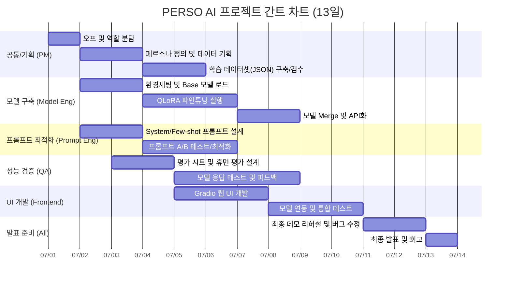
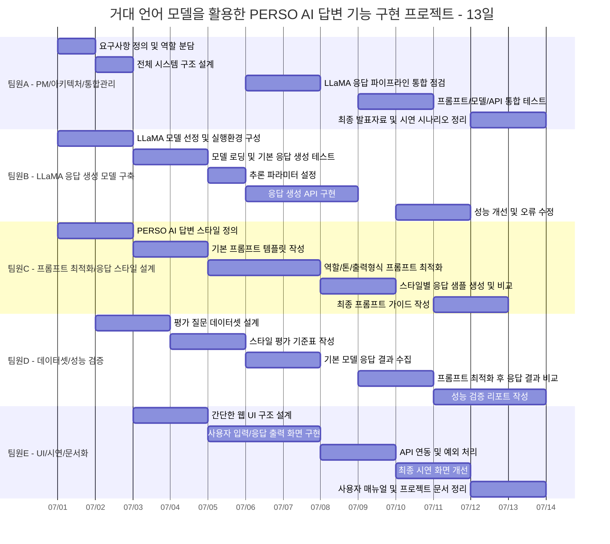

```mermaid
gantt
    title PERSO AI 프로젝트 간트 차트 (13일)
    dateFormat  YYYY-MM-DD
    axisFormat  %m/%d
    
    section 공통/기획 (PM)
    오프 및 역할 분담             :a1, 2024-07-01, 1d
    페르소나 정의 및 데이터 기획     :a2, after a1, 2d
    학습 데이터셋(JSON) 구축/검수    :a3, after a2, 2d
    
    section 모델 구축 (Model Eng)
    환경세팅 및 Base 모델 로드       :b1, 2024-07-02, 2d
    QLoRA 파인튜닝 실행              :b2, after b1, 3d
    모델 Merge 및 API화              :b3, after b2, 2d
    
    section 프롬프트 최적화 (Prompt Eng)
    System/Few-shot 프롬프트 설계    :c1, 2024-07-02, 2d
    프롬프트 A/B 테스트/최적화       :c2, after c1, 3d
    
    section 성능 검증 (QA)
    평가 시트 및 휴먼 평가 설계      :d1, 2024-07-03, 2d
    모델 응답 테스트 및 피드백       :d2, after d1, 4d
    
    section UI 개발 (Frontend)
    Gradio 웹 UI 개발                :e1, 2024-07-05, 3d
    모델 연동 및 통합 테스트         :e2, after e1, 3d
    
    section 발표 준비 (All)
    최종 데모 리허설 및 버그 수정    :f1, 2024-07-11, 2d
    최종 발표 및 회고                :f2, after f1, 1d
```

```mermaid
gantt
    title 거대 언어 모델을 활용한 PERSO AI 답변 기능 구현 프로젝트 - 13일
    dateFormat  YYYY-MM-DD
    axisFormat  %m/%d

    section 팀원A - PM/아키텍처/통합관리
    요구사항 정의 및 역할 분담              :a1, 2026-07-01, 1d
    전체 시스템 구조 설계                   :a2, 2026-07-02, 1d
    LLaMA 응답 파이프라인 통합 점검          :a3, 2026-07-06, 2d
    프롬프트/모델/API 통합 테스트            :a4, 2026-07-09, 2d
    최종 발표자료 및 시연 시나리오 정리       :a5, 2026-07-12, 2d

    section 팀원B - LLaMA 응답 생성 모델 구축
    LLaMA 모델 선정 및 실행환경 구성         :b1, 2026-07-01, 2d
    모델 로딩 및 기본 응답 생성 테스트        :b2, 2026-07-03, 2d
    추론 파라미터 설정                       :b3, 2026-07-05, 1d
    응답 생성 API 구현                       :b4, 2026-07-06, 3d
    성능 개선 및 오류 수정                   :b5, 2026-07-10, 2d

    section 팀원C - 프롬프트 최적화/응답 스타일 설계
    PERSO AI 답변 스타일 정의                :c1, 2026-07-01, 2d
    기본 프롬프트 템플릿 작성                :c2, 2026-07-03, 2d
    역할/톤/출력형식 프롬프트 최적화          :c3, 2026-07-05, 3d
    스타일별 응답 샘플 생성 및 비교           :c4, 2026-07-08, 2d
    최종 프롬프트 가이드 작성                :c5, 2026-07-11, 2d

    section 팀원D - 데이터셋/성능 검증
    평가 질문 데이터셋 설계                  :d1, 2026-07-02, 2d
    스타일 평가 기준표 작성                  :d2, 2026-07-04, 2d
    기본 모델 응답 결과 수집                 :d3, 2026-07-06, 2d
    프롬프트 최적화 후 응답 결과 비교         :d4, 2026-07-09, 2d
    성능 검증 리포트 작성                    :d5, 2026-07-11, 3d

    section 팀원E - UI/시연/문서화
    간단한 웹 UI 구조 설계                   :e1, 2026-07-03, 2d
    사용자 입력/응답 출력 화면 구현           :e2, 2026-07-05, 3d
    API 연동 및 예외 처리                    :e3, 2026-07-08, 2d
    최종 시연 화면 개선                      :e4, 2026-07-10, 2d
    사용자 매뉴얼 및 프로젝트 문서 정리        :e5, 2026-07-12, 2d
```
