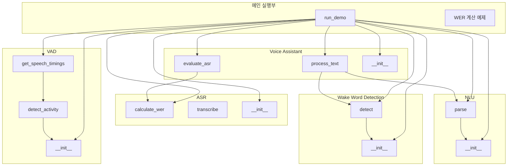
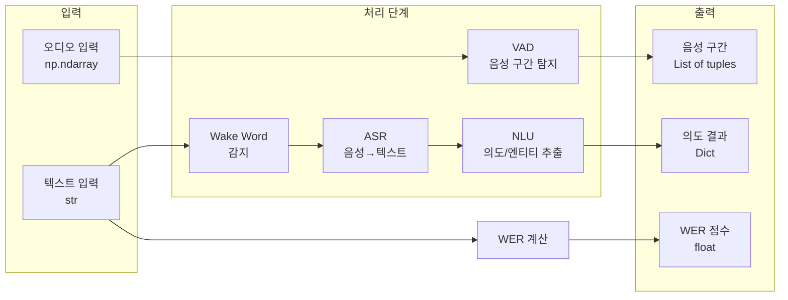
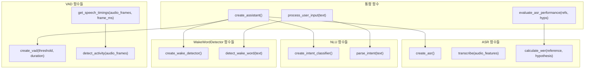
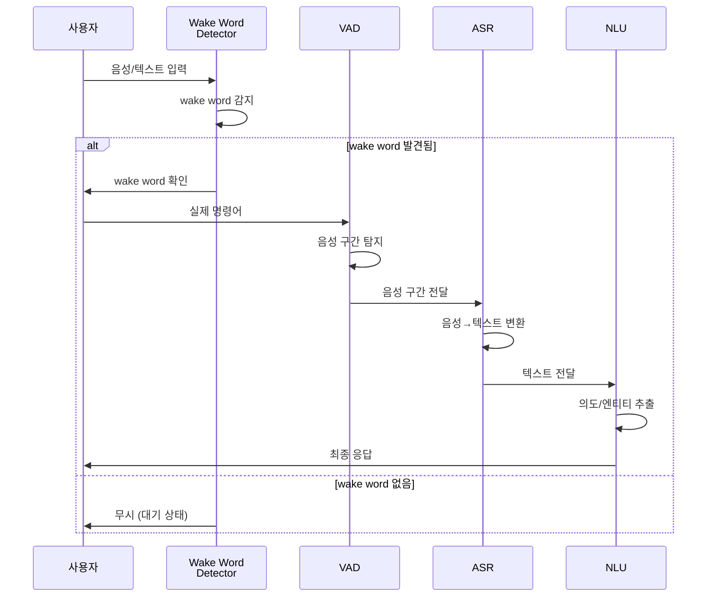

```python
# 음성비서 핵심 구성 요소 실습 코드

import re
import numpy as np
from typing import Dict, Tuple, List
import warnings
warnings.filterwarnings('ignore')

# ============================================
# 1. Wake Word Detection (간단한 키워드 매칭)
# ============================================

class WakeWordDetector:
    """간단한 wake word 감지기 (실제로는 딥러닝 모델 사용)"""
    
    def __init__(self, wake_words: List[str] = ["hey siri", "ok google", "hello"]):
        self.wake_words = [w.lower() for w in wake_words]
    
    def detect(self, text: str) -> Tuple[bool, str]:
        """텍스트에서 wake word 감지"""
        text_lower = text.lower()
        for wake_word in self.wake_words:
            if wake_word in text_lower:
                return True, wake_word
        return False, None
    
    def simulate_always_on(self, audio_stream_callback):
        """항상 대기 상태 시뮬레이션"""
        print("🎤 항상 대기 모드 활성화... (wake word listening)")
        # 실제 구현에서는 오디오 스트림 처리


# ============================================
# 2. VAD (Voice Activity Detection) - 에너지 기반
# ============================================

class VoiceActivityDetector:
    """에너지 기반 VAD (실제로는 더 복잡한 알고리즘 사용)"""
    
    def __init__(self, threshold: float = 0.01, min_speech_duration: int = 10):
        self.threshold = threshold
        self.min_speech_duration = min_speech_duration  # 최소 프레임 수
    
    def detect_activity(self, audio_frames: np.ndarray) -> List[Tuple[int, int]]:
        """
        음성 활동 구간 탐지
        Returns: [(start_frame, end_frame), ...]
        """
        # 에너지 계산 (RMS)
        energy = np.sqrt(np.mean(audio_frames**2, axis=1))
        
        # 임계값 이상 구간 찾기
        is_speech = energy > self.threshold
        
        # 연속된 음성 구간 찾기
        speech_segments = []
        in_speech = False
        start = 0
        
        for i, active in enumerate(is_speech):
            if active and not in_speech:
                start = i
                in_speech = True
            elif not active and in_speech:
                if i - start >= self.min_speech_duration:
                    speech_segments.append((start, i))
                in_speech = False
        
        if in_speech and len(audio_frames) - start >= self.min_speech_duration:
            speech_segments.append((start, len(audio_frames)))
        
        return speech_segments
    
    def get_speech_timings(self, audio_frames: np.ndarray, frame_ms: int = 10):
        """음성 시작/종료 시간(ms) 반환"""
        segments = self.detect_activity(audio_frames)
        return [(start * frame_ms, end * frame_ms) for start, end in segments]


# ============================================
# 3. ASR (Automatic Speech Recognition) - 간단한 음성-텍스트
# ============================================

class SimpleASR:
    """간단한 ASR 모의 구현 (실제로는 Whisper, Vosk 등 사용)"""
    
    def __init__(self):
        # 간단한 음소-단어 매핑 (데모용)
        self.phoneme_to_word = {
            "w eh dh er": "weather",
            "s eh t": "set",
            "t ih m er": "timer",
            "c aa l ih f ow r n y aa": "california",
            "h ao w": "how",
            "aa r": "are",
            "y uw": "you",
            "oo ou k": "ok google",
            "hh ey": "hey",
    }
    
    def transcribe(self, audio_features: np.ndarray) -> str:
        """음성 특징을 텍스트로 변환 (실제 ASR 모델 대체)"""
        # 실제 구현에서는 딥러닝 모델 사용
        # 여기서는 간단한 시뮬레이션
        sample_words = ["hey google", "weather tomorrow", "set timer", "how are you"]
        return np.random.choice(sample_words)
    
    @staticmethod
    def calculate_wer(reference: str, hypothesis: str) -> float:
        """WER (Word Error Rate) 계산"""
        ref_words = reference.lower().split()
        hyp_words = hypothesis.lower().split()
        
        # 간단한 Levenshtein 거리 계산
        n = len(ref_words)
        m = len(hyp_words)
        
        # DP 테이블 초기화
        dp = [[0] * (m + 1) for _ in range(n + 1)]
        for i in range(n + 1):
            dp[i][0] = i
        for j in range(m + 1):
            dp[0][j] = j
        
        # DP 계산
        for i in range(1, n + 1):
            for j in range(1, m + 1):
                if ref_words[i-1] == hyp_words[j-1]:
                    cost = 0
                else:
                    cost = 1  # substitution
                
                dp[i][j] = min(
                    dp[i-1][j] + 1,      # deletion
                    dp[i][j-1] + 1,      # insertion
                    dp[i-1][j-1] + cost  # substitution
                )
        
        min_edit_distance = dp[n][m]
        
        # WER = (S + D + I) / N * 100
        wer = (min_edit_distance / n) * 100 if n > 0 else 0
        return wer


# ============================================
# 4. NLU (Natural Language Understanding)
# ============================================

class IntentClassifier:
    """간단한 의도 분류기"""
    
    def __init__(self):
        self.intent_patterns = {
            "weather": ["날씨", "weather", "비", "맑음", "온도", "기온"],
            "timer": ["타이머", "timer", "알람", "alarm", "설정해줘"],
            "reminder": ["리마인더", "reminder", "기억", "알려줘"],
            "search": ["검색", "search", "찾아줘", "뭐야"],
            "greeting": ["안녕", "hello", "hi", "hey", "반가워"],
        }
        
        self.entity_extractors = {
            "date": r'\b(내일|모레|오늘|주말|월요일|화요일|수요일|목요일|금요일|토요일|일요일)\b',
            "time": r'\b([0-9]{1,2}:[0-9]{2}|[0-9]{1,2}시|[0-9]{1,2}분)\b',
            "number": r'\b[0-9]+\b',
            "location": r'\b(서울|부산|대구|인천|광주|대전|울산|제주)\b',
        }
    
    def parse(self, text: str) -> Dict:
        """텍스트에서 의도(Intent)와 엔티티(Entity) 추출"""
        text_lower = text.lower()
        
        # Intent 분류
        intent_scores = {}
        for intent, keywords in self.intent_patterns.items():
            score = sum(1 for kw in keywords if kw in text_lower)
            if score > 0:
                intent_scores[intent] = score
        
        primary_intent = max(intent_scores, key=intent_scores.get) if intent_scores else "unknown"
        
        # Entity 추출
        entities = {}
        for entity_name, pattern in self.entity_extractors.items():
            matches = re.findall(pattern, text)
            if matches:
                entities[entity_name] = matches[0] if len(matches) == 1 else matches
        
        return {
            "intent": primary_intent,
            "entities": entities,
            "original_text": text,
            "confidence": max(intent_scores.values()) / sum(intent_scores.values()) if intent_scores else 0
        }


# ============================================
# 5. 통합 음성비서 클래스
# ============================================

class VoiceAssistant:
    """음성비서 통합 클래스"""
    
    def __init__(self):
        self.wake_word_detector = WakeWordDetector()
        self.vad = VoiceActivityDetector()
        self.asr = SimpleASR()
        self.nlu = IntentClassifier()
        self.is_listening = True
        
    def process_text(self, text: str) -> Dict:
        """텍스트 처리 파이프라인"""
        # Step 1: Wake word 감지
        is_wake, wake_word = self.wake_word_detector.detect(text)
        
        if is_wake:
            print(f"🔊 Wake word detected: '{wake_word}'")
            # Wake word 제거 후 실제 명령어 추출
            command = re.sub(re.escape(wake_word), '', text, flags=re.IGNORECASE).strip()
            if not command:
                return {"status": "waiting_for_command", "message": "명령어를 말씀해주세요"}
        else:
            # Wake word 없으면 무시 (실제는 항상 대기)
            if self.is_listening:
                return {"status": "inactive", "message": "wake word를 불러주세요"}
            command = text
        
        # Step 3: NLU로 의도 파악
        nlu_result = self.nlu.parse(command if 'command' in locals() else text)
        
        return {
            "status": "processed",
            "command": command if 'command' in locals() else text,
            "wake_word_detected": is_wake,
            "nlu": nlu_result
        }
    
    def evaluate_asr(self, reference_texts: List[str], hypothesis_texts: List[str]) -> Dict:
        """ASR 성능 평가 (WER 계산)"""
        wer_scores = []
        for ref, hyp in zip(reference_texts, hypothesis_texts):
            wer = self.asr.calculate_wer(ref, hyp)
            wer_scores.append(wer)
            print(f"Reference: {ref}")
            print(f"Hypothesis: {hyp}")
            print(f"WER: {wer:.2f}%\n")
        
        return {
            "average_wer": np.mean(wer_scores),
            "individual_wer": wer_scores,
            "total_samples": len(wer_scores)
        }


# ============================================
# 실습 및 테스트 코드
# ============================================

def run_demo():
    print("=" * 60)
    print("음성비서 핵심 구성 요소 데모")
    print("=" * 60)
    
    # 1. Wake Word Detection 테스트
    print("\n[1] Wake Word Detection 테스트")
    wake_detector = WakeWordDetector()
    test_phrases = [
        "hey siri what's the weather",
        "ok google set a timer",
        "hello how are you",
        "what time is it"
    ]
    
    for phrase in test_phrases:
        detected, word = wake_detector.detect(phrase)
        print(f"  '{phrase}' → Detected: {detected} ({word if word else 'None'})")
    
    # 2. VAD 테스트 (시뮬레이션)
    print("\n[2] VAD (Voice Activity Detection) 테스트")
    dummy_audio = np.random.randn(1000, 1) * 0.1  # 무작위 오디오
    dummy_audio[100:300] = np.random.randn(200, 1) * 0.5  # 음성 구간 시뮬레이션
    
    vad = VoiceActivityDetector(threshold=0.2)
    segments = vad.get_speech_timings(dummy_audio, frame_ms=10)
    print(f"  감지된 음성 구간: {segments} ms")
    
    # 3. ASR 및 WER 계산 테스트
    print("\n[3] ASR 및 WER 계산 테스트")
    asr = SimpleASR()
    
    reference = "hey google weather tomorrow"
    hypothesis = "hey google weather tomorrow"  # 완벽한 인식
    wer = asr.calculate_wer(reference, hypothesis)
    print(f"  완벽 인식 WER: {wer:.2f}%")
    
    reference = "set a timer for 5 minutes"
    hypothesis = "set timer for 5 minute"  # 삭제(D) 1, 대체(S) 0, 삽입(I) 0
    wer = asr.calculate_wer(reference, hypothesis)
    print(f"  오류 포함 WER: {wer:.2f}%")
    
    # 4. NLU 테스트
    print("\n[4] NLU (Intent & Entity Extraction) 테스트")
    nlu = IntentClassifier()
    
    test_queries = [
        "내일 날씨 알려줘",
        "5분 타이머 설정해줘",
        "안녕하세요",
        "서울 날씨 어때?"
    ]
    
    for query in test_queries:
        result = nlu.parse(query)
        print(f"  Query: '{query}'")
        print(f"    Intent: {result['intent']}")
        print(f"    Entities: {result['entities']}")
        print(f"    Confidence: {result['confidence']:.2f}")
    
    # 5. 통합 음성비서 테스트
    print("\n[5] 통합 Voice Assistant 테스트")
    assistant = VoiceAssistant()
    
    user_inputs = [
        "hey google what's the weather",
        "ok google set a timer",
        "hello there"
    ]
    
    for user_input in user_inputs:
        print(f"\n  User: {user_input}")
        response = assistant.process_text(user_input)
        print(f"  Assistant: {response.get('nlu', {}).get('intent', 'unknown')}")
        if response.get('nlu', {}).get('entities'):
            print(f"    Entities: {response['nlu']['entities']}")


if __name__ == "__main__":
    run_demo()
    
    # 추가: WER 상세 계산 예제
    print("\n" + "=" * 60)
    print("WER (Word Error Rate) 상세 계산 예제")
    print("=" * 60)
    
    examples = [
        ("안녕하세요 저는 음성비서입니다", "안녕하세요 음성비서입니다"),  # 삭제 1
        ("오늘 날씨 어때", "오늘 날씨가 어때"),  # 삽입 1
        ("타이머 설정해줘", "알람 설정해줘"),  # 대체 1
        ("복잡한 문장 테스트입니다", "복잡한 문장 예제입니다"),  # 대체 1
    ]
    
    for ref, hyp in examples:
        # 간단한 WER 계산을 위한 단어 분할 (한국어는 형태소 분석 필요)
        def simple_tokenize(korean_text):
            # 공백 기준 분할 (실제는 형태소 분석 필요)
            return korean_text.split()
        
        ref_tokens = simple_tokenize(ref)
        hyp_tokens = simple_tokenize(hyp)
        
        # Levenshtein 거리 계산
        n = len(ref_tokens)
        m = len(hyp_tokens)
        dp = [[0] * (m + 1) for _ in range(n + 1)]
        for i in range(n + 1):
            dp[i][0] = i
        for j in range(m + 1):
            dp[0][j] = j
        
        for i in range(1, n + 1):
            for j in range(1, m + 1):
                cost = 0 if ref_tokens[i-1] == hyp_tokens[j-1] else 1
                dp[i][j] = min(dp[i-1][j] + 1, dp[i][j-1] + 1, dp[i-1][j-1] + cost)
        
        min_dist = dp[n][m]
        wer = (min_dist / n) * 100 if n > 0 else 0
        
        print(f"Ref: {ref}")
        print(f"Hyp: {hyp}")
        print(f"S+D+I = {min_dist}, N = {n}, WER = {wer:.2f}%")
        print()
```

GPT를 이용하여 위의 소스 코드를 예시로 아래와 같은 다양한 다이어그램을 작성할 수 있음

함수 기반으로 작성된 코드라면 **클래스 다이어그램 대신** 다음과 같은 다이어그램들이 더 적합합니다:

## 1. 함수 호출 관계도 (Function Call Graph)



## 2. 데이터 흐름도 (Data Flow Diagram)



## 3. 함수 간 의존성 다이어그램



## 4. 순차 처리 파이프라인 (Sequence Diagram)



## 함수 기반 vs 클래스 기반 비교

| 관점 | 클래스 기반 | 함수 기반 |
|------|------------|----------|
| **적합한 다이어그램** | 클래스 다이어그램 | 흐름도, 데이터 흐름도, 시퀀스 다이어그램 |
| **구조 표현** | 계층적 구조 | 처리 흐름 중심 |
| **재사용성 표현** | 상속/포함 관계 | 함수 호출 관계 |
| **상태 표현** | 멤버 변수 | 파라미터/반환값 |

함수 기반 코드에서는 **어떤 데이터가 어떤 함수를 거쳐 어떻게 변환되는지**를 보여주는 다이어그램이 더 의미 있습니다.
