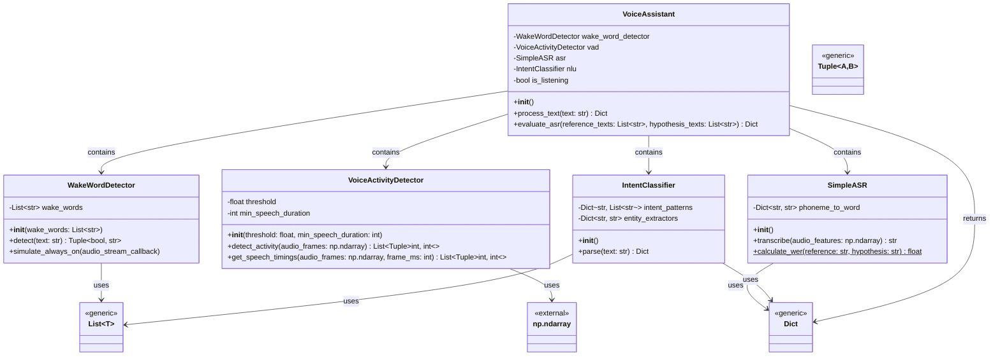

```mermaid
classDiagram
    class WakeWordDetector {
        -List~str~ wake_words
        +__init__(wake_words: List~str~)
        +detect(text: str) Tuple~bool, str~
        +simulate_always_on(audio_stream_callback)
    }

    class VoiceActivityDetector {
        -float threshold
        -int min_speech_duration
        +__init__(threshold: float, min_speech_duration: int)
        +detect_activity(audio_frames: np.ndarray) List~Tuple~int, int~~
        +get_speech_timings(audio_frames: np.ndarray, frame_ms: int) List~Tuple~int, int~~
    }

    class SimpleASR {
        -Dict~str, str~ phoneme_to_word
        +__init__()
        +transcribe(audio_features: np.ndarray) str
        +calculate_wer(reference: str, hypothesis: str) float$
    }

    class IntentClassifier {
        -Dict~str, List~str~~ intent_patterns
        -Dict~str, str~ entity_extractors
        +__init__()
        +parse(text: str) Dict
    }

    class VoiceAssistant {
        -WakeWordDetector wake_word_detector
        -VoiceActivityDetector vad
        -SimpleASR asr
        -IntentClassifier nlu
        -bool is_listening
        +__init__()
        +process_text(text: str) Dict
        +evaluate_asr(reference_texts: List~str~, hypothesis_texts: List~str~) Dict
    }

    class Dict {
        <<generic>>
    }

    class List~T~ {
        <<generic>>
    }

    class Tuple~A,B~ {
        <<generic>>
    }

    class np.ndarray {
        <<external>>
    }

    WakeWordDetector --> List : uses
    VoiceActivityDetector --> np.ndarray : uses
    SimpleASR --> Dict : uses
    IntentClassifier --> Dict : uses
    IntentClassifier --> List : uses
    VoiceAssistant --> WakeWordDetector : contains
    VoiceAssistant --> VoiceActivityDetector : contains
    VoiceAssistant --> SimpleASR : contains
    VoiceAssistant --> IntentClassifier : contains
    VoiceAssistant --> Dict : returns
```
