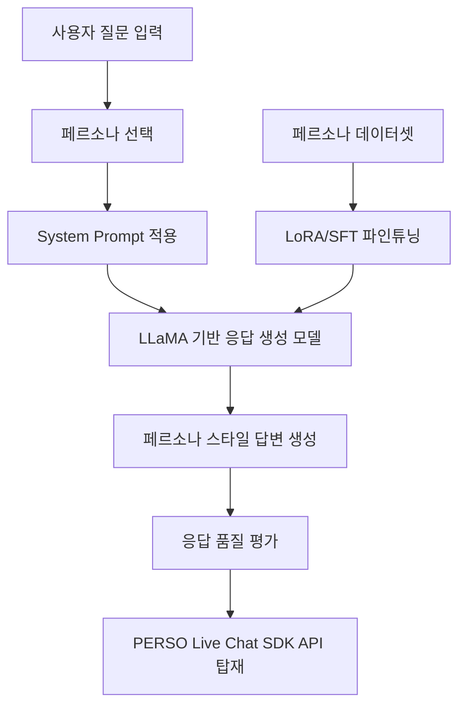
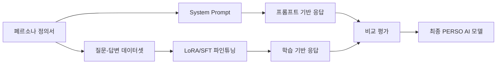

## 1. 프로젝트 제목에 대한 해석

프로젝트 제목은 다음과 같습니다.

> **거대 언어 모델을 활용한 PERSO AI 답변 기능 구현하기**

이 제목을 기술적으로 풀어보면 다음과 같습니다.

| 항목       | 의미                                        |
| -------- | ----------------------------------------- |
| 거대 언어 모델 | LLaMA, Qwen, Mistral 같은 사전학습 LLM          |
| PERSO AI | 개인화된 말투, 역할, 지식, 성격을 가진 AI                |
| 답변 기능    | 사용자의 질문을 받아 자연어로 응답 생성                    |
| 구현하기     | 모델 로딩, 프롬프트 설계, 데이터셋 구성, 파인튜닝, 평가, API 탑재 |

따라서 이 프로젝트는 단순 챗봇이 아니라 **“페르소나가 입혀진 챗봇 모델을 만들고 서비스 API에 연결하는 프로젝트”**로 정의하는 것이 적절합니다.

---

## 2. 핵심은 “페르소나 AI 모델”인가?

| 구분              | 설명                                  |
| --------------- | ----------------------------------- |
| 일반 LLM 챗봇       | 질문에 대해 일반적인 답변을 생성                  |
| 프롬프트 기반 페르소나 챗봇 | System Prompt로 말투와 역할을 지정           |
| 파인튜닝 기반 페르소나 모델 | 데이터셋을 학습해 특정 말투와 응답 패턴을 내재화         |
| 서비스형 PERSO AI   | 학습된 모델을 API 또는 SDK에 연결해 실제 서비스처럼 사용 |

즉, 이 프로젝트의 최종 목표는 단순히 “LLaMA를 실행했다”가 아니라,

> **LLaMA 기반 모델이 특정 페르소나의 말투, 역할, 응답 규칙을 유지하면서 답변하도록 만들고, 이를 API로 서비스에 탑재하는 것**

입니다.

---

## 3. 추천하는 프로젝트 방향

이 프로젝트는 다음 4단계로 구성

이 구조에서 핵심은 두 가지입니다.

첫째, **프롬프트만으로 페르소나를 구현하는 단계**가 필요합니다.
둘째, 그다음 **페르소나 데이터셋을 이용해 LoRA 또는 SFT 방식으로 말투와 응답 패턴을 학습시키는 단계**가 필요

---

## 4. 기존 3가지 사례에 대한 제 의견

다른 AI 모델이 제시한 3가지 사례는 방향 자체는 좋습니다. 다만 프로젝트 목적에 따라 장단점이 다릅니다.

| 사례     | 장점                       | 주의점                               | 추천도    |
| ------ | ------------------------ | --------------------------------- | ------ |
| 충남이    | 실무형 포트폴리오 가치가 높음         | 정책 정보는 틀리면 안 되므로 RAG 또는 근거 데이터 필요 | 매우 추천  |
| 서울 아저씨 | 말투 차이가 뚜렷해 파인튜닝 효과 확인 쉬움 | 과격한 표현은 조절 필요                     | 실습용 추천 |
| Emma   | 교육용 챗봇으로 확장성 좋음          | 영어 교정 패턴 데이터셋이 필요                 | 안정적 추천 |

가장 추천하는 것은 **1번 충남이**  <-- 3차 프로젝트에서 RAG를 학습하고 적용해야 됨
이유는 단순히 말투만 바꾸는 것이 아니라 **실제 문서 기반 상담 AI**로 확장할 수 있기 때문입니다.

다만 이번 프로젝트의 세부 항목이 RAG가 아니라 **LLaMA 응답 생성, 프롬프트 최적화, 모델 평가, SDK 탑재** 중심이라면, 충남이 사례를 사용할 때도 처음부터 정책 검색까지 넣기보다는 다음처럼 나누는 것이 좋습니다.

| 단계    | 구현 범위                  |
| ----- | ---------------------- |
| 1단계   | 충남이 페르소나 프롬프트 설계       |
| 2단계   | 충남이 말투 데이터셋 제작         |
| 3단계   | LLaMA/LoRA 기반 말투 파인튜닝  |
| 4단계   | 답변 스타일 평가              |
| 5단계   | API로 탑재                |
| 확장 단계 | 충남 육아 정책 PDF 기반 RAG 연결 |

즉, 이번 프로젝트에서는 **페르소나 말투와 응답 패턴 구현**을 핵심으로 잡고, RAG는 다음 프로젝트 또는 고도화 기능으로 두는 것이 좋습니다.

---

## 5. 프로젝트를 더 명확하게 정의하면

저라면 이 프로젝트를 이렇게 정의하겠습니다.

> **LLaMA 기반 사전학습 모델에 페르소나별 System Prompt와 학습 데이터셋을 적용하여, 사용자의 질문에 특정 캐릭터·전문가·멘토의 말투와 응답 규칙으로 답변하는 PERSO AI 응답 모델을 구현하고, 이를 Live Chat SDK API에 탑재하는 프로젝트**

이렇게 정의하면 프로젝트의 기술 범위가 명확해집니다.

---

## 6. 페르소나 AI 모델의 핵심 구성 요소

페르소나 AI는 단순히 “말투만 바꾸는 것”이 아닙니다. 최소한 아래 5가지가 필요합니다.

| 구성 요소 | 설명                | 예시                         |
| ----- | ----------------- | -------------------------- |
| 역할    | AI가 누구인지 정의       | 육아 상담사, 영어 튜터, 직장 멘토       |
| 말투    | 존댓말, 반말, 친근함, 전문성 | “~해요”, “~다네”, “Great job!” |
| 응답 규칙 | 답변 방식 제한          | 먼저 교정 후 설명, 마지막에 이모지 추가    |
| 지식 범위 | 어떤 분야를 아는지 정의     | 충남 육아 정책, 영어 회화, 직장생활      |
| 금지 규칙 | 하지 말아야 할 응답       | 모르면 지어내지 않기, 욕설 제한         |

이를 모델 학습 관점에서 보면 다음과 같습니다.

---

## 7. 프로젝트용으로 가장 좋은 페르소나 사례

프로젝트에 맞게 다시 추천한다면 아래 3가지

| 추천 순위 | 페르소나              | 프로젝트 적합성          |
| ----- | ----------------- | ----------------- |
| 1순위   | 충남이: 임신·출산·육아 상담사 | 실무형, 포트폴리오 가치 높음  |
| 2순위   | PERSO 학습 멘토       | 교육 과정과 직접 연결 가능   |
| 3순위   | 서울 아저씨 또는 Emma    | 말투 파인튜닝 효과 확인에 좋음 |

특히 교육 프로젝트라면 **“PERSO 학습 멘토”**도 좋다고 봅니다.

예를 들면 다음과 같습니다.

| 항목    | 내용                          |
| ----- | --------------------------- |
| 페르소나명 | PERSO 멘토                    |
| 역할    | AI/코딩 학습을 도와주는 다정한 실습 멘토    |
| 말투    | 친절한 존댓말, 쉬운 비유 사용           |
| 응답 규칙 | 개념 → 예시 → 코드 → 실습 과제 순서로 답변 |
| 활용 분야 | LLM, 파이썬, 프롬프트, 프로젝트 지도     |

이 페르소나는 사용자님의 교육 과정과도 잘 맞습니다.

예시입니다.

| Role      | 내용                                                                                                             |
| --------- | -------------------------------------------------------------------------------------------------------------- |
| System    | 당신은 비전공자에게 AI와 코딩을 쉽게 설명하는 PERSO 학습 멘토입니다. 어려운 개념은 비유로 설명하고, 답변은 항상 `개념 설명 → 쉬운 예시 → 실습 코드 → 확인 질문` 순서로 작성합니다. |
| User      | LoRA가 뭔지 모르겠어요.                                                                                                |
| Assistant | LoRA는 기존 모델 전체를 다시 학습하지 않고, 작은 보조 가중치만 추가로 학습하는 방법입니다. 쉽게 말하면 이미 운전을 잘하는 사람에게 ‘택시 운전 요령’만 추가로 가르치는 것과 비슷합니다... |

이 사례는 학생들이 바로 이해하기 좋고, 실제 강의용 챗봇으로 확장하기도 좋습니다.

---

## 8. 프로젝트 세부 항목별 구현 방향

세부 항목을 기준으로 정리

| 세부 항목                                   | 실제 구현 내용                                         |
| --------------------------------------- | ------------------------------------------------ |
| LLaMA를 활용한 응답 생성 모델 구축                  | Hugging Face 또는 Ollama 기반으로 LLaMA 계열 모델 로딩       |
| 원하는 스타일에 맞게 응답이 나오도록 프롬프트 최적화           | System Prompt, few-shot 예시, temperature 조정       |
| 학습시킨 응답 생성 모델의 성능 검증                    | 일반 모델 vs 프롬프트 모델 vs 파인튜닝 모델 비교                   |
| PERSO Live Chat SDK의 API로 학습시킨 응답 모델 탑재 | FastAPI로 `/chat`, `/persona`, `/generate` API 구성 |

이렇게 하면 “모델 학습”과 “서비스 탑재”가 연결됨

---

가장 좋은 구성은 **1차 실습은 “서울 아저씨”처럼 말투 차이가 뚜렷한 페르소나로 파인튜닝 효과를 확인**하고, **최종 프로젝트는 “충남이” 또는 “PERSO 학습 멘토”처럼 실무 적용 가능한 페르소나로 완성**하는 방식입니다.
