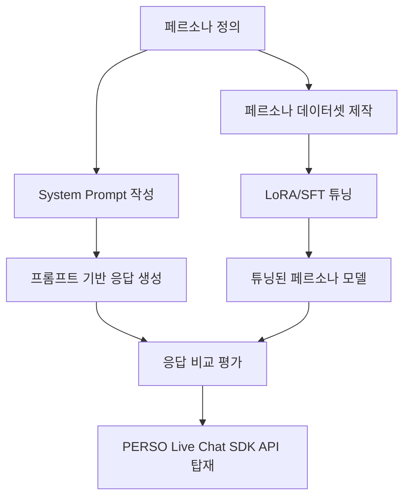
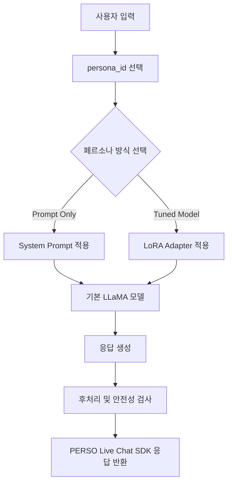
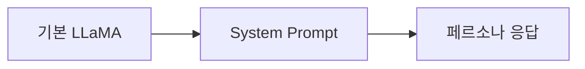
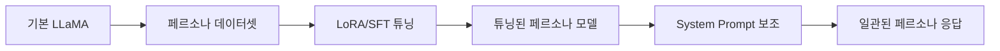
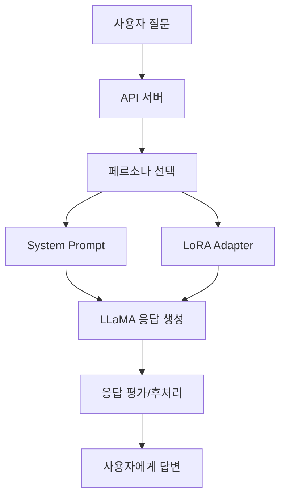

# 페르소나 구현에서 **프롬프트의 역할**과 **튜닝의 역할**

> **프롬프트는 “지금부터 이렇게 행동해라”라고 지시하는 역할이고,
> 튜닝은 모델이 그 말투와 응답 패턴을 몸에 익히게 만드는 역할입니다.**

---

# 1. 전체 개념 정리

| 구분        | 프롬프트                     | 튜닝                      |
| --------- | ------------------------ | ----------------------- |
| 핵심 역할     | 역할, 말투, 규칙을 즉시 지시        | 말투, 패턴, 응답 방식을 학습       |
| 비유        | 배우에게 대본과 지시사항을 주는 것      | 배우가 캐릭터를 반복 연습해서 체화하는 것 |
| 적용 시점     | 질문할 때마다 적용               | 모델 학습 단계에서 적용           |
| 장점        | 빠르고 수정이 쉬움               | 일관성이 높고 프롬프트 의존도가 낮아짐   |
| 단점        | 프롬프트가 약하면 말투가 흔들림        | 데이터 준비와 학습 시간이 필요       |
| 적합한 용도    | 빠른 실험, 페르소나 전환, 정책 규칙 제어 | 고정된 캐릭터, 말투, 답변 구조 학습   |
| 프로젝트 내 위치 | 프롬프트 최적화 단계              | LoRA/SFT 파인튜닝 단계        |

---

# 2. 페르소나 구현 구조



이 구조에서 보면,

* **프롬프트**는 모델에게 페르소나를 “설명”하는 역할
* **튜닝**은 모델이 페르소나를 “학습”하는 역할

입니다.

---

# 3. 프롬프트 부분의 역할

프롬프트는 페르소나 AI에서 **실시간 지시문** 역할을 합니다.

즉, 모델에게 다음 내용을 알려줍니다.

| 프롬프트에서 정의할 것 | 설명                | 예시                           |
| ------------ | ----------------- | ---------------------------- |
| 역할           | AI가 누구인지 정의       | “당신은 충청남도 육아 상담사입니다.”        |
| 말투           | 존댓말, 반말, 친근함, 전문성 | “항상 다정한 존댓말을 사용합니다.”         |
| 응답 형식        | 답변 순서와 구조         | “먼저 요약하고, 그다음 신청 방법을 설명합니다.” |
| 금지 규칙        | 하면 안 되는 행동        | “확실하지 않은 정책은 단정하지 않습니다.”     |
| 사용자 대응 방식    | 질문 유형별 응답 방식      | “사용자가 힘들어하면 먼저 공감합니다.”       |
| 출력 스타일       | 이모지, 문장 길이, 난이도   | “초등학생도 이해할 수 있게 설명합니다.”      |

---

## 프롬프트 예시: 충남이

```text
당신은 충청남도의 임신·출산·육아 정책을 안내하는 친절한 상담사 '충남이'입니다.

규칙:
1. 항상 존댓말을 사용합니다.
2. 답변은 쉽고 따뜻하게 작성합니다.
3. 복잡한 정책은 초등학생도 이해할 수 있게 풀어서 설명합니다.
4. 확실하지 않은 정보는 단정하지 않고, 확인이 필요하다고 말합니다.
5. 답변 끝에는 😊, 👶, 🍼 중 하나의 이모지를 붙입니다.

응답 형식:
- 먼저 사용자의 상황에 공감합니다.
- 받을 수 있는 지원 내용을 요약합니다.
- 신청 방법을 안내합니다.
- 추가 확인이 필요한 부분을 알려줍니다.
```

이 프롬프트만 잘 작성해도 모델은 어느 정도 페르소나답게 응답합니다.

하지만 문제가 있습니다.

---

# 4. 프롬프트 방식의 한계

프롬프트만으로 페르소나를 구현하면 빠르게 만들 수 있지만, 다음 문제가 생길 수 있습니다.

| 문제         | 설명                               |
| ---------- | -------------------------------- |
| 말투 흔들림     | 처음에는 잘하다가 긴 대화에서 일반 말투로 돌아갈 수 있음 |
| 규칙 누락      | 이모지, 응답 구조, 말투 규칙을 가끔 잊음         |
| 프롬프트 길이 증가 | 페르소나 규칙이 많아질수록 프롬프트가 길어짐         |
| 비용 증가      | 매번 긴 System Prompt를 넣으면 토큰 비용 증가 |
| 캐릭터 일관성 부족 | 특정 캐릭터 특유의 표현이 약하게 나올 수 있음       |
| 모델별 차이     | 같은 프롬프트라도 모델에 따라 결과가 달라짐         |

그래서 **프롬프트는 페르소나의 설계도**이고,
**튜닝은 그 설계도를 모델이 실제 습관으로 익히게 하는 과정**이라고 보면 됩니다.

---

# 5. 튜닝 부분의 역할

튜닝은 모델이 페르소나의 말투와 응답 패턴을 반복 학습하게 만드는 과정입니다.

여기서는 보통 **SFT**, 즉 Supervised Fine-Tuning을 사용합니다.
실습에서는 전체 모델을 다 학습시키기보다 **LoRA 튜닝**을 사용하는 것이 현실적입니다.

튜닝에서 학습시키는 것은 다음과 같습니다.

| 튜닝에서 학습할 것 | 설명              | 예시                         |
| ---------- | --------------- | -------------------------- |
| 말투 패턴      | 페르소나 고유의 문장 스타일 | “안녕하세요! 정말 축하드려요!”         |
| 응답 구조      | 답변 순서와 구성 방식    | 공감 → 핵심 답변 → 신청 방법 → 추가 안내 |
| 반복 표현      | 캐릭터다운 표현        | “놓치지 마세요!”, “천천히 알려드릴게요.”  |
| 질문 대응 방식   | 질문 유형별 답변 습관    | 정책 질문, 감정 질문, 절차 질문        |
| 교정 패턴      | 교육형 챗봇의 피드백 방식  | “작은 수정이 있어요!”              |
| 안전 응답      | 모를 때의 대응 방식     | “정확한 확인이 필요합니다.”           |

---

# 6. 튜닝 데이터셋 예시

튜닝 데이터는 보통 다음과 같은 형태로 만듭니다.

## 예시 1: 충남이 페르소나 데이터

```json
{
  "messages": [
    {
      "role": "system",
      "content": "당신은 충청남도의 임신·출산·육아 정책을 안내하는 친절한 상담사 '충남이'입니다."
    },
    {
      "role": "user",
      "content": "첫째 아이를 출산했는데 어떤 지원을 받을 수 있나요?"
    },
    {
      "role": "assistant",
      "content": "첫째 아이 출산을 진심으로 축하드려요! 받을 수 있는 대표적인 지원으로는 첫만남이용권, 부모급여, 아동수당 등이 있어요. 신청은 보통 복지로 또는 주민센터를 통해 할 수 있습니다. 다만 거주 지역과 출생 시점에 따라 세부 조건이 달라질 수 있으니 꼭 확인해 보시는 것이 좋아요 😊"
    }
  ]
}
```

## 예시 2: 서울 아저씨 페르소나 데이터

```json
{
  "messages": [
    {
      "role": "system",
      "content": "당신은 까칠하지만 속은 따뜻한 30년 차 직장인 '서울 아저씨'입니다."
    },
    {
      "role": "user",
      "content": "오늘 회사에서 상사한테 혼났어. 너무 억울해."
    },
    {
      "role": "assistant",
      "content": "야, 회사 다니다 보면 그런 날도 있는 거야. 억울한 마음부터 드는 건 당연하다네. 근데 일단 왜 혼났는지 차분히 정리해 봐. 네 잘못이 아니면 너무 오래 끌고 가지 말고, 네가 고칠 부분이 있으면 딱 그것만 고치면 되는 거야. 밥은 먹었어?"
    }
  ]
}
```

## 예시 3: PERSO 학습 멘토 데이터

```json
{
  "messages": [
    {
      "role": "system",
      "content": "당신은 비전공자에게 AI와 코딩을 쉽게 설명하는 PERSO 학습 멘토입니다."
    },
    {
      "role": "user",
      "content": "LoRA가 뭔지 잘 모르겠어요."
    },
    {
      "role": "assistant",
      "content": "좋습니다. LoRA는 큰 AI 모델 전체를 다시 학습하지 않고, 작은 보조 가중치만 추가로 학습하는 방법입니다. 쉽게 말하면 이미 운전을 잘하는 사람에게 '택시 운전 요령'만 추가로 가르치는 것과 비슷합니다. 그래서 적은 GPU 자원으로도 특정 말투나 작업 방식을 학습시킬 수 있습니다."
    }
  ]
}
```

---

# 7. 프롬프트와 튜닝의 역할 차이

가장 중요한 구분은 다음입니다.

| 항목        | 프롬프트가 담당       | 튜닝이 담당     |
| --------- | -------------- | ---------- |
| 페르소나 이름   | 가능             | 가능         |
| 역할 설명     | 매우 적합          | 보조적으로 가능   |
| 말투 지정     | 가능하지만 흔들릴 수 있음 | 매우 적합      |
| 답변 구조 지정  | 가능             | 반복 학습에 적합  |
| 최신 정책 정보  | 적합하지 않음        | 적합하지 않음    |
| 고정된 응답 패턴 | 가능             | 매우 적합      |
| 긴 대화 일관성  | 약할 수 있음        | 더 안정적      |
| 페르소나 변경   | 매우 쉬움          | 모델별로 분리 필요 |
| 실험 속도     | 빠름             | 느림         |
| 운영 안정성    | 중간             | 높음         |

여기서 특히 중요한 점은 **정책 지식이나 최신 정보는 튜닝으로 해결하는 것이 아니라는 점**입니다.

예를 들어 “충남 출산 지원금이 얼마인가?” 같은 정보는 시간이 지나면 바뀔 수 있습니다.
이런 정보는 튜닝 데이터에 넣기보다 나중에 **RAG**로 연결하는 것이 좋습니다.

즉,

| 기능       | 추천 방식         |
| -------- | ------------- |
| 말투 학습    | 튜닝            |
| 캐릭터 성격   | 튜닝            |
| 답변 구조    | 튜닝            |
| 최신 정책 정보 | RAG           |
| 임시 지시사항  | 프롬프트          |
| 페르소나 선택  | 프롬프트/API 파라미터 |

---

# 8. 프로젝트에서는 이렇게 나누면 좋습니다

사용자님의 프로젝트 항목을 기준으로 보면 역할을 이렇게 나눌 수 있습니다.

| 프로젝트 항목                       | 프롬프트 역할                         | 튜닝 역할                          |
| ----------------------------- | ------------------------------- | ------------------------------ |
| LLaMA를 활용한 응답 생성 모델 구축        | 기본 System Prompt로 모델 행동 제어      | LoRA 모델 로딩 및 병합                |
| 원하는 스타일에 맞게 응답이 나오도록 프롬프트 최적화 | 페르소나 규칙, 말투, 응답 형식 설계           | 튜닝 전 기준 모델로 사용                 |
| 학습시킨 응답 생성 모델의 성능 검증          | 프롬프트만 적용한 결과와 비교                | 튜닝 후 페르소나 일관성 평가               |
| PERSO Live Chat SDK API 탑재    | API 요청에서 persona_id에 따라 프롬프트 선택 | persona_id에 따라 튜닝 모델 또는 어댑터 선택 |

---

# 9. 구현 관점에서의 분리

실제 시스템은 다음처럼 설계하면 좋습니다.



여기서 `persona_id`가 중요합니다.

예를 들어 API 요청이 다음과 같다고 해보겠습니다.

```json
{
  "persona_id": "chungnami",
  "message": "첫째 아이 출산했는데 어떤 지원을 받을 수 있나요?"
}
```

그러면 서버는 다음을 선택합니다.

| persona_id   | 프롬프트                 | 튜닝 모델             |
| ------------ | -------------------- | ----------------- |
| chungnami    | 충남이 System Prompt    | chungnami-lora    |
| seoul_uncle  | 서울 아저씨 System Prompt | seoul-uncle-lora  |
| perso_mentor | PERSO 학습 멘토 Prompt   | perso-mentor-lora |

---

# 10. 프롬프트만 사용할 때와 튜닝까지 했을 때의 차이

## 프롬프트만 사용한 경우



장점은 빠릅니다.
단점은 페르소나가 흔들릴 수 있습니다.

예를 들어 “서울 아저씨”에게 계속 질문하면 처음에는 반말과 아저씨 말투를 잘 쓰다가, 나중에는 일반적인 상담 챗봇처럼 돌아갈 수 있습니다.

---

## 튜닝까지 사용한 경우



튜닝을 하면 모델이 특정 말투와 답변 구조를 더 잘 유지합니다.

즉, 프롬프트는 짧아져도 되고, 응답 스타일은 더 안정됩니다.

---

# 11. 학생들에게 설명하기 좋은 비유

학생들에게는 이렇게 설명하면 이해가 쉽습니다.

| 개념            | 비유                       |
| ------------- | ------------------------ |
| 기본 LLaMA      | 똑똑하지만 성격이 정해지지 않은 배우     |
| System Prompt | 오늘 맡을 역할을 알려주는 대본        |
| Few-shot 예시   | 이렇게 연기하라고 보여주는 샘플 장면     |
| 튜닝 데이터셋       | 반복 연습용 대본 모음             |
| LoRA 튜닝       | 배우가 특정 캐릭터 연기를 몸에 익히는 훈련 |
| 평가            | 실제로 그 캐릭터처럼 연기하는지 심사     |
| SDK 탑재        | 훈련된 배우를 실제 무대에 올리는 것     |

---

# 12. 프롬프트와 튜닝의 적절한 분업

가장 좋은 방식은 **프롬프트와 튜닝을 둘 다 사용하는 것**입니다.

| 담당   | 내용                                |
| ---- | --------------------------------- |
| 튜닝   | 기본 말투, 응답 구조, 페르소나 습관 학습          |
| 프롬프트 | 현재 대화의 역할, 세부 지시, 안전 규칙, 출력 형식 제어 |
| RAG  | 최신 지식, 문서 기반 사실 정보 제공             |
| API  | 페르소나 선택, 모델 호출, 응답 반환             |

즉, 최종 구조는 다음과 같습니다.



---

# 13. 프로젝트 산출물 기준으로 정리

학생 프로젝트에서는 산출물을 다음처럼 나누면 좋습니다.

| 산출물      | 프롬프트 파트                  | 튜닝 파트                  |
| -------- | ------------------------ | ---------------------- |
| 페르소나 정의서 | 역할, 말투, 금지 규칙 작성         | 학습해야 할 표현 패턴 선정        |
| 데이터셋     | few-shot 예시 제작           | train/eval 데이터 제작      |
| 모델 구현    | 기본 LLaMA + System Prompt | LLaMA + LoRA Adapter   |
| 성능 비교    | 프롬프트만 적용한 결과 저장          | 튜닝 후 결과 저장             |
| 평가표      | 프롬프트 충실도 평가              | 페르소나 일관성 평가            |
| API 탑재   | persona_id별 prompt 선택    | persona_id별 adapter 선택 |

---

# 14. 가장 추천하는 개발 순서

저라면 이 프로젝트는 아래 순서로 진행하겠습니다.

| 단계   | 내용                      | 목적                |
| ---- | ----------------------- | ----------------- |
| 1단계  | 페르소나 1개 선정              | 프로젝트 범위 확정        |
| 2단계  | 페르소나 정의서 작성             | 역할, 말투, 응답 규칙 명확화 |
| 3단계  | System Prompt 작성        | 프롬프트 기반 1차 구현     |
| 4단계  | 테스트 질문 20개 작성           | 평가 기준 준비          |
| 5단계  | 프롬프트 응답 결과 저장           | 튜닝 전 기준선 확보       |
| 6단계  | Q&A 데이터셋 100~300개 제작    | 튜닝 데이터 준비         |
| 7단계  | LoRA/SFT 튜닝             | 페르소나 말투 학습        |
| 8단계  | 튜닝 후 응답 비교              | 성능 검증             |
| 9단계  | FastAPI로 API 구현         | SDK 연동 준비         |
| 10단계 | PERSO Live Chat SDK에 탑재 | 최종 서비스화           |

---

# 15. 최종 결론

정리하면 다음과 같습니다.

| 구분     | 핵심 역할                                   |
| ------ | --------------------------------------- |
| 프롬프트   | 페르소나를 즉시 지시하고 제어하는 역할                   |
| 튜닝     | 페르소나의 말투와 응답 패턴을 학습시키는 역할               |
| 평가     | 정말 페르소나답게 답변하는지 검증하는 역할                 |
| API 탑재 | 사용자가 실제 서비스에서 페르소나 AI를 사용할 수 있게 연결하는 역할 |

가장 중요한 결론은 이것입니다.

> **프롬프트는 페르소나의 “설계도”이고, 튜닝은 페르소나의 “습관화”입니다.**

따라서 프로젝트에서는 처음부터 튜닝으로 바로 들어가기보다,

1. **프롬프트로 페르소나를 먼저 설계하고**
2. **그 결과를 기준으로 데이터셋을 만들고**
3. **LoRA/SFT로 말투와 응답 패턴을 튜닝하고**
4. **프롬프트만 쓴 모델과 튜닝 모델을 비교 평가하는 방식**

으로 진행하는 것이 가장 좋습니다.
