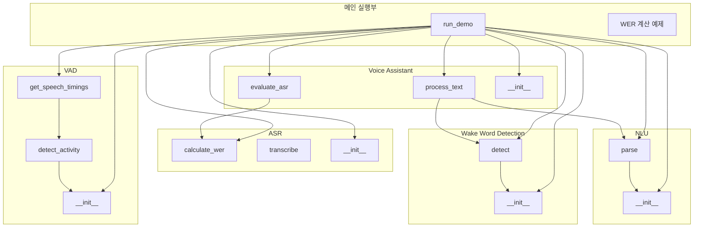
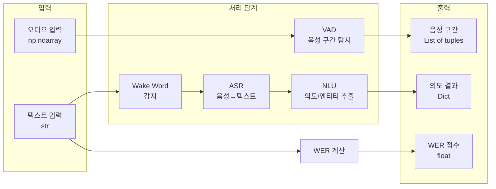
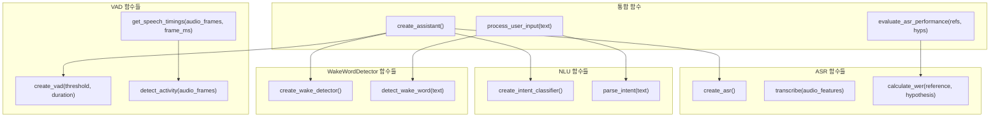
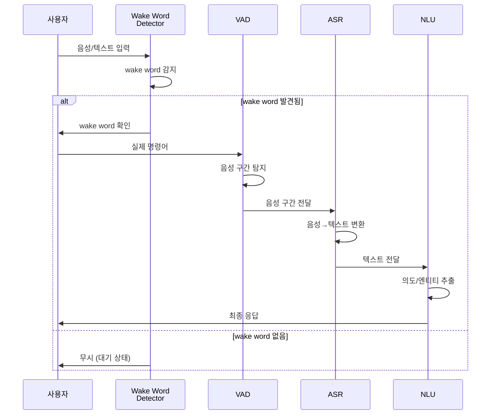

함수 기반으로 작성된 코드라면 **클래스 다이어그램 대신** 다음과 같은 다이어그램들이 더 적합합니다:

## 1. 함수 호출 관계도 (Function Call Graph)

## 2. 데이터 흐름도 (Data Flow Diagram)

## 3. 함수 간 의존성 다이어그램

## 4. 순차 처리 파이프라인 (Sequence Diagram)

## 함수 기반 vs 클래스 기반 비교

| 관점 | 클래스 기반 | 함수 기반 |
|------|------------|----------|
| **적합한 다이어그램** | 클래스 다이어그램 | 흐름도, 데이터 흐름도, 시퀀스 다이어그램 |
| **구조 표현** | 계층적 구조 | 처리 흐름 중심 |
| **재사용성 표현** | 상속/포함 관계 | 함수 호출 관계 |
| **상태 표현** | 멤버 변수 | 파라미터/반환값 |

함수 기반 코드에서는 **어떤 데이터가 어떤 함수를 거쳐 어떻게 변환되는지**를 보여주는 다이어그램이 더 의미 있습니다.
