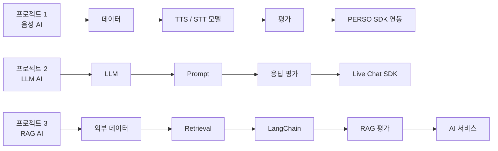
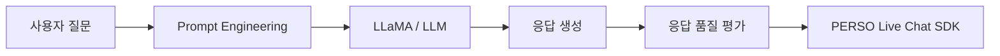
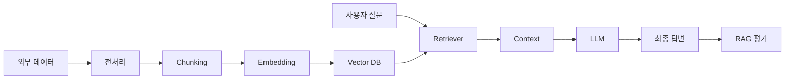

첨부 문서의 프로젝트 3개는 각각 **① 음성 모델 구축 → ② LLM 응답 모델 구축 → ③ 외부 데이터 기반 RAG 시스템 구축**으로 단계적으로 확장되는 구조입니다. 문서에는 개인별 역할이 직접 명시되어 있지는 않으므로, 아래의 역할과 요소기술은 **프로젝트 요구사항과 앞선 정규교과 내용을 기반으로 실제 팀 프로젝트에서 배정할 수 있도록 세분화하여 도출한 것**입니다.

문서의 프로젝트 1은 TTS·STT 모델을 구현하고 PERSO AI SDK에 탑재하는 것이 핵심이며, 프로젝트 2는 LLaMA 기반 응답 생성·프롬프트 최적화·성능 검증·PERSO Live Chat SDK 연동, 프로젝트 3은 LangChain과 RAG를 이용하여 외부 데이터를 참조하는 커스텀 AI 시스템을 만드는 것으로 정의되어 있습니다.  또한 정규교과에서 음성 데이터 및 TTS/STT, LLaMA와 Transformer, Prompt Engineering, LangChain, RAG를 순차적으로 학습하도록 구성되어 있어 프로젝트 역할도 이 기술 축을 기준으로 나누는 것이 자연스럽습니다.  

# 1. 프로젝트 1

## 나만의 음성 모델 만들기

**목표:** PERSO AI에 탑재할 TTS(Text-to-Speech), STT(Speech-to-Text) 모델을 구현하고 SDK에 연동하는 프로젝트입니다. 

### 전체 역할과 요소기술

| 역할           | 주요 수행 내용                       | 요소기술                                                  |
| ------------ | ------------------------------ | ----------------------------------------------------- |
| 프로젝트 리더 / PM | 일정·업무 분배, 요구사항 관리, 모델 및 서비스 통합 | 요구사항 분석, Git/GitHub, 협업 관리                            |
| 음성 데이터 담당    | 음성 데이터 수집·정제·분석                | Python, NumPy, Pandas, WAV, Sampling Rate             |
| 음성 전처리 담당    | 잡음 제거, 음성 구간 검출, 특징 분석         | Librosa, Torchaudio, VAD, STFT, Mel-Spectrogram, MFCC |
| STT 모델 담당    | 음성을 텍스트로 변환하는 모델 구축            | STT, Whisper 계열 모델 등                                  |
| TTS 모델 담당    | 텍스트를 음성으로 변환하는 모델 구축           | TTS, 음성합성 모델                                          |
| 모델 학습 담당     | 오픈소스 모델 적용 및 필요 시 추가 학습        | PyTorch, Hugging Face, Fine-tuning                    |
| 성능평가 담당      | STT/TTS 결과 성능 검증               | WER, CER, 음질 평가, 추론시간 측정                              |
| SDK 연동 담당    | 모델을 PERSO AI와 연결               | PERSO AI SDK, API, JSON                               |
| Backend 담당   | 모델 호출 API 구현                   | Python, FastAPI/Flask, REST API                       |
| UI/통합 담당     | 음성 입력·출력 서비스 화면 및 통합 테스트       | HTML/CSS/JS, Gradio/Streamlit 등                       |
| QA/테스트 담당    | 다양한 음성 환경에 대한 테스트              | Test Case, 오류 분석, 로그 관리                               |
| 문서화 담당       | 모델·API·실행방법·결과 문서화             | Markdown, GitHub, API Documentation                   |

※ Whisper, FastAPI, Librosa 등의 구체적인 제품/라이브러리는 문서에 직접 명시된 것이 아니라 프로젝트 구현에 적용할 수 있는 **요소기술 예시**입니다.

### 5인 팀 개인별 역할 예시

| 개인 | 개인별 역할           | 담당 업무                       | 개인별 요소기술                              |
| -- | ---------------- | --------------------------- | ------------------------------------- |
| A  | 프로젝트 리더 / 음성 데이터 | 요구사항 분석, 데이터 수집 및 전체 통합 관리  | Python, Pandas, Git, GitHub           |
| B  | STT 모델 개발        | 음성→텍스트 변환 모델 구축 및 성능 개선     | Python, PyTorch, Whisper, WER, CER    |
| C  | TTS 모델 개발        | 텍스트→음성 합성 모델 구축             | Python, PyTorch, TTS, Mel-Spectrogram |
| D  | 음성 전처리 및 평가      | Noise 제거, VAD, 특징 추출, 모델 평가 | Librosa, STFT, MFCC, VAD              |
| E  | SDK/API 및 서비스 통합 | 모델 API 구성 및 PERSO AI SDK 연동 | FastAPI, REST API, JSON, PERSO AI SDK |

### 개인별 기술내용 작성 예시

**B 학생**

* 역할: STT 모델 개발 담당
* 수행내용: 입력 음성을 텍스트로 변환하기 위한 STT 모델 구축 및 추론 기능 구현
* 요소기술: `Python`, `PyTorch`, `Whisper`, `Audio Preprocessing`, `WER`, `CER`
* 결과물: STT 추론 모듈, 테스트 결과, 모델 성능 평가 자료

**D 학생**

* 역할: 음성 데이터 전처리 및 모델 평가
* 수행내용: 음성 데이터 정규화, 잡음 처리, 음성 구간 검출 및 STT/TTS 모델 성능 비교
* 요소기술: `Librosa`, `NumPy`, `VAD`, `STFT`, `MFCC`, `Mel-Spectrogram`

---

# 2. 프로젝트 2

## 거대 언어 모델을 활용한 PERSO AI 답변 기능 구현

문서에서는 LLaMA 기반 응답 모델 구축, 원하는 스타일의 답변을 위한 프롬프트 최적화, 응답 생성 모델 성능 검증 및 PERSO Live Chat SDK 연동을 요구합니다. 

### 전체 역할과 요소기술

| 역할                  | 주요 수행 내용                  | 요소기술                                               |
| ------------------- | ------------------------- | -------------------------------------------------- |
| 프로젝트 리더 / AI 서비스 기획 | 서비스 시나리오 및 요구사항 정의        | 요구사항 분석, Use Case, Git                             |
| LLM 모델 담당           | LLaMA 기반 응답 모델 구성         | LLaMA, Transformer, Hugging Face                   |
| 모델 학습 담당            | 필요 시 모델 Fine-tuning       | PyTorch, Transformers, Fine-tuning, LoRA           |
| Prompt Engineer     | 원하는 응답 스타일 정의 및 Prompt 개선 | System Prompt, Few-shot, Prompt Template           |
| 대화 설계 담당            | Persona, 답변 톤, 대화 흐름 설계   | Persona, Conversation Design                       |
| LLM 평가 담당           | 답변 품질 평가                  | Accuracy, Relevance, Consistency, Human Evaluation |
| Backend 담당          | LLM 모델 호출 API 개발          | Python, FastAPI, REST API                          |
| SDK 연동 담당           | PERSO Live Chat과 LLM 연동   | PERSO Live Chat SDK, API, JSON                     |
| UI/서비스 통합           | 사용자 입력·답변 서비스 구현          | JavaScript, Gradio, Streamlit 등                    |
| QA 담당               | 정상·예외 질문 테스트              | Test Case, 로그분석, 오류처리                              |
| 문서화 담당              | 프롬프트·모델·API·평가결과 정리       | Markdown, API Documentation                        |

### 핵심 요소기술 구조

### 5인 팀 개인별 역할 예시

| 개인 | 개인별 역할           | 담당 업무                               | 개인별 요소기술                                 |
| -- | ---------------- | ----------------------------------- | ---------------------------------------- |
| A  | PM / 서비스 설계      | 요구사항·대화 시나리오·기능 관리                  | 요구사항 분석, Git/GitHub, Persona             |
| B  | LLM 모델 개발        | LLaMA 기반 응답 모델 구축                   | Python, PyTorch, LLaMA, Transformers     |
| C  | Prompt Engineer  | 응답 형식 및 Persona 최적화                 | System Prompt, Few-shot, Prompt Template |
| D  | 평가 / QA          | 생성 답변 품질 및 오류 분석                    | LLM Evaluation, Test Case, Python        |
| E  | Backend / SDK 통합 | LLM API 개발 및 PERSO Live Chat SDK 연동 | FastAPI, REST API, JSON, SDK             |

### 개인별 작성 예시

**C 학생**

* 역할: Prompt Engineering 및 대화 스타일 설계
* 수행내용: LLM의 역할과 응답 형식을 정의하고 다양한 Prompt를 실험하여 PERSO AI의 답변 스타일 최적화
* 요소기술: `Prompt Engineering`, `System Prompt`, `Few-shot Prompting`, `Prompt Template`, `Persona Design`

**E 학생**

* 역할: LLM 서비스 API 및 PERSO Live Chat 연동
* 수행내용: LLM 응답 생성 모듈을 API 형태로 구성하고 PERSO Live Chat SDK와 통합
* 요소기술: `Python`, `FastAPI`, `REST API`, `JSON`, `PERSO Live Chat SDK`

---

# 3. 프로젝트 3

## 사전 데이터 기반 PERSO AI 답변 커스텀하기

이 프로젝트는 LangChain을 이용하여 LLM 애플리케이션을 오케스트레이션하고, 외부 데이터를 동적으로 검색하는 RAG 기능을 구현하여 사용자 질의에 정확하고 풍부한 맥락을 제공하는 시스템을 완성하는 것이 목표입니다. 

세 프로젝트 가운데 역할을 가장 세분화하기 좋은 프로젝트입니다.

### 전체 역할과 요소기술

| 역할             | 주요 수행 내용                   | 요소기술                                       |
| -------------- | -------------------------- | ------------------------------------------ |
| 프로젝트 리더 / PM   | 요구사항·업무·일정 관리              | 요구사항 분석, Git/GitHub                        |
| RAG Architect  | 전체 RAG 파이프라인 구조 설계         | RAG, LangChain, LLM                        |
| 데이터 수집 담당      | PDF, TXT, Web 등의 외부 데이터 확보 | Python, Web/API, PDF Loader                |
| 데이터 전처리 담당     | 문서 정제 및 구조화                | Python, Pandas, Text Processing            |
| Chunking 담당    | 문서를 검색 단위로 분리              | Text Splitter, Chunk Size, Overlap         |
| Embedding 담당   | 텍스트를 Vector로 변환            | Embedding Model, Vector                    |
| Vector DB 담당   | Vector 저장 및 검색 환경 구축       | FAISS, Chroma, Qdrant 등의 Vector DB         |
| Retrieval 담당   | 관련 문서 검색 로직 구현             | Retriever, Similarity Search, MMR          |
| Re-ranking 담당  | 검색 결과 재정렬                  | Reranker, Cross-Encoder 등                  |
| LangChain 담당   | RAG Chain 및 데이터 흐름 연결      | LangChain, Chain, Runnable                 |
| Prompt 담당      | 검색 문맥을 LLM Prompt에 적용      | PromptTemplate, Context                    |
| LLM 담당         | 검색 결과를 이용한 답변 생성           | LLM, Transformer                           |
| Backend/API 담당 | RAG 기능을 API 서비스화           | FastAPI, REST API                          |
| Evaluation 담당  | 검색·답변 품질 검증                | Recall, Precision, Relevance, Faithfulness |
| QA 담당          | Hallucination 및 예외 질문 테스트  | Test Case, Groundedness                    |
| UI 담당          | 질의·응답 인터페이스 구축             | HTML/CSS/JS, Gradio 등                      |
| 문서화 담당         | 구조·API·실험·결과 정리            | Markdown, Mermaid, GitHub                  |

### RAG 역할 구조

### 6인 팀 개인별 역할 예시

| 개인 | 개인별 역할                | 담당 업무                  | 개인별 요소기술                               |
| -- | --------------------- | ---------------------- | -------------------------------------- |
| A  | PM / RAG Architect    | 요구사항 및 전체 RAG 구조 설계    | RAG Architecture, LangChain, Git       |
| B  | 데이터 파이프라인             | 외부 문서 수집·전처리·Chunking  | Python, Document Loader, Text Splitter |
| C  | Embedding / Vector DB | Embedding 생성 및 벡터 저장   | Embedding, FAISS/Chroma/Qdrant         |
| D  | Retriever / 검색        | 사용자 질문 기반 관련 문서 검색     | Retriever, Similarity Search, MMR      |
| E  | LangChain / LLM       | 검색 결과와 LLM을 연결하여 답변 생성 | LangChain, PromptTemplate, LLM         |
| F  | Backend / Evaluation  | API 구축 및 검색·답변 품질 검증   | FastAPI, REST API, RAG Evaluation      |

### 개인별 작성 예시

**B 학생**

* 역할: RAG 데이터 파이프라인 구축
* 수행내용: PDF 및 텍스트 문서를 수집하고 LLM 검색에 적합하도록 전처리 및 Chunking 수행
* 요소기술: `Python`, `LangChain Document Loader`, `Text Splitter`, `Chunking`, `Data Preprocessing`

**C 학생**

* 역할: Embedding 및 Vector Database 구축
* 수행내용: 문서 Chunk를 Embedding Vector로 변환하고 Vector Database에 저장하여 검색 환경 구축
* 요소기술: `Embedding Model`, `Vector DB`, `FAISS/Chroma/Qdrant`, `Similarity Search`

**D 학생**

* 역할: RAG 검색 시스템 구현
* 수행내용: 사용자 질문과 유사한 문서를 Vector DB에서 검색하여 LLM에 전달하는 Retrieval 기능 구현
* 요소기술: `Retriever`, `Similarity Search`, `MMR`, `Top-K Retrieval`

---

# 4. 세 프로젝트의 역할을 한 번에 정리하면

| 역할 분야       | 프로젝트 1       | 프로젝트 2              | 프로젝트 3                |
| ----------- | ------------ | ------------------- | --------------------- |
| 프로젝트 관리     | PM           | PM                  | PM                    |
| 데이터         | 음성 데이터       | 학습/대화 데이터           | 문서/외부 데이터             |
| 데이터 전처리     | 음성 전처리       | 텍스트 전처리             | 문서 전처리/Chunking       |
| AI 모델       | STT/TTS      | LLaMA/LLM           | LLM                   |
| Prompt      | 선택           | **핵심**              | **핵심**                |
| Embedding   | -            | -                   | **핵심**                |
| Vector DB   | -            | -                   | **핵심**                |
| Retrieval   | -            | -                   | **핵심**                |
| LangChain   | -            | 선택                  | **핵심**                |
| 모델 평가       | WER/CER/음질   | 답변 품질               | 검색+답변 품질              |
| Backend/API | 모델 API       | LLM API             | RAG API               |
| PERSO 연동    | PERSO AI SDK | PERSO Live Chat SDK | PERSO 서비스 연동          |
| UI/UX       | 음성 인터페이스     | Chat UI             | RAG Chat UI           |
| QA          | 음성 테스트       | LLM 응답 테스트          | RAG/Hallucination 테스트 |
| 문서화         | 모델/API       | Prompt/API          | RAG/API/Architecture  |

# 5. 개인별 역할을 기록할 때 가장 좋은 형식

실제 **프로젝트 결과보고서, 수료생 포트폴리오, 취업용 프로젝트 기술서**에서는 단순히

> 역할: STT 개발
> 기술: Python, Whisper

정도로 쓰는 것보다 다음의 5개 항목으로 작성하는 것이 좋습니다.

| 항목     | 작성 내용           |
| ------ | --------------- |
| 개인별 역할 | 자신이 책임진 영역      |
| 담당 기능  | 실제 구현한 기능       |
| 수행 업무  | 구체적으로 한 작업      |
| 요소기술   | 사용한 기술·프레임워크·모델 |
| 산출물    | 자신이 만든 결과물      |

예를 들어 프로젝트 3의 학생은 다음과 같이 기록할 수 있습니다.

> **개인별 역할:** RAG Retrieval 및 Vector DB 담당
> **담당 기능:** 사용자 질문과 관련된 사내 문서를 검색하는 Retrieval 기능 구현
> **수행 업무:** 문서 Chunking, Embedding 생성, Vector DB 저장, Top-K 검색 및 MMR 검색 성능 비교
> **요소기술:** Python, LangChain, Embedding Model, Chroma/FAISS, Retriever, MMR
> **산출물:** Vector DB 구축 모듈, Retriever 모듈, 검색 성능 비교 결과

이 형태로 작성하면 **같은 프로젝트를 수행한 팀원이라도 각자의 역할과 기술 역량이 명확하게 구분**됩니다.

특히 교육과정 관점에서는 세 프로젝트의 개인별 역량을 **프로젝트 1 = 음성 AI Engineer**, **프로젝트 2 = LLM/Prompt Engineer**, **프로젝트 3 = RAG/AI Application Engineer**로 단계적으로 구분하여 기록하면, 800시간 과정에서 어떤 기술 역량이 축적되었는지를 가장 명확하게 보여줄 수 있습니다. 
