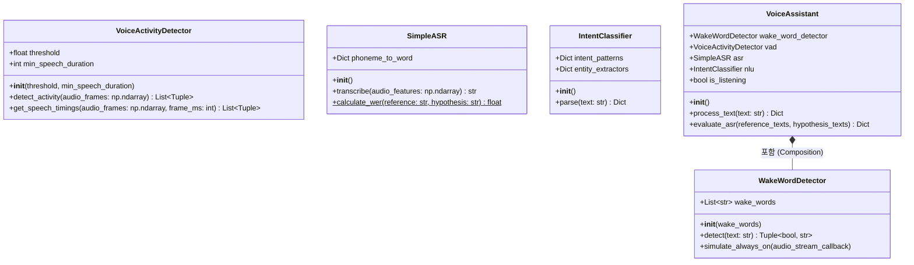

```mermaid
classDiagram
    class WakeWordDetector {
        +List~str~ wake_words
        +__init__(wake_words)
        +detect(text: str) Tuple~bool, str~
        +simulate_always_on(audio_stream_callback)
    }

    class VoiceActivityDetector {
        +float threshold
        +int min_speech_duration
        +__init__(threshold, min_speech_duration)
        +detect_activity(audio_frames: np.ndarray) List~Tuple~
        +get_speech_timings(audio_frames: np.ndarray, frame_ms: int) List~Tuple~
    }

    class SimpleASR {
        +Dict phoneme_to_word
        +__init__()
        +transcribe(audio_features: np.ndarray) str
        +calculate_wer(reference: str, hypothesis: str) float$
    }

    class IntentClassifier {
        +Dict intent_patterns
        +Dict entity_extractors
        +__init__()
        +parse(text: str) Dict
    }

    class VoiceAssistant {
        +WakeWordDetector wake_word_detector
        +VoiceActivityDetector vad
        +SimpleASR asr
        +IntentClassifier nlu
        +bool is_listening
        +__init__()
        +process_text(text: str) Dict
        +evaluate_asr(reference_texts, hypothesis_texts) Dict
    }

    %% Relationships
    VoiceAssistant *-- WakeWordDetector : 포함 (Composition)
```
    VoiceAssistant *-- VoiceActivityDetector : 포함 (Composition)
    VoiceAssistant *-- SimpleASR : 포함 (Composition)
    VoiceAssistant *-- IntentClassifier : 포함 (Composition)
