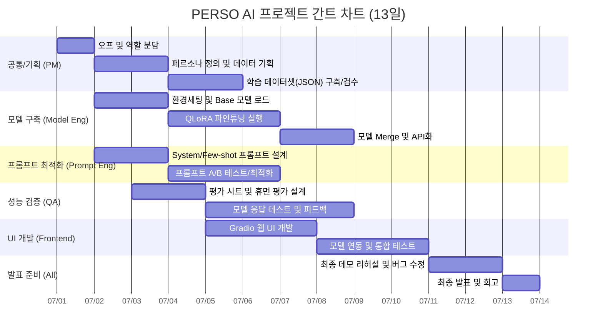

```mermaid
gantt
    title PERSO AI 프로젝트 간트 차트 (13일)
    dateFormat  YYYY-MM-DD
    axisFormat  %m/%d
    
    section 공통/기획 (PM)
    오프 및 역할 분담             :a1, 2024-07-01, 1d
    페르소나 정의 및 데이터 기획     :a2, after a1, 2d
    학습 데이터셋(JSON) 구축/검수    :a3, after a2, 2d
    
    section 모델 구축 (Model Eng)
    환경세팅 및 Base 모델 로드       :b1, 2024-07-02, 2d
    QLoRA 파인튜닝 실행              :b2, after b1, 3d
    모델 Merge 및 API화              :b3, after b2, 2d
    
    section 프롬프트 최적화 (Prompt Eng)
    System/Few-shot 프롬프트 설계    :c1, 2024-07-02, 2d
    프롬프트 A/B 테스트/최적화       :c2, after c1, 3d
    
    section 성능 검증 (QA)
    평가 시트 및 휴먼 평가 설계      :d1, 2024-07-03, 2d
    모델 응답 테스트 및 피드백       :d2, after d1, 4d
    
    section UI 개발 (Frontend)
    Gradio 웹 UI 개발                :e1, 2024-07-05, 3d
    모델 연동 및 통합 테스트         :e2, after e1, 3d
    
    section 발표 준비 (All)
    최종 데모 리허설 및 버그 수정    :f1, 2024-07-11, 2d
    최종 발표 및 회고                :f2, after f1, 1d
```
