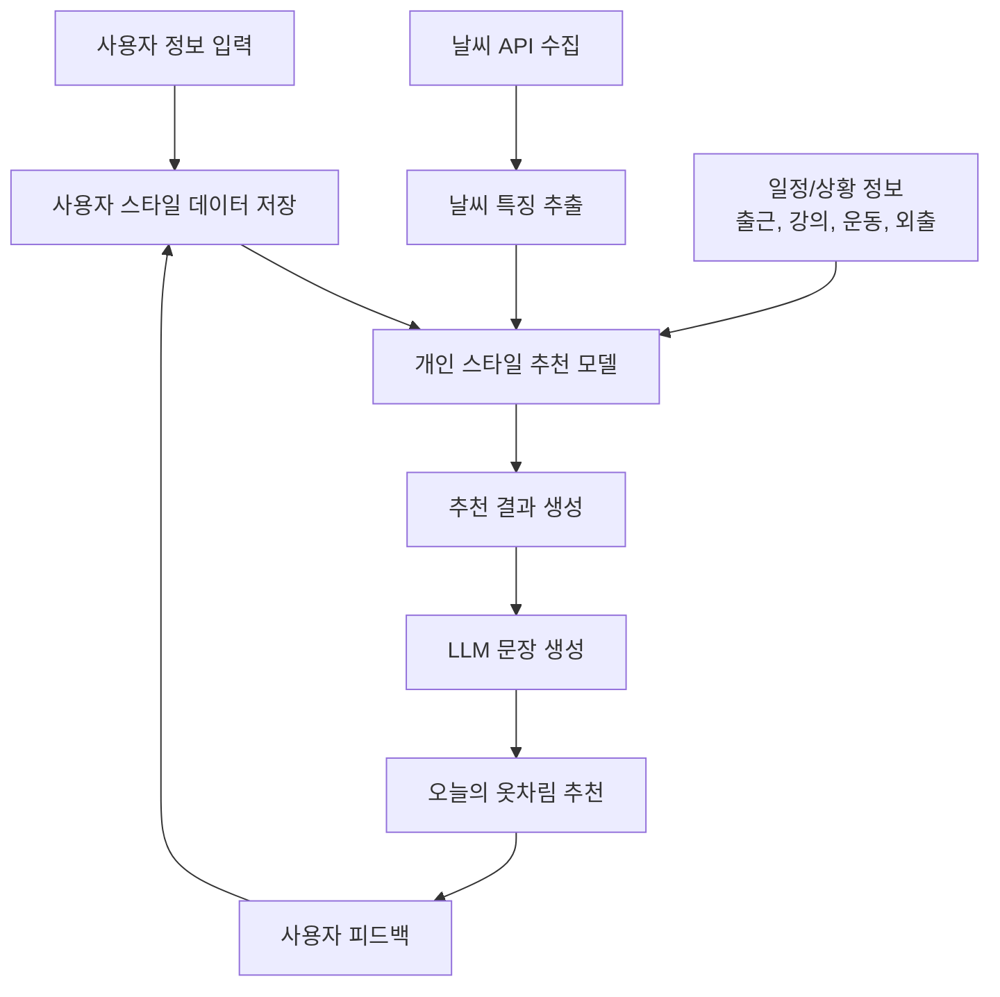
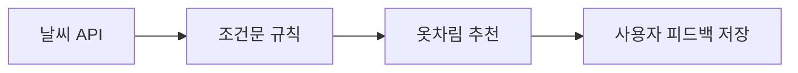
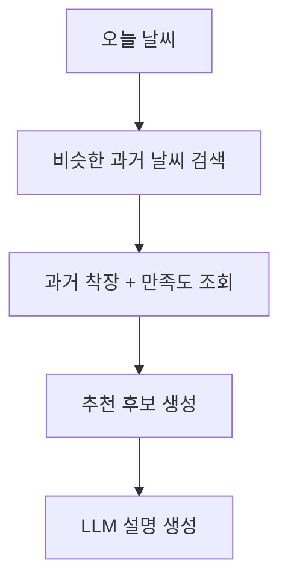
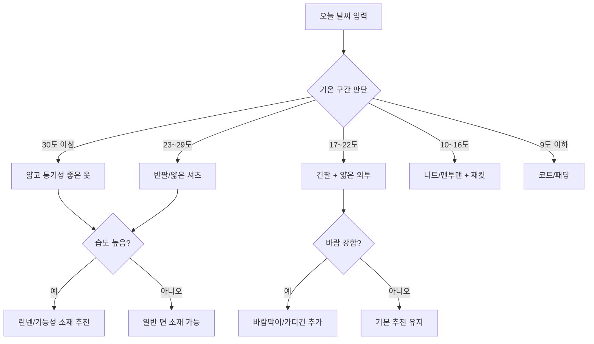
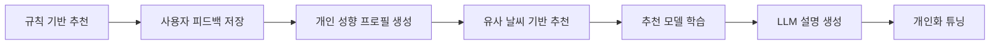

# **오늘 날씨 데이터 + 사용자의 과거 옷차림 데이터 + 사용자의 피드백 → 개인 맞춤형 옷차림 추천**

한국 서비스라면 기상청 단기예보 API를 사용할 수 있고, 단기예보는 지역별·시간별 날씨를 읍면동 단위 5km 격자로 제공하는 구조입니다. ([데이터.go.kr][1]) 해외/간단 MVP용으로는 Open-Meteo도 좋은데, API 키 없이 사용할 수 있고 기온·습도·풍속 등 예보 변수를 제공합니다. ([Open Meteo][2])

---

## 1. 결론: 충분히 가능한 프로젝트인가?

**가능합니다.** 오히려 교육용·포트폴리오용 AI 프로젝트로도 좋습니다.

이 시스템은 크게 세 가지 AI 요소로 구성할 수 있습니다.

| 구성 요소     | 역할                                 | AI 적용 방식               |
| --------- | ---------------------------------- | ---------------------- |
| 날씨 수집     | 오늘의 기온, 체감온도, 습도, 바람, 강수, 계절 정보 수집 | API 연동                 |
| 개인 스타일 학습 | 사용자가 어떤 날씨에 어떤 옷을 선호했는지 학습         | 추천 모델 / 분류 모델 / 유사도 검색 |
| 추천 문장 생성  | “오늘은 얇은 셔츠 + 가벼운 재킷이 좋아요”처럼 자연어 설명 | LLM / 프롬프트 / 파인튜닝      |

중요한 점은 **처음부터 LLM을 파인튜닝할 필요는 없습니다.**
초기에는 **규칙 기반 + 개인 데이터 검색 + LLM 프롬프트**만으로도 꽤 좋은 결과를 만들 수 있습니다. 이후 데이터가 쌓이면 추천 모델을 튜닝하면 됩니다.

---

## 2. 전체 시스템 구조



---

## 3. 추천에 필요한 핵심 데이터

### 1) 날씨 데이터

필수로 사용할 변수는 다음입니다.

| 변수       | 설명            | 추천에 미치는 영향     |
| -------- | ------------- | -------------- |
| 기온       | 실제 온도         | 기본 옷 두께 결정     |
| 체감온도     | 바람·습도 반영 온도   | 실제 착용감 판단      |
| 습도       | 끈적임, 땀, 불쾌감   | 소재 선택에 중요      |
| 풍속       | 바람 세기         | 외투, 방풍 여부 결정   |
| 강수확률     | 비 가능성         | 우산, 방수 신발, 겉옷  |
| 일교차      | 아침/낮/저녁 온도 차이 | 레이어드 필요성       |
| 계절       | 봄/여름/가을/겨울    | 색상, 소재, 스타일 기준 |
| 미세먼지/자외선 | 선택 사항         | 마스크, 모자, 선글라스  |

한국형 서비스라면 **기상청 단기예보 조회서비스**를 쓰는 것이 적합하고, 빠른 MVP라면 Open-Meteo도 편합니다. 기상청 API는 초단기실황·초단기예보·단기예보를 제공하고, 단기예보는 글피까지의 예보를 시간 단위로 세분화해 제공합니다. ([데이터.go.kr][1])

---

### 2) 사용자 스타일 데이터

사용자에게 매일 다음과 같은 데이터를 입력받습니다.

| 항목    | 예시                                 |
| ----- | ---------------------------------- |
| 날짜    | 2026-07-07                         |
| 위치    | 대전, 서울, 광주 등                       |
| 기온    | 28도                                |
| 습도    | 75%                                |
| 바람    | 약함 / 보통 / 강함                       |
| 상황    | 출근, 강의, 운동, 데이트, 여행                |
| 실제 착용 | 반팔 셔츠, 얇은 슬랙스, 운동화                 |
| 색상 취향 | 무채색, 밝은색, 캐주얼                      |
| 만족도   | 1~5점                               |
| 코멘트   | “습해서 너무 더웠다”, “바람 때문에 얇은 겉옷이 필요했다” |

이 데이터가 쌓이면 모델은 다음과 같은 개인 패턴을 학습할 수 있습니다.

예를 들어:

> 이 사용자는 24도 이하에서는 반팔보다 긴팔을 선호한다.
> 습도가 70% 이상이면 청바지를 불편해한다.
> 바람이 강하면 얇은 바람막이를 선호한다.
> 강의 일정이 있는 날에는 캐주얼보다 단정한 스타일을 선호한다.

---

## 4. “튜닝”은 무엇을 튜닝해야 하나?

여기서 중요한 설계 포인트가 있습니다.

**LLM 전체를 바로 파인튜닝하는 것보다, 추천 로직을 개인화하는 것이 우선입니다.**

추천 시스템은 다음 3단계로 발전시키는 것이 좋습니다.

---

## 5. 단계별 개발 전략

## 1단계: 규칙 기반 MVP

처음에는 AI 없이도 동작하는 기본 추천기를 만듭니다.

예시 규칙:

| 조건            | 추천                      |
| ------------- | ----------------------- |
| 30도 이상, 습도 높음 | 통기성 좋은 반팔, 린넨 셔츠, 얇은 바지 |
| 20~24도, 바람 있음 | 긴팔 셔츠 + 얇은 가디건          |
| 10~15도        | 니트, 맨투맨, 가벼운 코트         |
| 5도 이하         | 패딩, 목도리, 장갑             |
| 강수확률 높음       | 방수 신발, 우산, 어두운 하의       |

이 단계의 목표는 **서비스 흐름을 완성하는 것**입니다.



추천 예시:

> 오늘은 기온이 높고 습도가 높은 편이므로, 통기성이 좋은 반팔 셔츠와 얇은 면바지를 추천합니다. 오후에 비 가능성이 있다면 방수 가능한 신발과 접이식 우산을 챙기는 것이 좋습니다.

---

## 2단계: 사용자 피드백 기반 개인화

사용자가 추천 결과에 대해 평가합니다.

| 추천 결과         | 사용자 반응      |
| ------------- | ----------- |
| 반팔 + 린넨 바지 추천 | “좋아요”       |
| 긴팔 셔츠 추천      | “더웠어요”      |
| 청바지 추천        | “습해서 불편했어요” |
| 바람막이 추천       | “유용했어요”     |

이 피드백을 저장해서 다음 추천에 반영합니다.

예를 들어 기본 규칙은 “24도는 반팔 추천”이지만, 사용자가 추위를 많이 탄다면:

> 일반적으로는 반팔이 적합하지만, 사용자의 과거 선택을 보면 24도에서도 얇은 긴팔을 선호했으므로 얇은 긴팔 셔츠를 추천합니다.

이 단계에서는 **개인별 가중치**를 둘 수 있습니다.

| 사용자 성향       | 조정 방식                |
| ------------ | -------------------- |
| 추위를 많이 탐     | 추천 온도 기준을 2~3도 높게 조정 |
| 더위를 많이 탐     | 외투 추천 기준을 낮춤         |
| 격식 있는 스타일 선호 | 후드티보다 셔츠/가디건 우선      |
| 캐주얼 선호       | 셔츠보다 티셔츠/맨투맨 우선      |
| 습도에 민감       | 린넨, 기능성 소재 우선        |

---

## 3단계: 머신러닝 추천 모델 적용

데이터가 어느 정도 쌓이면 머신러닝 모델을 적용할 수 있습니다.

추천 문제는 보통 **다중 분류 또는 다중 라벨 추천 문제**로 볼 수 있습니다.

예를 들어 모델 입력은 다음과 같습니다.

```text
기온: 24도
체감온도: 23도
습도: 68%
풍속: 4m/s
강수확률: 20%
계절: 봄
상황: 강의
사용자 성향: 단정한 캐주얼 선호
```

모델 출력은 다음과 같습니다.

```text
상의: 얇은 긴팔 셔츠
하의: 슬랙스
아우터: 얇은 가디건
신발: 로퍼 또는 깔끔한 운동화
소재: 면/린넨 혼방
스타일: 단정한 캐주얼
```

사용 가능한 모델은 다음과 같습니다.

| 모델               |   적합도 | 설명                   |
| ---------------- | ----: | -------------------- |
| Decision Tree    |    높음 | 교육용으로 설명하기 쉬움        |
| Random Forest    |    높음 | 날씨 조건과 옷차림 분류에 적합    |
| XGBoost/LightGBM |    높음 | 성능 좋은 추천 모델 가능       |
| KNN 유사도 검색       | 매우 높음 | 과거 비슷한 날씨의 옷차림 추천    |
| 딥러닝              |    중간 | 데이터가 많을 때 적합         |
| LLM 파인튜닝         | 선택 사항 | 추천 문장 스타일을 개인화할 때 적합 |

초기에는 **KNN 유사도 검색 + 규칙 기반 + LLM** 조합이 가장 현실적입니다.

---

## 4단계: LLM을 이용한 자연어 추천

추천 모델이 구조화된 결과를 만들면, LLM은 이를 자연스럽게 설명합니다.

모델 내부 추천 결과:

```json
{
  "top": "얇은 긴팔 셔츠",
  "bottom": "슬랙스",
  "outer": "가벼운 가디건",
  "shoes": "운동화",
  "reason": "아침에는 선선하고 낮에는 따뜻하며 바람이 약간 있음"
}
```

LLM 출력:

> 오늘은 아침에는 약간 선선하고 낮에는 따뜻한 날씨입니다. 얇은 긴팔 셔츠에 슬랙스를 입고, 이동 시간이 길다면 가벼운 가디건을 챙기는 것을 추천합니다. 바람이 약간 있으므로 너무 얇은 반팔보다는 소매가 있는 옷이 더 안정적입니다.

여기서 LLM은 **판단 모델**이 아니라 **설명 생성 모델**로 쓰는 것이 안전합니다.

---

## 5단계: 개인 스타일 튜닝

사용자 데이터가 충분히 쌓이면 다음 방식으로 튜닝할 수 있습니다.

### 방법 A: 프롬프트 기반 개인화

가장 쉬운 방식입니다.

```text
사용자는 단정한 캐주얼 스타일을 선호한다.
너무 화려한 색상을 싫어한다.
습도가 높은 날에는 청바지를 불편해한다.
기온이 22도 이하이면 얇은 외투를 선호한다.
```

이런 사용자 프로필을 프롬프트에 넣고 추천합니다.

장점: 구현 쉬움
단점: 데이터가 많아지면 관리가 복잡함

---

### 방법 B: RAG 방식 개인화

사용자의 과거 착장 기록을 벡터DB에 저장해두고, 오늘 날씨와 비슷한 과거 사례를 검색합니다.



예시:

> 작년 10월 12일, 비슷한 기온과 바람 조건에서 사용자는 “긴팔 셔츠 + 얇은 재킷” 조합에 만족도 5점을 주었습니다. 따라서 오늘도 유사한 조합을 추천합니다.

장점: 개인화가 잘 됨
단점: 과거 데이터가 필요함

---

### 방법 C: 추천 모델 튜닝

사용자 데이터를 학습해서 모델 자체가 추천하도록 만듭니다.

입력:

```text
날씨 + 계절 + 습도 + 바람 + 일정 + 사용자 성향
```

출력:

```text
상의, 하의, 아우터, 신발, 소재, 스타일
```

이 경우 `RandomForestClassifier`, `LightGBM`, `XGBoost`, `CatBoost` 같은 모델을 사용할 수 있습니다.

장점: 추천 품질 향상
단점: 학습 데이터가 필요함

---

### 방법 D: LLM 파인튜닝

LLM 파인튜닝은 마지막 단계로 생각하는 것이 좋습니다.

LLM 파인튜닝이 적합한 경우는 다음입니다.

| 경우                    | LLM 파인튜닝 적합 여부 |
| --------------------- | -------------- |
| 옷 종류를 예측하고 싶다         | 낮음             |
| 추천 문장 톤을 개인화하고 싶다     | 높음             |
| 사용자의 말투에 맞게 설명하고 싶다   | 높음             |
| 스타일 상담사처럼 응답하게 만들고 싶다 | 높음             |
| 10~50개 데이터만 있다        | 낮음             |
| 수백~수천 개 추천 예시가 있다     | 가능             |

즉, **옷차림 결정은 추천 모델이 하고, 설명은 LLM이 하는 구조**가 가장 좋습니다.

---

## 6. 데이터베이스 설계 예시

### 사용자 스타일 로그 테이블

| 필드            | 설명          |
| ------------- | ----------- |
| user_id       | 사용자 ID      |
| date          | 날짜          |
| location      | 위치          |
| temperature   | 기온          |
| feels_like    | 체감온도        |
| humidity      | 습도          |
| wind_speed    | 풍속          |
| precipitation | 강수 여부       |
| season        | 계절          |
| situation     | 출근/운동/강의/외출 |
| top           | 상의          |
| bottom        | 하의          |
| outer         | 아우터         |
| shoes         | 신발          |
| style         | 캐주얼/포멀/스포티  |
| satisfaction  | 만족도         |
| comment       | 사용자 코멘트     |

---

## 7. 추천 알고리즘 예시

초기 추천 로직은 다음처럼 만들 수 있습니다.



---

## 8. 개발 단계별 로드맵

| 단계  | 목표        | 주요 작업                        |
| --- | --------- | ---------------------------- |
| 1단계 | MVP 만들기   | 날씨 API 연동, 규칙 기반 추천          |
| 2단계 | 사용자 입력 저장 | 오늘 입은 옷, 만족도, 코멘트 저장         |
| 3단계 | 개인화 적용    | 추위/더위 민감도, 선호 스타일 반영         |
| 4단계 | 유사 날씨 검색  | 과거 비슷한 날씨의 옷차림 검색            |
| 5단계 | 추천 모델 학습  | RandomForest/KNN/LightGBM 적용 |
| 6단계 | LLM 연결    | 추천 이유를 자연어로 설명               |
| 7단계 | 피드백 루프    | 사용자의 평가를 다시 학습 데이터로 저장       |
| 8단계 | 고도화       | 일정, 장소, 미세먼지, 쇼핑몰 연동 등 확장    |

---

## 9. 추천 기술 스택

| 영역     | 추천 기술                           |
| ------ | ------------------------------- |
| 백엔드    | FastAPI                         |
| 프론트엔드  | Streamlit, Gradio, React        |
| 날씨 API | 기상청 API, Open-Meteo             |
| 데이터베이스 | SQLite → PostgreSQL             |
| 추천 모델  | scikit-learn, LightGBM          |
| 개인화 검색 | FAISS, ChromaDB                 |
| LLM    | OpenAI API, Ollama, Qwen, Llama |
| 배포     | Docker, Render, AWS, GCP        |
| 모바일 확장 | Flutter, React Native           |

교육용 MVP라면 다음 조합이 가장 적합합니다.

> **FastAPI + Streamlit + Open-Meteo + SQLite + scikit-learn + LLM API**

---

## 10. 프로젝트 이름 예시

이 프로젝트는 다음과 같은 제목으로 정리할 수 있습니다.

| 방향       | 프로젝트 제목                              |
| -------- | ------------------------------------ |
| 간단형      | 날씨 기반 AI 옷차림 추천 시스템                  |
| 개인화 강조   | 개인 스타일 학습형 AI 코디 추천 서비스              |
| 포트폴리오형   | 날씨와 사용자 선호도를 반영한 PERSO AI 스타일 추천 시스템 |
| 교육 프로젝트형 | 기상 데이터 기반 개인 맞춤형 의상 추천 AI            |
| 서비스형     | 오늘 뭐 입지? AI 스타일 어시스턴트                |

가장 적합한 제목은 다음입니다.

> **날씨와 개인 스타일을 반영한 AI 옷차림 추천 시스템**

---

## 11. 최종 권장 구조

처음부터 복잡한 파인튜닝으로 가지 말고 아래 순서로 진행하는 것이 좋습니다.



핵심은 다음입니다.

1. **날씨 데이터는 API로 가져온다.**
2. **사용자의 옷차림과 만족도를 계속 저장한다.**
3. **처음에는 규칙 기반으로 추천한다.**
4. **데이터가 쌓이면 유사 날씨 검색과 머신러닝 추천 모델을 적용한다.**
5. **LLM은 추천 이유를 자연스럽게 설명하는 역할로 사용한다.**
6. **충분한 데이터가 생기면 개인 스타일 튜닝 또는 LoRA 파인튜닝을 검토한다.**

---

## 12. 현실적인 MVP 예시

처음 만들 MVP는 다음 정도면 충분합니다.

### 입력

```text
지역: 대전
상황: 강의
스타일: 단정한 캐주얼
추위 민감도: 보통
더위 민감도: 높음
```

### 시스템 처리

```text
1. 날씨 API에서 오늘 기온, 습도, 바람, 강수확률 수집
2. 규칙 기반으로 기본 옷차림 후보 생성
3. 사용자 선호도 반영
4. LLM으로 추천 문장 생성
5. 사용자가 만족도 입력
6. 데이터베이스에 저장
```

### 출력

```text
오늘은 기온이 높고 습도가 있는 편이므로, 통기성이 좋은 반팔 셔츠나 얇은 린넨 셔츠를 추천합니다. 강의 일정이 있다면 너무 캐주얼한 티셔츠보다는 단정한 셔츠형 상의를 선택하는 것이 좋습니다. 하의는 얇은 슬랙스나 면바지가 적합하고, 장시간 이동이 있다면 편한 운동화를 추천합니다.
```

---

## 핵심 정리

이 프로젝트는 충분히 가능합니다. 가장 좋은 구현 방향은 **“날씨 API + 개인 스타일 로그 + 추천 알고리즘 + LLM 설명 생성”** 구조입니다.

처음에는 파인튜닝보다 **규칙 기반 추천과 사용자 피드백 저장**이 더 중요합니다. 이후 데이터가 쌓이면 **유사 날씨 검색, 추천 모델 학습, LLM 응답 튜닝** 순서로 고도화하는 것이 가장 안정적입니다.

[1]: https://www.data.go.kr/data/15084084/openapi.do?utm_source=chatgpt.com "기상청_단기예보 조회서비스"
[2]: https://open-meteo.com/?utm_source=chatgpt.com "Open-Meteo.com: 🌤️ Free Open-Source Weather API"
